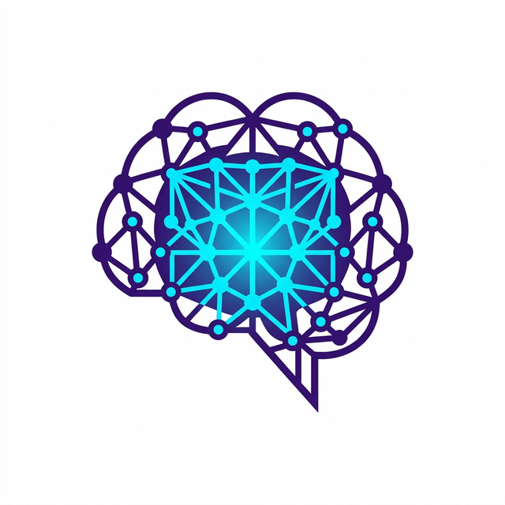
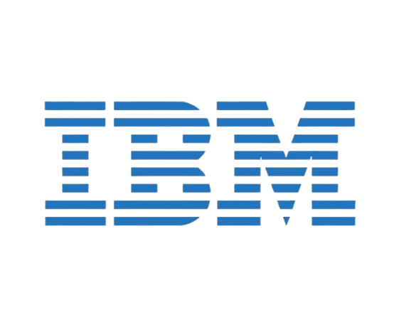
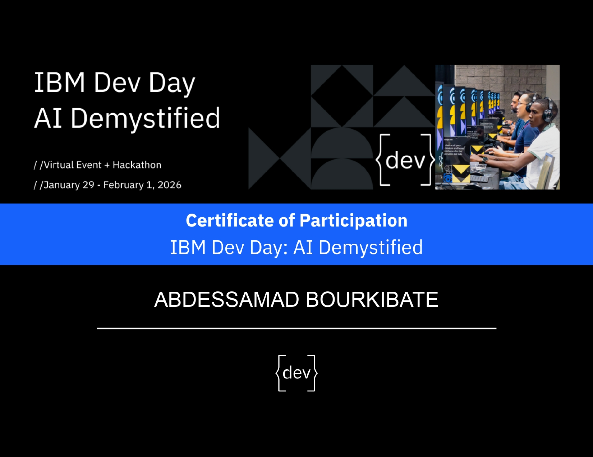
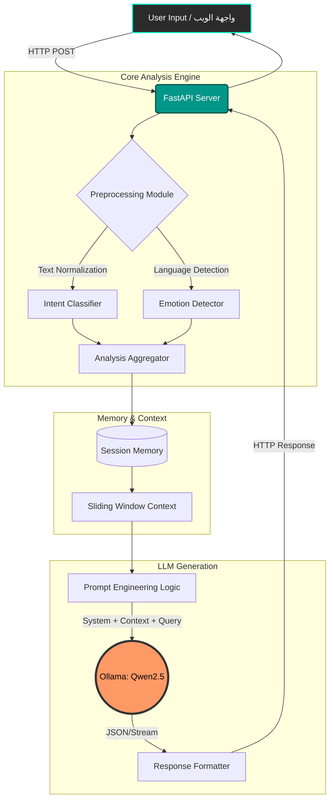

<div align="center">
  
  
  <h1>🧠 Human Insight AI | بصيرة الذكاء الاصطناعي للبشر</h1>
  
  <p><b>Advanced Cognitive Language System — Understands human intent, emotional nuance, ethical context, and semantic depth in real-time.</b></p>
  <p><b>النظام اللغوي الإدراكي المتقدم — يفهم النوايا البشرية، الفروق العاطفية الدقيقة، السياق الأخلاقي، والعمق الدلالي في وقت فعلي.</b></p>

  <p>
    <a href="https://github.com/ABDESSAMAD-BOURKIBATE/Human-Insight-AI/stargazers"></a>
    <a href="https://github.com/ABDESSAMAD-BOURKIBATE/Human-Insight-AI/network/members"></a>
    <a href="https://github.com/ABDESSAMAD-BOURKIBATE/Human-Insight-AI/issues"></a>
    <a href="https://github.com/ABDESSAMAD-BOURKIBATE/Human-Insight-AI/blob/main/LICENSE"></a>
  </p>
  <p>
    
    
    
    
  </p>
</div>

<hr>

## 🏆 Proudly Built for IBM Hackathon | فخورون بالمشاركة في هاكاثون IBM

<div align="center">
  
  <br><br>
  
  <br>
  <p><i>This project was developed as a competitive entry for an IBM-sponsored Hackathon, leveraging advanced AI modeling and prioritizing privacy.</i></p>
  <p><i>تم تطوير هذا المشروع كإدخال تنافسي في هاكاثون برعاية شركة IBM، مع الاستفادة من النمذجة المتقدمة للذكاء الاصطناعي وإعطاء الأولوية للخصوصية.</i></p>
</div>

<hr>

<details open>
  <summary><h2>📑 Table of Contents | جدول المحتويات</h2></summary>
  
  - [1. Overview | نظرة عامة](#1-overview--نظرة-عامة)
  - [2. Key Features | المميزات الرئيسية](#2-key-features--المميزات-الرئيسية)
  - [3. System Architecture | التصميم الفني والمعمارية](#3-system-architecture--التصميم-الفني-والمعمارية)
  - [4. Intent & Emotion Engine | محرك المشاعر والنوايا](#4-intent--emotion-engine--محرك-المشاعر-والنوايا)
  - [5. System Requirements | متطلبات التشغيل](#5-system-requirements--متطلبات-التشغيل)
  - [6. Setup & Installation | دليل التثبيت الشامل](#6-setup--installation--دليل-التثبيت-الشامل)
  - [7. API Documentation | توثيق واجهة برمجة التطبيقات](#7-api-documentation--توثيق-واجهة-برمجة-التطبيقات)
  - [8. Project Structure | هيكلة ملفات المشروع](#8-project-structure--هيكلة-ملفات-المشروع)
  - [9. User Interface | الواجهة الأمامية](#9-user-interface--الواجهة-الأمامية)
  - [10. Environment Variables | المتغيرات البيئية](#10-environment-variables--المتغيرات-البيئية)
  - [11. Use Cases | حالات الاستخدام](#11-use-cases--حالات-الاستخدام)
  - [12. FAQ | الأسئلة الشائعة](#12-faq--الأسئلة-الشائعة)
  - [13. License | الترخيص](#13-license--الترخيص)
</details>

---

## 1. Overview | نظرة عامة

### 🇬🇧 English
**Human Insight AI** is a revolutionary system developed to bridge the gap between abstract artificial intelligence and the complexities of human psychology. It goes beyond mere word processing to dive deep into underlying semantics, extracting dormant intents, and accurately assessing the user's emotional state. 

Powered by **Qwen 2.5:3B** running locally via **Ollama**, this system guarantees **100% Data Privacy** (Zero Data Leakage). It combines large language models with innovative natural language processing modules to construct conversational narratives that mimic deep human cognition.

### 🇦🇪 العربية
مشروع **Human Insight AI** هو نظام ثوري تم تطويره للربط بين الذكاء الاصطناعي المجرد وبين التعقيدات السيكولوجية البشرية. لا يكتفي هذا النظام بمعالجة النصوص والكلمات، بل يغوص في أعماق المعاني لاستخراج النوايا الكامنة وتحديد الحالة العاطفية للمستخدم بدقة فائقة.

يعتمد المشروع على نماذج متقدمة مثل **Qwen 2.5:3B** تعمل محلياً عبر أداة **Ollama**، مما يعني ضمان **الخصوصية التامة للبيانات** وعدم تسريب أي معلومات إلى خوادم خارجية.

---

## 2. Key Features | المميزات الرئيسية

| 🇬🇧 Feature | 🇦🇪 الميزة | 📝 Description / الوصف |
|:---:|:---:|---|
| 🧠 **Cognitive Engine** | **المحرك المعرفي** | Powered by Qwen & Ollama for optimal edge-device performance. يعتمد الذكاء التوليدي القوي للموارد المحدودة. |
| 🎭 **Emotion Detector** | **مستشعر المشاعر** | Distinguishes between anger, joy, anxiety, and neutral states. يميز الغضب، الحزن، الفرح، والقلق بتفصيل دقيق. |
| 🎯 **Intent Classifier** | **مصنف النوايا** | Analyzes whether the user is asking, complaining, or sharing. يحلل الهدف الخفي لسؤال المستخدم ويوجه الرد وفقاً لذلك. |
| 💾 **Sliding Memory** | **الذاكرة الديناميكية** | Maintains temporal context without exhausting system RAM. يحتفظ النظام بخط سير المحادثة السابقة بذكاء. |
| 🌍 **Multilingual** | **تعدد اللغات** | Superb Arabic RTL support alongside English and French. دعم قوي للغة العربية كلاسيكية وعامية، مع دعم كامل للغات الإنجليزية والفرنسية. |
| 🎨 **Glassmorphism UI** | **الواجهة الزجاجية** | Breathtaking responsive web UI with particle animations. واجهة ويب احترافية مذهلة تستخدم أحدث صيحات التصميم بأسلوب زجاجي. |
| 🔒 **100% Private** | **خصوصية مطلقة** | Fully offline execution. Zero reliance on external cloud servers. كل عمليات التحليل والتوليد تحدث على جهازك الخاص. لا اتصال بخوادم خارجية على الإطلاق. |

---

## 3. System Architecture | التصميم الفني والمعمارية



---

## 4. Intent & Emotion Engine | محرك المشاعر والنوايا

### 🎯 Intent Classifications | تصنيفات النوايا
1. ℹ️ `Informational`: Seeking facts or data. (طلب معلومات أو حقائق)
2. 💖 `Emotional`: Seeking support or venting. (البحث عن الدعم أو التنفيس)
3. 🔬 `Analytical`: Requesting comparisons or logic. (طلب مقارنات أو تحليل منطقي)
4. ⚖️ `Ethical`: Questions dealing with right/wrong. (أسئلة تتعلق بالصواب والخطأ)
5. 🗣️ `Persuasive`: Attempting to argue or convince. (محاولة الإقناع أو الجدل)
6. ❓ `Ambiguous`: Unclear input requiring clarification. (غير واضح - يستدعي طلب توضيح)

### 🎭 Emotion Dimensions | أبعاد المشاعر
- 🌟 **Positive:** Happy, Satisfied, Euphoric (مرح، سعيد، مسرور)
- 🌧️ **Negative:** Angry, Sad, Fearful, Frustrated (غاضب، حزين، خائف، محبط)
- 😐 **Neutral:** Objective, Indifferent (موضوعي، محايد)
- 📊 **Polarity Score:** Ranges from `[-1.0]` (extremely negative) to `[+1.0]` (extremely positive).

---

## 5. System Requirements | متطلبات التشغيل

⚙️ **Hardware / الأجهزة:**
- **OS:** Windows 10/11, macOS, Linux (Ubuntu/Debian)
- **CPU:** Intel Core i5 / AMD Ryzen 5 or better.
- **RAM:** Minimum 8GB (16GB Recommended for smooth LLM inference).
- **Disk:** ~5GB for models and Python environment (SSD Highly Recommended).

📦 **Software / البرمجيات:**
- `Python` 3.10+
- `Ollama` (Local LLM runner)
- `Git`

---

## 6. Setup & Installation | دليل التثبيت الشامل

### Step 1: Install Ollama & Pull Model (الخطوة 1: تثبيت النماذج)
Download/install [Ollama](https://ollama.com/), then run:
```bash
ollama pull qwen2.5:3b
```
*(You may adjust this to `llama3` or `mistral` based on preference / ويمكنك استخدام نماذج أخرى).*

### Step 2: Clone & Environment (الخطوة 2: الإعداد)
```bash
git clone https://github.com/ABDESSAMAD-BOURKIBATE/Human-Insight-AI.git
cd Human-Insight-AI

# Create Virtual Environment / إنشاء بيئة افتراضية
python -m venv venv

# Activate (Windows) / تفعيل للويندوز
venv\Scripts\activate
# Activate (Mac/Linux) / تفعيل للماك واللينكس
source venv/bin/activate

# Install Dependencies / تنزيل المكتبات
pip install -r requirements.txt
```

### Step 3: Run Server (الخطوة 3: التشغيل)
Launch the FastAPI server and the Web UI:
```bash
# Start API Server & Web UI / تشغيل الخادم
python -m src.main --mode server
```
Then navigate to 🌐 `http://localhost:8000` in your browser.

*(For terminal-only CLI mode): / ولتشغيل وضع سطر الأوامر فقط:*
```bash
python -m src.main --mode cli
```

---

## 7. API Documentation | توثيق واجهة برمجة التطبيقات

### 💬 `POST /api/chat`
Submit a user message to receive an intelligent, emotionally-aware response.

**Request Body:**
```json
{
  "message": "I am feeling very exhausted and burnt out today.",
  "session_id": "user-session-12345"
}
```

**Response (200 OK):**
```json
{
  "response": "I hear you, and it's completely valid to feel burnt out. Take a deep breath. Is there anything specific causing this exhaustion that you'd like to talk about?",
  "analysis": {
    "intent": "emotional",
    "emotion": {
      "polarity": -0.7,
      "state": "sad/stressed"
    },
    "language": "en"
  }
}
```

### 🩺 `GET /api/health`
Check server and Ollama connection status.

### 🧹 `DELETE /api/memory/{session_id}`
Clear conversation context for a specific session.

---

## 8. Project Structure | هيكلة ملفات المشروع

```text
Human-Insight-AI/
├── src/
│   ├── api/          # FastAPI Routes & Schemas (Endpoints)
│   ├── core/         # Config (.env parsing) & Loggers
│   ├── engine/       # Intelligence Core 🧠
│   │   ├── llm_engine.py         # Ollama Integration
│   │   ├── memory.py             # Sliding-window context
│   │   ├── intent_classifier.py  # Intent detection
│   │   ├── emotion_detector.py   # Emotion polarity analysis
│   │   └── preprocessing.py      # NLP text normalization
│   └── main.py       # Application Entry Point
├── frontend/
│   ├── index.html    # Core structure 
│   ├── style.css     # Glassmorphism aesthetics 🎨
│   ├── script.js     # Interactivity & API fetching
│   └── assets/       # Logos, IBM Badges, etc.
├── data/             # Persistent data / logs
├── notebooks/        # Jupyter research notebooks
├── README.md         # You are here!
├── requirements.txt  # Python packages
└── .gitignore        # Excluded files
```

---

## 9. User Interface | الواجهة الأمامية

The frontend is a masterclass in modern web design, utilizing **Glassmorphism**.
تتميز الواجهة الأمامية بتصميم "الزجاج المكسور" أو Glassmorphism الأنيق.

- ✨ **Dynamic Particles:** An animated network background simulating neural nodes.
- 📱 **Responsive:** Perfectly adapts to mobile, tablet, and desktop screens.
- 📊 **Real-time Analytics:** Emotion and intent cards update dynamically below each message.
- 🌙 **Eye-care Dark Mode:** High-contrast, mathematically pleasing color palettes.

---

## 10. Environment Variables | المتغيرات البيئية

Configure your `.env` file for deep customization:

| Variable | Default Value | Description |
|---|---|---|
| `OLLAMA_BASE_URL` | `http://localhost:11434` | Ollama API address |
| `OLLAMA_MODEL` | `qwen2.5:3b` | Target LLM to use |
| `LLM_CONTEXT_SIZE` | `2048` | Max token context window |
| `LLM_TEMPERATURE` | `0.7` | Generation creativity (0.0 - 1.0) |
| `MEMORY_MAX_TURNS` | `10` | Conversational recall depth |
| `API_PORT` | `8000` | Port for the FastAPI server |

---

## 11. Use Cases | حالات الاستخدام

1. 🎧 **Empathetic Customer Support (دعم فني متعاطف):**
   De-escalate angry customers automatically as the engine senses `Negative/Angry` polarity and adjusts its tone.
2. 🏥 **Psychological Companionship (مرافق نفسي أولي):**
   Provide thoughtful, empathetic responses to users emitting `Emotional` intents hinting at stress or sadness.
3. 📈 **Sentiment Dashboard (تحليل الأسواق):**
   Process massive streams of text (e.g., social media APIs) to extract live public sentiment regarding a product.
4. 🎓 **Smart Education (تعليم تفاعلي):**
   Detect `Informational` queries and provide structured, pedagogical answers without frustration.

---

## 12. FAQ | الأسئلة الشائعة

**Q: The system is running slowly, how can I fix it? (النظام بطيء، ما الحل؟)**
**A:** LLM inference relies heavily on CPU/GPU. If your device lacks a dedicated GPU, response times naturally increase. Close background apps, or switch to a smaller model (e.g., `qwen:0.5b`).

**Q: Does it support varied Arabic dialects? (هل يدعم اللهجات العربية؟)**
**A:** Yes! The Qwen 2.5 architecture is natively robust across modern standard Arabic (MSA) and various regional dialects (Egyptian, Gulf, Levantine).

**Q: Is my data safe? (هل بياناتي آمنة؟)**
**A:** 100%. The system is "Offline First". Your prompt never connects to the internet; it is processed locally on your hardware.

---

## 13. License | الترخيص

This amazing open-source project is distributed under the [MIT License](https://opensource.org/licenses/MIT).

You are free to:
- Use commercially / الاستخدام التجاري
- Modify / التعديل
- Distribute / التوزيع
- Use privately / الاستخدام الخاص

<br>

<div align="center">
  <b>Built with passion and cognitive depth ❤️ by Abdessamad Bourkibate.</b><br>
  <b>مصنوع بشغف وعمق إدراكي بواسطة عبد الصمد بوركيبات.</b>
</div>
