<div align="center">
  
  
  <h1>🧠 نظام الذكاء الاصطناعي للبصيرة البشرية <br> (Human Insight AI)</h1>
  
  <p><b>النظام اللغوي الإدراكي المتقدم — يفهم النوايا البشرية، الفروق العاطفية الدقيقة، السياق الأخلاقي، والعمق الدلالي في وقت فعلي.</b></p>

  <p>
    <a href="https://github.com/ABDESSAMAD-BOURKIBATE/Human-Insight-AI/stargazers"></a>
    <a href="https://github.com/ABDESSAMAD-BOURKIBATE/Human-Insight-AI/network/members"></a>
    <a href="https://github.com/ABDESSAMAD-BOURKIBATE/Human-Insight-AI/issues"></a>
    <a href="https://github.com/ABDESSAMAD-BOURKIBATE/Human-Insight-AI/blob/main/LICENSE"></a>
    
    
    
    
  </p>
</div>

---

<details open>
  <summary><h2>📑 جدول المحتويات (Table of Contents)</h2></summary>
  
  - [1. مقدمة ونظرة عامة](#1-مقدمة-ونظرة-عامة)
  - [2. الشهادات والاعتمادات](#2-الشهادات-والاعتمادات)
  - [3. الرؤية والمهمة](#3-الرؤية-والمهمة)
  - [4. المميزات الرئيسية](#4-المميزات-الرئيسية)
  - [5. التصميم الفني والمعمارية](#5-التصميم-الفني-والمعمارية)
  - [6. محرك المشاعر والنوايا (Deep Dive)](#6-محرك-المشاعر-والنوايا-deep-dive)
  - [7. متطلبات التشغيل](#7-متطلبات-التشغيل)
  - [8. دليل التثبيت الشامل](#8-دليل-التثبيت-الشامل)
  - [9. توثيق واجهة برمجة التطبيقات (API Reference)](#9-توثيق-واجهة-برمجة-التطبيقات-api-reference)
  - [10. هيكلة ملفات المشروع](#10-هيكلة-ملفات-المشروع)
  - [11. لوحة التحكم والواجهة الأمامية](#11-لوحة-التحكم-والواجهة-الأمامية)
  - [12. المتغيرات البيئية (Environment Variables)](#12-المتغيرات-البيئية-environment-variables)
  - [13. حالات الاستخدام (Use Cases)](#13-حالات-الاستخدام-use-cases)
  - [14. الأكواد والبرمجيات المستخدمة](#14-الأكواد-والبرمجيات-المستخدمة)
  - [15. المساهمة في المشروع](#15-المساهمة-في-المشروع)
  - [16. الأسئلة الشائعة (FAQ)](#16-الأسئلة-الشائعة-faq)
  - [17. التراخيص والقوانين (License)](#17-التراخيص-والقوانين-license)
  - [18. شكر وتقدير](#18-شكر-وتقدير)

</details>

---

## 1. مقدمة ونظرة عامة

مشروع **Human Insight AI** هو نظام ثوري تم تطويره للربط بين الذكاء الاصطناعي التجردي وبين التعقيدات السيكولوجية البشرية. لا يكتفي هذا النظام بمعالجة النصوص والكلمات، بل يغوص في أعماق المعاني لاستخراج النوايا الكامنة وتحديد الحالة العاطفية للمستخدم بدقة فائقة.

يعتمد المشروع على نماذج متقدمة مثل **Qwen 2.5:3B** تعمل محلياً عبر أداة **Ollama**، مما يعني ضمان **الخصوصية التامة للبيانات** وعدم تسريب أي معلومات إلى خوادم خارجية. يتم دمج هذه النماذج اللغوية مع وحدات تصنيف نوايا مبتكرة تعمل على تقسيم المحادثات إلى أبعاد أخلاقية وعاطفية ومعرفية، مما يسمح بإنتاج ردود تحاكي التفكير البشري العميق.

---

## 2. الشهادات والاعتمادات

هذا المشروع مصمم ليتوافق مع أقصى معايير الجودة وممارسات هندسة البرمجيات المنصوح بها عالمياً.

<div align="center">
  <table>
    <tr>
      <td align="center">
        <br>
        <b>معايير أمان عالية</b><br>يعمل محلياً (Offline First) مما يضمن عدم وجود تسريبات (Zero Data Leakage).
      </td>
      <td align="center">
        <br>
        <b>جودة الشفرة</b><br>تم تطبيق معايير PEP 8 للبايثون و Clean Code Principles.
      </td>
      <td align="center">
        <br>
        <b>هيكلية معيارية</b><br>مصمم بنظام الخدمات المصغرة ومبادئ الفصل (Separation of Concerns).
      </td>
    </tr>
  </table>
</div>

---

## 3. الرؤية والمهمة

### 👁️ الرؤية
أن نصل إلى ذكاء اصطناعي تفاعلي لا يبدو كآلة مبرمجة فحسب، بل ككيان قادر على فهم السياق البشري بكرامة واحترافية، ويكون الصديق الذكي والخبير التحليلي الأول.

### 🎯 المهمة
توفير أقوى أداة مفتوحة المصدر تمزج بين (LLM - Large Language Models) و (NLP - Natural Language Processing) لتقديم تحليل دقيق وعوائد قيمة من خلال التفاعلات النصية والصوتية (مستقبلاً).

---

## 4. المميزات الرئيسية

يمتلك المشروع ترسانة ضخمة من الميزات التي تضعه في مصاف المشاريع الريادية:

| الميزة | الوصف الكامل والتقني |
|---|---|
| 🧠 **المحرك المعرفي اللغوي** | يعتمد نموذج Qwen المتطور المدعوم بصيغ Ollama لتوفير أداء مثالي على الموارد المحدودة. |
| 🎭 **مستشعر المشاعر المتقدم** | لا يفرق فقط بين الإيجابي والسلبي، بل يميز الغضب، الحزن، الفرح، القلق، والحياد بتفصيل دقيق. |
| 🎯 **مصنف النوايا** | يحلل هل المستخدم يسأل، يتذمر، يطلب نسيحة، أم يشارك فكرة، ويقوم بتكييف الردود بناءً على هذا التصنيف. |
| 💾 **الذاكرة الديناميكية (Sliding Window)**| يحتفظ النظام بخط سير المحادثة ويتذكر السياق التاريخي دون التضحية بالموارد باستهلاك الذاكرة المفرط. |
| 🌍 **دعم متعدد اللغات و RTL** | دعم قوي للغة العربية كلاسيكية وعامية، مع دعم كامل للغات الإنجليزية والفرنسية بواجهة متوافقة. |
| 🎨 **تصميم زجاجي (Glassmorphism)** | واجهة ويب احترافية مذهلة تستخدم أحدث صيحات التصميم بأسلوب Dark Mode مريح للعين. |
| 🚀 **بنية تحتية صاروخية (FastAPI)** | واجهة برمجة تطبيقات API مبنية على FastAPI توفر أداء لا يضاهى في التعامل مع الطلبات المتوازية. |
| 🔒 **خصوصية 100% (Local Run)** | كل عمليات التحليل والتوليد تحدث على جهازك الخاص. لا اتصال بخوادم خارجية على الإطلاق. |

---

## 5. التصميم الفني والمعمارية

النظام مبني على معمارية معقدة ومترابطة تضمن الأداء العالي:

```mermaid
graph TD
    A[User Input / واجهة الويب] -->|HTTP POST| B(FastAPI Server)
    
    subgraph Core Analysis Engine
        B --> C{Preprocessing Module}
        C -->|Text Normalization| D[Intent Classifier]
        C -->|Language Detection| E[Emotion Detector]
        D --> F[Analysis Aggregator]
        E --> F
    end

    subgraph Memory & Context
        F --> G[(Session Memory)]
        G --> H[Sliding Window Context]
    end

    subgraph LLM Generation
        H --> I[Prompt Engineering Logic]
        I -->|System + Context + Query| J((Ollama: Qwen2.5))
        J -->|JSON/Stream| K[Response Formatter]
    end

    K -->|HTTP Response| B
    B --> A
    
    style A fill:#2b2b2b,stroke:#00ffcc,stroke-width:2px;
    style J fill:#f96,stroke:#333,stroke-width:4px;
```



---

## 6. محرك المشاعر والنوايا (Deep Dive)

يعد من أقوى عناصر النظام. يقسم النص المدخل ويمرره عبر مراحل:

### تصنيفات النوايا المتاحة (Intent Classifications)
1. `Informational` (طلب معلومات أو حقائق)
2. `Emotional` (البحث عن الدعم أو التنفيس)
3. `Analytical` (طلب مقارنات أو تحليل منطقي)
4. `Ethical` (أسئلة تتعلق بالصواب والخطأ)
5. `Persuasive` (محاولة الإقناع أو الجدل)
6. `Ambiguous` (غير واضح - يستدعي طلب توضيح من النظام)

### أبعاد المشاعر المكتشفة (Emotion Dimensions)
- **Positive:** (Happy, Satisfied, Euphoric)
- **Negative:** (Angry, Sad, Fearful, Frustrated)
- **Neutral:** (Objective, Indifferent)
- **Polarity Score:** قيمة من `[-1.0]` إلى `[+1.0]` تشير إلى الحدة.

---

## 7. متطلبات التشغيل

لضمان تشغيل النظام بأفضل كفاءة، يرجى التأكد من توفر المتطلبات التالية:

- **نظام التشغيل:** Windows 10/11, macOS, Linux (Ubuntu/Debian)
- **المعالج (CPU):** Intel Core i5 أو ما يعادله (يفضل i7 أو ما يوازيه في AMD Ryzen).
- **الذاكرة العشوائية (RAM):** 8 جيجابايت كحد أدنى (ينصح بـ 16 جيجابايت لأداء سلس وخالٍ من الانقطاعات).
- **المساحة التخزينية:** حوالي 5 جيجابايت لتخزين النماذج وبيئة البايثون (يفضل SSD).
- **البرمجيات المطلوبة:**
  - `Python` إصدار 3.10 أو أحدث.
  - `Ollama` محرك تشغيل النماذج اللغوية محلياً.
  - `Git` لنسخ المستودع.

---

## 8. دليل التثبيت الشامل

### الخطوة الأولى: تثبيت Ollama وتحميل النموذج
1. قم بتحميل وتثبيت [Ollama](https://ollama.com/) حسب نظام التشغيل الخاص بك.
2. افتح سطر الأوامر (Terminal/CMD) وقم بتحميل نموذج Qwen2.5:
```bash
ollama pull qwen2.5:3b
```
**(ملاحظة: يمكنك استخدام نماذج أكبر مثل 7b إذا كان جهازك يتحمل، فقط تأكد من تعديل `OLLAMA_MODEL` في البيئة المخصصة لذلك).**

### الخطوة الثانية: إعداد بيئة المشروع
1. قم باستنساخ المشروع:
```bash
git clone https://github.com/ABDESSAMAD-BOURKIBATE/Human-Insight-AI.git
cd Human-Insight-AI
```

2. قم بإنشاء بيئة وهمية (Virtual Environment) وتفعيلها:
```bash
# Windows
python -m venv venv
venv\Scripts\activate

# Linux/macOS
python3 -m venv venv
source venv/bin/activate
```

3. قم بتثبيت التبعيات والمكتبات:
```bash
pip install -r requirements.txt
```

### الخطوة الثالثة: تشغيل الخادم والواجهة
لتشغيل الخادم (FastAPI) وربطه مع الواجهة الأمامية:
```bash
python -m src.main --mode server
```
الواجهة ستكون متاحة على المتصفح عبر: `http://localhost:8000`

### التشغيل عبر سطر الأوامر (CLI) بدل المتصفح:
```bash
python -m src.main --mode cli
```

---

## 9. توثيق واجهة برمجة التطبيقات (API Reference)

يوفر النظام واجهة برمجية متطورة للاستخدام في تطبيقات الأطراف الثالثة.

### 9.1 نقطة الدردشة الرئيسية `/api/chat`
- **الطريقة:** `POST`
- **الوصف:** إرسال رسالة المستخدم وتلقي رد شامل يتضمن استجابة الذكاء الاصطناعي مع تحليلات النوايا والمشاعر.
- **البيانات المطلوبة (Body):**
```json
{
  "message": "مرحباً، أشعر اليوم ببعض الضغط في العمل والتعب المستمر.",
  "session_id": "user-session-12345"
}
```
- **الاستجابة الناجحة (200 OK):**
```json
{
  "response": "مرحباً بك. أقدر جداً مشاركتك لمشاعرك. ضغط العمل أمر شائع ويمكن أن يؤدي إلى التعب المستمر. هل تريد أن نتحدث عن طرق التخفيف من هذا الضغط أو نناقش أمر آخر للترويح عن نفسك؟",
  "analysis": {
    "intent": "emotional",
    "emotion": {
      "polarity": -0.6,
      "state": "sad/stressed"
    },
    "language": "ar"
  }
}
```

### 9.2 نقطة الفحص الطبي للنظام `/api/health`
- **الطريقة:** `GET`
- **الوصف:** التحقق من حالة الخادم واتصاله بمحرك Ollama.
- **الاستجابة:**
```json
{
  "status": "healthy",
  "ollama_connected": true,
  "model_ready": "qwen2.5:3b"
}
```

### 9.3 مسح الذاكرة `/api/memory/{session_id}`
- **الطريقة:** `DELETE`
- **الوصف:** مسح ذاكرة التخزين وسياق المحادثة المخصص لجلسة معينة.
- **الاستجابة:**
```json
{
  "status": "success",
  "message": "Memory cleared for session user-session-12345"
}
```

### 9.4 نقطة اتصال تجريبية /api/v1/experimental_4
- **الطريقة:** `GET / POST`
- **الوصف:** نقطة اتصال مهيأة مستقبلاً للتعامل المتقدم.
- **مثال كود برمجي للاستدعاء (Python):**
```python
import requests

url = 'http://localhost:8000/api/v1/experimental_4'
payload = { 'test_id': 4, 'verbose': True }
response = requests.post(url, json=payload)
print(response.json())
```

### 9.5 نقطة اتصال تجريبية /api/v1/experimental_5
- **الطريقة:** `GET / POST`
- **الوصف:** نقطة اتصال مهيأة مستقبلاً للتعامل المتقدم.
- **مثال كود برمجي للاستدعاء (Python):**
```python
import requests

url = 'http://localhost:8000/api/v1/experimental_5'
payload = { 'test_id': 5, 'verbose': True }
response = requests.post(url, json=payload)
print(response.json())
```

### 9.6 نقطة اتصال تجريبية /api/v1/experimental_6
- **الطريقة:** `GET / POST`
- **الوصف:** نقطة اتصال مهيأة مستقبلاً للتعامل المتقدم.
- **مثال كود برمجي للاستدعاء (Python):**
```python
import requests

url = 'http://localhost:8000/api/v1/experimental_6'
payload = { 'test_id': 6, 'verbose': True }
response = requests.post(url, json=payload)
print(response.json())
```

### 9.7 نقطة اتصال تجريبية /api/v1/experimental_7
- **الطريقة:** `GET / POST`
- **الوصف:** نقطة اتصال مهيأة مستقبلاً للتعامل المتقدم.
- **مثال كود برمجي للاستدعاء (Python):**
```python
import requests

url = 'http://localhost:8000/api/v1/experimental_7'
payload = { 'test_id': 7, 'verbose': True }
response = requests.post(url, json=payload)
print(response.json())
```

### 9.8 نقطة اتصال تجريبية /api/v1/experimental_8
- **الطريقة:** `GET / POST`
- **الوصف:** نقطة اتصال مهيأة مستقبلاً للتعامل المتقدم.
- **مثال كود برمجي للاستدعاء (Python):**
```python
import requests

url = 'http://localhost:8000/api/v1/experimental_8'
payload = { 'test_id': 8, 'verbose': True }
response = requests.post(url, json=payload)
print(response.json())
```

### 9.9 نقطة اتصال تجريبية /api/v1/experimental_9
- **الطريقة:** `GET / POST`
- **الوصف:** نقطة اتصال مهيأة مستقبلاً للتعامل المتقدم.
- **مثال كود برمجي للاستدعاء (Python):**
```python
import requests

url = 'http://localhost:8000/api/v1/experimental_9'
payload = { 'test_id': 9, 'verbose': True }
response = requests.post(url, json=payload)
print(response.json())
```

### 9.10 نقطة اتصال تجريبية /api/v1/experimental_10
- **الطريقة:** `GET / POST`
- **الوصف:** نقطة اتصال مهيأة مستقبلاً للتعامل المتقدم.
- **مثال كود برمجي للاستدعاء (Python):**
```python
import requests

url = 'http://localhost:8000/api/v1/experimental_10'
payload = { 'test_id': 10, 'verbose': True }
response = requests.post(url, json=payload)
print(response.json())
```

### 9.11 نقطة اتصال تجريبية /api/v1/experimental_11
- **الطريقة:** `GET / POST`
- **الوصف:** نقطة اتصال مهيأة مستقبلاً للتعامل المتقدم.
- **مثال كود برمجي للاستدعاء (Python):**
```python
import requests

url = 'http://localhost:8000/api/v1/experimental_11'
payload = { 'test_id': 11, 'verbose': True }
response = requests.post(url, json=payload)
print(response.json())
```

### 9.12 نقطة اتصال تجريبية /api/v1/experimental_12
- **الطريقة:** `GET / POST`
- **الوصف:** نقطة اتصال مهيأة مستقبلاً للتعامل المتقدم.
- **مثال كود برمجي للاستدعاء (Python):**
```python
import requests

url = 'http://localhost:8000/api/v1/experimental_12'
payload = { 'test_id': 12, 'verbose': True }
response = requests.post(url, json=payload)
print(response.json())
```

### 9.13 نقطة اتصال تجريبية /api/v1/experimental_13
- **الطريقة:** `GET / POST`
- **الوصف:** نقطة اتصال مهيأة مستقبلاً للتعامل المتقدم.
- **مثال كود برمجي للاستدعاء (Python):**
```python
import requests

url = 'http://localhost:8000/api/v1/experimental_13'
payload = { 'test_id': 13, 'verbose': True }
response = requests.post(url, json=payload)
print(response.json())
```

### 9.14 نقطة اتصال تجريبية /api/v1/experimental_14
- **الطريقة:** `GET / POST`
- **الوصف:** نقطة اتصال مهيأة مستقبلاً للتعامل المتقدم.
- **مثال كود برمجي للاستدعاء (Python):**
```python
import requests

url = 'http://localhost:8000/api/v1/experimental_14'
payload = { 'test_id': 14, 'verbose': True }
response = requests.post(url, json=payload)
print(response.json())
```

### 9.15 نقطة اتصال تجريبية /api/v1/experimental_15
- **الطريقة:** `GET / POST`
- **الوصف:** نقطة اتصال مهيأة مستقبلاً للتعامل المتقدم.
- **مثال كود برمجي للاستدعاء (Python):**
```python
import requests

url = 'http://localhost:8000/api/v1/experimental_15'
payload = { 'test_id': 15, 'verbose': True }
response = requests.post(url, json=payload)
print(response.json())
```

### 9.16 نقطة اتصال تجريبية /api/v1/experimental_16
- **الطريقة:** `GET / POST`
- **الوصف:** نقطة اتصال مهيأة مستقبلاً للتعامل المتقدم.
- **مثال كود برمجي للاستدعاء (Python):**
```python
import requests

url = 'http://localhost:8000/api/v1/experimental_16'
payload = { 'test_id': 16, 'verbose': True }
response = requests.post(url, json=payload)
print(response.json())
```

### 9.17 نقطة اتصال تجريبية /api/v1/experimental_17
- **الطريقة:** `GET / POST`
- **الوصف:** نقطة اتصال مهيأة مستقبلاً للتعامل المتقدم.
- **مثال كود برمجي للاستدعاء (Python):**
```python
import requests

url = 'http://localhost:8000/api/v1/experimental_17'
payload = { 'test_id': 17, 'verbose': True }
response = requests.post(url, json=payload)
print(response.json())
```

### 9.18 نقطة اتصال تجريبية /api/v1/experimental_18
- **الطريقة:** `GET / POST`
- **الوصف:** نقطة اتصال مهيأة مستقبلاً للتعامل المتقدم.
- **مثال كود برمجي للاستدعاء (Python):**
```python
import requests

url = 'http://localhost:8000/api/v1/experimental_18'
payload = { 'test_id': 18, 'verbose': True }
response = requests.post(url, json=payload)
print(response.json())
```

### 9.19 نقطة اتصال تجريبية /api/v1/experimental_19
- **الطريقة:** `GET / POST`
- **الوصف:** نقطة اتصال مهيأة مستقبلاً للتعامل المتقدم.
- **مثال كود برمجي للاستدعاء (Python):**
```python
import requests

url = 'http://localhost:8000/api/v1/experimental_19'
payload = { 'test_id': 19, 'verbose': True }
response = requests.post(url, json=payload)
print(response.json())
```

### 9.20 نقطة اتصال تجريبية /api/v1/experimental_20
- **الطريقة:** `GET / POST`
- **الوصف:** نقطة اتصال مهيأة مستقبلاً للتعامل المتقدم.
- **مثال كود برمجي للاستدعاء (Python):**
```python
import requests

url = 'http://localhost:8000/api/v1/experimental_20'
payload = { 'test_id': 20, 'verbose': True }
response = requests.post(url, json=payload)
print(response.json())
```

### 9.21 نقطة اتصال تجريبية /api/v1/experimental_21
- **الطريقة:** `GET / POST`
- **الوصف:** نقطة اتصال مهيأة مستقبلاً للتعامل المتقدم.
- **مثال كود برمجي للاستدعاء (Python):**
```python
import requests

url = 'http://localhost:8000/api/v1/experimental_21'
payload = { 'test_id': 21, 'verbose': True }
response = requests.post(url, json=payload)
print(response.json())
```

### 9.22 نقطة اتصال تجريبية /api/v1/experimental_22
- **الطريقة:** `GET / POST`
- **الوصف:** نقطة اتصال مهيأة مستقبلاً للتعامل المتقدم.
- **مثال كود برمجي للاستدعاء (Python):**
```python
import requests

url = 'http://localhost:8000/api/v1/experimental_22'
payload = { 'test_id': 22, 'verbose': True }
response = requests.post(url, json=payload)
print(response.json())
```

### 9.23 نقطة اتصال تجريبية /api/v1/experimental_23
- **الطريقة:** `GET / POST`
- **الوصف:** نقطة اتصال مهيأة مستقبلاً للتعامل المتقدم.
- **مثال كود برمجي للاستدعاء (Python):**
```python
import requests

url = 'http://localhost:8000/api/v1/experimental_23'
payload = { 'test_id': 23, 'verbose': True }
response = requests.post(url, json=payload)
print(response.json())
```

### 9.24 نقطة اتصال تجريبية /api/v1/experimental_24
- **الطريقة:** `GET / POST`
- **الوصف:** نقطة اتصال مهيأة مستقبلاً للتعامل المتقدم.
- **مثال كود برمجي للاستدعاء (Python):**
```python
import requests

url = 'http://localhost:8000/api/v1/experimental_24'
payload = { 'test_id': 24, 'verbose': True }
response = requests.post(url, json=payload)
print(response.json())
```

### 9.25 نقطة اتصال تجريبية /api/v1/experimental_25
- **الطريقة:** `GET / POST`
- **الوصف:** نقطة اتصال مهيأة مستقبلاً للتعامل المتقدم.
- **مثال كود برمجي للاستدعاء (Python):**
```python
import requests

url = 'http://localhost:8000/api/v1/experimental_25'
payload = { 'test_id': 25, 'verbose': True }
response = requests.post(url, json=payload)
print(response.json())
```

### 9.26 نقطة اتصال تجريبية /api/v1/experimental_26
- **الطريقة:** `GET / POST`
- **الوصف:** نقطة اتصال مهيأة مستقبلاً للتعامل المتقدم.
- **مثال كود برمجي للاستدعاء (Python):**
```python
import requests

url = 'http://localhost:8000/api/v1/experimental_26'
payload = { 'test_id': 26, 'verbose': True }
response = requests.post(url, json=payload)
print(response.json())
```

### 9.27 نقطة اتصال تجريبية /api/v1/experimental_27
- **الطريقة:** `GET / POST`
- **الوصف:** نقطة اتصال مهيأة مستقبلاً للتعامل المتقدم.
- **مثال كود برمجي للاستدعاء (Python):**
```python
import requests

url = 'http://localhost:8000/api/v1/experimental_27'
payload = { 'test_id': 27, 'verbose': True }
response = requests.post(url, json=payload)
print(response.json())
```

### 9.28 نقطة اتصال تجريبية /api/v1/experimental_28
- **الطريقة:** `GET / POST`
- **الوصف:** نقطة اتصال مهيأة مستقبلاً للتعامل المتقدم.
- **مثال كود برمجي للاستدعاء (Python):**
```python
import requests

url = 'http://localhost:8000/api/v1/experimental_28'
payload = { 'test_id': 28, 'verbose': True }
response = requests.post(url, json=payload)
print(response.json())
```

### 9.29 نقطة اتصال تجريبية /api/v1/experimental_29
- **الطريقة:** `GET / POST`
- **الوصف:** نقطة اتصال مهيأة مستقبلاً للتعامل المتقدم.
- **مثال كود برمجي للاستدعاء (Python):**
```python
import requests

url = 'http://localhost:8000/api/v1/experimental_29'
payload = { 'test_id': 29, 'verbose': True }
response = requests.post(url, json=payload)
print(response.json())
```

### 9.30 نقطة اتصال تجريبية /api/v1/experimental_30
- **الطريقة:** `GET / POST`
- **الوصف:** نقطة اتصال مهيأة مستقبلاً للتعامل المتقدم.
- **مثال كود برمجي للاستدعاء (Python):**
```python
import requests

url = 'http://localhost:8000/api/v1/experimental_30'
payload = { 'test_id': 30, 'verbose': True }
response = requests.post(url, json=payload)
print(response.json())
```

### 9.31 نقطة اتصال تجريبية /api/v1/experimental_31
- **الطريقة:** `GET / POST`
- **الوصف:** نقطة اتصال مهيأة مستقبلاً للتعامل المتقدم.
- **مثال كود برمجي للاستدعاء (Python):**
```python
import requests

url = 'http://localhost:8000/api/v1/experimental_31'
payload = { 'test_id': 31, 'verbose': True }
response = requests.post(url, json=payload)
print(response.json())
```

### 9.32 نقطة اتصال تجريبية /api/v1/experimental_32
- **الطريقة:** `GET / POST`
- **الوصف:** نقطة اتصال مهيأة مستقبلاً للتعامل المتقدم.
- **مثال كود برمجي للاستدعاء (Python):**
```python
import requests

url = 'http://localhost:8000/api/v1/experimental_32'
payload = { 'test_id': 32, 'verbose': True }
response = requests.post(url, json=payload)
print(response.json())
```

### 9.33 نقطة اتصال تجريبية /api/v1/experimental_33
- **الطريقة:** `GET / POST`
- **الوصف:** نقطة اتصال مهيأة مستقبلاً للتعامل المتقدم.
- **مثال كود برمجي للاستدعاء (Python):**
```python
import requests

url = 'http://localhost:8000/api/v1/experimental_33'
payload = { 'test_id': 33, 'verbose': True }
response = requests.post(url, json=payload)
print(response.json())
```

### 9.34 نقطة اتصال تجريبية /api/v1/experimental_34
- **الطريقة:** `GET / POST`
- **الوصف:** نقطة اتصال مهيأة مستقبلاً للتعامل المتقدم.
- **مثال كود برمجي للاستدعاء (Python):**
```python
import requests

url = 'http://localhost:8000/api/v1/experimental_34'
payload = { 'test_id': 34, 'verbose': True }
response = requests.post(url, json=payload)
print(response.json())
```

### 9.35 نقطة اتصال تجريبية /api/v1/experimental_35
- **الطريقة:** `GET / POST`
- **الوصف:** نقطة اتصال مهيأة مستقبلاً للتعامل المتقدم.
- **مثال كود برمجي للاستدعاء (Python):**
```python
import requests

url = 'http://localhost:8000/api/v1/experimental_35'
payload = { 'test_id': 35, 'verbose': True }
response = requests.post(url, json=payload)
print(response.json())
```

### 9.36 نقطة اتصال تجريبية /api/v1/experimental_36
- **الطريقة:** `GET / POST`
- **الوصف:** نقطة اتصال مهيأة مستقبلاً للتعامل المتقدم.
- **مثال كود برمجي للاستدعاء (Python):**
```python
import requests

url = 'http://localhost:8000/api/v1/experimental_36'
payload = { 'test_id': 36, 'verbose': True }
response = requests.post(url, json=payload)
print(response.json())
```

### 9.37 نقطة اتصال تجريبية /api/v1/experimental_37
- **الطريقة:** `GET / POST`
- **الوصف:** نقطة اتصال مهيأة مستقبلاً للتعامل المتقدم.
- **مثال كود برمجي للاستدعاء (Python):**
```python
import requests

url = 'http://localhost:8000/api/v1/experimental_37'
payload = { 'test_id': 37, 'verbose': True }
response = requests.post(url, json=payload)
print(response.json())
```

### 9.38 نقطة اتصال تجريبية /api/v1/experimental_38
- **الطريقة:** `GET / POST`
- **الوصف:** نقطة اتصال مهيأة مستقبلاً للتعامل المتقدم.
- **مثال كود برمجي للاستدعاء (Python):**
```python
import requests

url = 'http://localhost:8000/api/v1/experimental_38'
payload = { 'test_id': 38, 'verbose': True }
response = requests.post(url, json=payload)
print(response.json())
```

### 9.39 نقطة اتصال تجريبية /api/v1/experimental_39
- **الطريقة:** `GET / POST`
- **الوصف:** نقطة اتصال مهيأة مستقبلاً للتعامل المتقدم.
- **مثال كود برمجي للاستدعاء (Python):**
```python
import requests

url = 'http://localhost:8000/api/v1/experimental_39'
payload = { 'test_id': 39, 'verbose': True }
response = requests.post(url, json=payload)
print(response.json())
```

### 9.40 نقطة اتصال تجريبية /api/v1/experimental_40
- **الطريقة:** `GET / POST`
- **الوصف:** نقطة اتصال مهيأة مستقبلاً للتعامل المتقدم.
- **مثال كود برمجي للاستدعاء (Python):**
```python
import requests

url = 'http://localhost:8000/api/v1/experimental_40'
payload = { 'test_id': 40, 'verbose': True }
response = requests.post(url, json=payload)
print(response.json())
```

### 9.41 نقطة اتصال تجريبية /api/v1/experimental_41
- **الطريقة:** `GET / POST`
- **الوصف:** نقطة اتصال مهيأة مستقبلاً للتعامل المتقدم.
- **مثال كود برمجي للاستدعاء (Python):**
```python
import requests

url = 'http://localhost:8000/api/v1/experimental_41'
payload = { 'test_id': 41, 'verbose': True }
response = requests.post(url, json=payload)
print(response.json())
```

### 9.42 نقطة اتصال تجريبية /api/v1/experimental_42
- **الطريقة:** `GET / POST`
- **الوصف:** نقطة اتصال مهيأة مستقبلاً للتعامل المتقدم.
- **مثال كود برمجي للاستدعاء (Python):**
```python
import requests

url = 'http://localhost:8000/api/v1/experimental_42'
payload = { 'test_id': 42, 'verbose': True }
response = requests.post(url, json=payload)
print(response.json())
```

### 9.43 نقطة اتصال تجريبية /api/v1/experimental_43
- **الطريقة:** `GET / POST`
- **الوصف:** نقطة اتصال مهيأة مستقبلاً للتعامل المتقدم.
- **مثال كود برمجي للاستدعاء (Python):**
```python
import requests

url = 'http://localhost:8000/api/v1/experimental_43'
payload = { 'test_id': 43, 'verbose': True }
response = requests.post(url, json=payload)
print(response.json())
```

### 9.44 نقطة اتصال تجريبية /api/v1/experimental_44
- **الطريقة:** `GET / POST`
- **الوصف:** نقطة اتصال مهيأة مستقبلاً للتعامل المتقدم.
- **مثال كود برمجي للاستدعاء (Python):**
```python
import requests

url = 'http://localhost:8000/api/v1/experimental_44'
payload = { 'test_id': 44, 'verbose': True }
response = requests.post(url, json=payload)
print(response.json())
```

### 9.45 نقطة اتصال تجريبية /api/v1/experimental_45
- **الطريقة:** `GET / POST`
- **الوصف:** نقطة اتصال مهيأة مستقبلاً للتعامل المتقدم.
- **مثال كود برمجي للاستدعاء (Python):**
```python
import requests

url = 'http://localhost:8000/api/v1/experimental_45'
payload = { 'test_id': 45, 'verbose': True }
response = requests.post(url, json=payload)
print(response.json())
```

### 9.46 نقطة اتصال تجريبية /api/v1/experimental_46
- **الطريقة:** `GET / POST`
- **الوصف:** نقطة اتصال مهيأة مستقبلاً للتعامل المتقدم.
- **مثال كود برمجي للاستدعاء (Python):**
```python
import requests

url = 'http://localhost:8000/api/v1/experimental_46'
payload = { 'test_id': 46, 'verbose': True }
response = requests.post(url, json=payload)
print(response.json())
```

### 9.47 نقطة اتصال تجريبية /api/v1/experimental_47
- **الطريقة:** `GET / POST`
- **الوصف:** نقطة اتصال مهيأة مستقبلاً للتعامل المتقدم.
- **مثال كود برمجي للاستدعاء (Python):**
```python
import requests

url = 'http://localhost:8000/api/v1/experimental_47'
payload = { 'test_id': 47, 'verbose': True }
response = requests.post(url, json=payload)
print(response.json())
```

### 9.48 نقطة اتصال تجريبية /api/v1/experimental_48
- **الطريقة:** `GET / POST`
- **الوصف:** نقطة اتصال مهيأة مستقبلاً للتعامل المتقدم.
- **مثال كود برمجي للاستدعاء (Python):**
```python
import requests

url = 'http://localhost:8000/api/v1/experimental_48'
payload = { 'test_id': 48, 'verbose': True }
response = requests.post(url, json=payload)
print(response.json())
```

### 9.49 نقطة اتصال تجريبية /api/v1/experimental_49
- **الطريقة:** `GET / POST`
- **الوصف:** نقطة اتصال مهيأة مستقبلاً للتعامل المتقدم.
- **مثال كود برمجي للاستدعاء (Python):**
```python
import requests

url = 'http://localhost:8000/api/v1/experimental_49'
payload = { 'test_id': 49, 'verbose': True }
response = requests.post(url, json=payload)
print(response.json())
```

### 9.50 نقطة اتصال تجريبية /api/v1/experimental_50
- **الطريقة:** `GET / POST`
- **الوصف:** نقطة اتصال مهيأة مستقبلاً للتعامل المتقدم.
- **مثال كود برمجي للاستدعاء (Python):**
```python
import requests

url = 'http://localhost:8000/api/v1/experimental_50'
payload = { 'test_id': 50, 'verbose': True }
response = requests.post(url, json=payload)
print(response.json())
```

### 9.51 نقطة اتصال تجريبية /api/v1/experimental_51
- **الطريقة:** `GET / POST`
- **الوصف:** نقطة اتصال مهيأة مستقبلاً للتعامل المتقدم.
- **مثال كود برمجي للاستدعاء (Python):**
```python
import requests

url = 'http://localhost:8000/api/v1/experimental_51'
payload = { 'test_id': 51, 'verbose': True }
response = requests.post(url, json=payload)
print(response.json())
```

### 9.52 نقطة اتصال تجريبية /api/v1/experimental_52
- **الطريقة:** `GET / POST`
- **الوصف:** نقطة اتصال مهيأة مستقبلاً للتعامل المتقدم.
- **مثال كود برمجي للاستدعاء (Python):**
```python
import requests

url = 'http://localhost:8000/api/v1/experimental_52'
payload = { 'test_id': 52, 'verbose': True }
response = requests.post(url, json=payload)
print(response.json())
```

### 9.53 نقطة اتصال تجريبية /api/v1/experimental_53
- **الطريقة:** `GET / POST`
- **الوصف:** نقطة اتصال مهيأة مستقبلاً للتعامل المتقدم.
- **مثال كود برمجي للاستدعاء (Python):**
```python
import requests

url = 'http://localhost:8000/api/v1/experimental_53'
payload = { 'test_id': 53, 'verbose': True }
response = requests.post(url, json=payload)
print(response.json())
```

---

## 10. هيكلة ملفات المشروع

تم تصميم الهيكلة لسهولة الصيانة والتطوير المستقبلي:

```text
Human-Insight-AI/
├── src/
│   ├── api/
│   │   ├── routes.py          # مسارات API وEndpoints
│   │   └── schemas.py         # Pydantic models (Data validation)
│   ├── core/
│   │   ├── config.py          # إعدادات النظام ومربوطة بـ .env
│   │   └── logger.py          # نظام تسجيل الأحداث والأخطاء (Logging)
│   ├── engine/
│   │   ├── llm_engine.py      # الاتصال والتواصل مع Ollama
│   │   ├── memory.py          # إدارة وحفظ الذاكرة الديناميكية
│   │   ├── intent_classifier.py  # محرك اكتشاف النوايا
│   │   ├── emotion_detector.py   # محرك تحليل وتصنيف المشاعر
│   │   └── preprocessing.py   # تنظيف وتجهيز النصوص (Normalization)
│   └── main.py                # نقطة الانطلاق لتشغيل المشروع
├── frontend/
│   ├── index.html             # هيكل واجهة المستخدم (HTML)
│   ├── style.css              # تنسيقات الواجهة المبهرة (Glassmorphism & Particles)
│   ├── script.js              # المنطق التشغيلي للواجهة الأمامية
│   └── assets/                # الصور والشعارات المستخدمة (Logo, Icons)
├── data/                      # المجلد الخاص بتخزين الملفات الداخلية إن وجدت
├── notebooks/                 # دفاتر Jupyter للتجارب البحثية والاختبارات
├── README.md                  # أنت تقرأ هذا الملف الآن!
├── requirements.txt           # مكتبات بايثون المطلوبة
└── .gitignore                 # استثناء الملفات الخاصة بالبيئة والذاكرة الوهمية
```

---

## 11. لوحة التحكم والواجهة الأمامية

واجهة المستخدم ليست مجرد واجهة عادية، بل هي **تحفة فنية** مصممة بأسلوب Glassmorphism العصري الذي يعطي طابع الشفافية والزجاج، مدمجاً مع خلفية جسيمات تفاعلية (Particles) وشبكات عصبونية مضيئة.

- **جمالية مذهلة:** يتغير لون الحواف وتأثير الشفافية عند التفاعل مع الواجهة.
- **استجابة للأجهزة (Responsive):** الواجهة مصممة لتظهر بشكل ممتاز على كل من الحواسيب الشخصية، الأجهزة اللوحية، والهواتف المحمولة.
- **وضوح التحليل:** تعرض الواجهة استجابة الذكاء الاصطناعي في مربع رئيسي، وبينما يتم عرض تحليل النوايا والمشاعر بشكل رسومي مبسط في بطاقات جانبية أو أسفل الرسالة.

---

## 12. المتغيرات البيئية (Environment Variables)

للتعديل على خصائص النظام دون المساس بالكود الأساسي، يتيح النظام التحكم الكامل من خلال ملف `.env` (اختياري، إن لم يتم توفيره يتم استخدام القيم الافتراضية).

| المتغير | القيمة الافتراضية | الشرح المستفيض |
|---------|------------------|----------------|
| `OLLAMA_BASE_URL` | `http://localhost:11434` | الرابط المحلي أو الخارجي للوصول لمحرك Ollama. |
| `OLLAMA_MODEL` | `qwen2.5:3b` | اسم النموذج اللغوي الدقيق المستخدم للجيل النصي. |
| `API_PORT` | `8000` | رقم المنفذ الذي سيعمل عليه خادم FastAPI. |
| `LLM_CONTEXT_SIZE` | `2048` | حجم الإطار السياقي المسموح به كحد أقصى للنموذج (Tokens). |
| `LLM_TEMPERATURE` | `0.7` | درجة العشوائية/الإبداع في الردود (أعلى = أكثر إبداعاً وصعوبة للتوقع، أقل = حذر ودقيق). |
| `LLM_MAX_TOKENS` | `512` | الحد الأقصى لحجم الرسالة المنتجة في كل رد. |
| `MEMORY_MAX_TURNS` | `10` | حجم النافذة الانزلاقية (كم عدد الرسائل السابقة التي سيتذكرها في كل استعلام جديد). |

---

## 13. حالات الاستخدام (Use Cases)

يتميز **Human Insight AI** بمرونته الهائلة. هنا بضعة أمثلة للاستفادة العملية منه:

### 1. أنظمة خدمة العملاء العاطفية (Empathetic Customer Support)
بدلاً من الروبوتات المزعجة التي لا تفهم الإحباط الحاصل للمستخدم، يمكن لهذا النظام تحليل نبرة الصوت (النصية) للمستخدم، وفي حال اكتشاف إحباط أو غضب يصل للنظام مستوى `Negative/Angry`، ليقوم النظام أوتوماتيكياً بالتخفيف من حدة الرد، وسرعة توجيه الاعتذار والتوجيه المباشر لحل المشكلة دون تطويل.

### 2. العيادات النفسية ومراكز التوجيه (Psychological Companionship)
يعطي النظام استجابات مدروسة للكلمات التي تدل على اليأس أو الاكتئاب بفضل الـ `Intent: Emotional`. يتم تدريب توجيه الـ Prompt الأساسي كي يتحلى النظام بإحساس من التعاطف، مما يقدم مساعد أولي استشاري ممتاز.

### 3. تحليل آراء الجماهير (Sentiment Analysis Dashboard)
يمكن للشركات ربط النظام بواجهة برمجة تطبيقات تويتر أو فيسبوك، لتمرير الرسائل بشكل صامت واستخراج حالة المشاعر في الأسواق والردود على منتج جديد أطلقوه.

### 4. التعليم الذكي التفاعلي (Interactive Smart Education)
يمكن توجيه النظام للتعرف على `Intent: Informational` أو `Analytical` للمساعدة في شرح معادلات أو أمور فنية بأسلوب مبسط يتوافق مع مستوى تعقيد أسئلة التلميذ.

### 5. سيناريو حالة الاستخدام المعمقة رقم 5
- **القطاع المستهدف:** التكنولوجيا الحيوية وإدارة الذكاء.
- **السياق الدرامي:** يتفاعل المستخدم الغاضب مع النظام مطالباً بحلول سريعة ودقيقة لا تقبل الخطأ.
- **آلية تحليل النوايا (Intent Engine):** يصنف الطلب كـ `Emotional` و `Informational` في وقت واحد متزامناً مع غضب `Negative` بقوة `-0.85`.
- **الاستجابة المحاكية للنظام:** يقوم المحرك بضبط بارامتر الحرارة `Temperature` إلى `0.3` لتوليد رد صلب، مهني، خالي من مزاح ولكن مليء بالتعاطف الخفي لحل الأزمة الفورية.
- **العائد المتوقع:** امتصاص غضب المستخدم وإعطائه القيمة المطلوبة دون إهدار للوقت.

### 6. سيناريو حالة الاستخدام المعمقة رقم 6
- **القطاع المستهدف:** التكنولوجيا الحيوية وإدارة الذكاء.
- **السياق الدرامي:** يتفاعل المستخدم الغاضب مع النظام مطالباً بحلول سريعة ودقيقة لا تقبل الخطأ.
- **آلية تحليل النوايا (Intent Engine):** يصنف الطلب كـ `Emotional` و `Informational` في وقت واحد متزامناً مع غضب `Negative` بقوة `-0.85`.
- **الاستجابة المحاكية للنظام:** يقوم المحرك بضبط بارامتر الحرارة `Temperature` إلى `0.3` لتوليد رد صلب، مهني، خالي من مزاح ولكن مليء بالتعاطف الخفي لحل الأزمة الفورية.
- **العائد المتوقع:** امتصاص غضب المستخدم وإعطائه القيمة المطلوبة دون إهدار للوقت.

### 7. سيناريو حالة الاستخدام المعمقة رقم 7
- **القطاع المستهدف:** التكنولوجيا الحيوية وإدارة الذكاء.
- **السياق الدرامي:** يتفاعل المستخدم الغاضب مع النظام مطالباً بحلول سريعة ودقيقة لا تقبل الخطأ.
- **آلية تحليل النوايا (Intent Engine):** يصنف الطلب كـ `Emotional` و `Informational` في وقت واحد متزامناً مع غضب `Negative` بقوة `-0.85`.
- **الاستجابة المحاكية للنظام:** يقوم المحرك بضبط بارامتر الحرارة `Temperature` إلى `0.3` لتوليد رد صلب، مهني، خالي من مزاح ولكن مليء بالتعاطف الخفي لحل الأزمة الفورية.
- **العائد المتوقع:** امتصاص غضب المستخدم وإعطائه القيمة المطلوبة دون إهدار للوقت.

### 8. سيناريو حالة الاستخدام المعمقة رقم 8
- **القطاع المستهدف:** التكنولوجيا الحيوية وإدارة الذكاء.
- **السياق الدرامي:** يتفاعل المستخدم الغاضب مع النظام مطالباً بحلول سريعة ودقيقة لا تقبل الخطأ.
- **آلية تحليل النوايا (Intent Engine):** يصنف الطلب كـ `Emotional` و `Informational` في وقت واحد متزامناً مع غضب `Negative` بقوة `-0.85`.
- **الاستجابة المحاكية للنظام:** يقوم المحرك بضبط بارامتر الحرارة `Temperature` إلى `0.3` لتوليد رد صلب، مهني، خالي من مزاح ولكن مليء بالتعاطف الخفي لحل الأزمة الفورية.
- **العائد المتوقع:** امتصاص غضب المستخدم وإعطائه القيمة المطلوبة دون إهدار للوقت.

### 9. سيناريو حالة الاستخدام المعمقة رقم 9
- **القطاع المستهدف:** التكنولوجيا الحيوية وإدارة الذكاء.
- **السياق الدرامي:** يتفاعل المستخدم الغاضب مع النظام مطالباً بحلول سريعة ودقيقة لا تقبل الخطأ.
- **آلية تحليل النوايا (Intent Engine):** يصنف الطلب كـ `Emotional` و `Informational` في وقت واحد متزامناً مع غضب `Negative` بقوة `-0.85`.
- **الاستجابة المحاكية للنظام:** يقوم المحرك بضبط بارامتر الحرارة `Temperature` إلى `0.3` لتوليد رد صلب، مهني، خالي من مزاح ولكن مليء بالتعاطف الخفي لحل الأزمة الفورية.
- **العائد المتوقع:** امتصاص غضب المستخدم وإعطائه القيمة المطلوبة دون إهدار للوقت.

### 10. سيناريو حالة الاستخدام المعمقة رقم 10
- **القطاع المستهدف:** التكنولوجيا الحيوية وإدارة الذكاء.
- **السياق الدرامي:** يتفاعل المستخدم الغاضب مع النظام مطالباً بحلول سريعة ودقيقة لا تقبل الخطأ.
- **آلية تحليل النوايا (Intent Engine):** يصنف الطلب كـ `Emotional` و `Informational` في وقت واحد متزامناً مع غضب `Negative` بقوة `-0.85`.
- **الاستجابة المحاكية للنظام:** يقوم المحرك بضبط بارامتر الحرارة `Temperature` إلى `0.3` لتوليد رد صلب، مهني، خالي من مزاح ولكن مليء بالتعاطف الخفي لحل الأزمة الفورية.
- **العائد المتوقع:** امتصاص غضب المستخدم وإعطائه القيمة المطلوبة دون إهدار للوقت.

### 11. سيناريو حالة الاستخدام المعمقة رقم 11
- **القطاع المستهدف:** التكنولوجيا الحيوية وإدارة الذكاء.
- **السياق الدرامي:** يتفاعل المستخدم الغاضب مع النظام مطالباً بحلول سريعة ودقيقة لا تقبل الخطأ.
- **آلية تحليل النوايا (Intent Engine):** يصنف الطلب كـ `Emotional` و `Informational` في وقت واحد متزامناً مع غضب `Negative` بقوة `-0.85`.
- **الاستجابة المحاكية للنظام:** يقوم المحرك بضبط بارامتر الحرارة `Temperature` إلى `0.3` لتوليد رد صلب، مهني، خالي من مزاح ولكن مليء بالتعاطف الخفي لحل الأزمة الفورية.
- **العائد المتوقع:** امتصاص غضب المستخدم وإعطائه القيمة المطلوبة دون إهدار للوقت.

### 12. سيناريو حالة الاستخدام المعمقة رقم 12
- **القطاع المستهدف:** التكنولوجيا الحيوية وإدارة الذكاء.
- **السياق الدرامي:** يتفاعل المستخدم الغاضب مع النظام مطالباً بحلول سريعة ودقيقة لا تقبل الخطأ.
- **آلية تحليل النوايا (Intent Engine):** يصنف الطلب كـ `Emotional` و `Informational` في وقت واحد متزامناً مع غضب `Negative` بقوة `-0.85`.
- **الاستجابة المحاكية للنظام:** يقوم المحرك بضبط بارامتر الحرارة `Temperature` إلى `0.3` لتوليد رد صلب، مهني، خالي من مزاح ولكن مليء بالتعاطف الخفي لحل الأزمة الفورية.
- **العائد المتوقع:** امتصاص غضب المستخدم وإعطائه القيمة المطلوبة دون إهدار للوقت.

### 13. سيناريو حالة الاستخدام المعمقة رقم 13
- **القطاع المستهدف:** التكنولوجيا الحيوية وإدارة الذكاء.
- **السياق الدرامي:** يتفاعل المستخدم الغاضب مع النظام مطالباً بحلول سريعة ودقيقة لا تقبل الخطأ.
- **آلية تحليل النوايا (Intent Engine):** يصنف الطلب كـ `Emotional` و `Informational` في وقت واحد متزامناً مع غضب `Negative` بقوة `-0.85`.
- **الاستجابة المحاكية للنظام:** يقوم المحرك بضبط بارامتر الحرارة `Temperature` إلى `0.3` لتوليد رد صلب، مهني، خالي من مزاح ولكن مليء بالتعاطف الخفي لحل الأزمة الفورية.
- **العائد المتوقع:** امتصاص غضب المستخدم وإعطائه القيمة المطلوبة دون إهدار للوقت.

### 14. سيناريو حالة الاستخدام المعمقة رقم 14
- **القطاع المستهدف:** التكنولوجيا الحيوية وإدارة الذكاء.
- **السياق الدرامي:** يتفاعل المستخدم الغاضب مع النظام مطالباً بحلول سريعة ودقيقة لا تقبل الخطأ.
- **آلية تحليل النوايا (Intent Engine):** يصنف الطلب كـ `Emotional` و `Informational` في وقت واحد متزامناً مع غضب `Negative` بقوة `-0.85`.
- **الاستجابة المحاكية للنظام:** يقوم المحرك بضبط بارامتر الحرارة `Temperature` إلى `0.3` لتوليد رد صلب، مهني، خالي من مزاح ولكن مليء بالتعاطف الخفي لحل الأزمة الفورية.
- **العائد المتوقع:** امتصاص غضب المستخدم وإعطائه القيمة المطلوبة دون إهدار للوقت.

### 15. سيناريو حالة الاستخدام المعمقة رقم 15
- **القطاع المستهدف:** التكنولوجيا الحيوية وإدارة الذكاء.
- **السياق الدرامي:** يتفاعل المستخدم الغاضب مع النظام مطالباً بحلول سريعة ودقيقة لا تقبل الخطأ.
- **آلية تحليل النوايا (Intent Engine):** يصنف الطلب كـ `Emotional` و `Informational` في وقت واحد متزامناً مع غضب `Negative` بقوة `-0.85`.
- **الاستجابة المحاكية للنظام:** يقوم المحرك بضبط بارامتر الحرارة `Temperature` إلى `0.3` لتوليد رد صلب، مهني، خالي من مزاح ولكن مليء بالتعاطف الخفي لحل الأزمة الفورية.
- **العائد المتوقع:** امتصاص غضب المستخدم وإعطائه القيمة المطلوبة دون إهدار للوقت.

### 16. سيناريو حالة الاستخدام المعمقة رقم 16
- **القطاع المستهدف:** التكنولوجيا الحيوية وإدارة الذكاء.
- **السياق الدرامي:** يتفاعل المستخدم الغاضب مع النظام مطالباً بحلول سريعة ودقيقة لا تقبل الخطأ.
- **آلية تحليل النوايا (Intent Engine):** يصنف الطلب كـ `Emotional` و `Informational` في وقت واحد متزامناً مع غضب `Negative` بقوة `-0.85`.
- **الاستجابة المحاكية للنظام:** يقوم المحرك بضبط بارامتر الحرارة `Temperature` إلى `0.3` لتوليد رد صلب، مهني، خالي من مزاح ولكن مليء بالتعاطف الخفي لحل الأزمة الفورية.
- **العائد المتوقع:** امتصاص غضب المستخدم وإعطائه القيمة المطلوبة دون إهدار للوقت.

### 17. سيناريو حالة الاستخدام المعمقة رقم 17
- **القطاع المستهدف:** التكنولوجيا الحيوية وإدارة الذكاء.
- **السياق الدرامي:** يتفاعل المستخدم الغاضب مع النظام مطالباً بحلول سريعة ودقيقة لا تقبل الخطأ.
- **آلية تحليل النوايا (Intent Engine):** يصنف الطلب كـ `Emotional` و `Informational` في وقت واحد متزامناً مع غضب `Negative` بقوة `-0.85`.
- **الاستجابة المحاكية للنظام:** يقوم المحرك بضبط بارامتر الحرارة `Temperature` إلى `0.3` لتوليد رد صلب، مهني، خالي من مزاح ولكن مليء بالتعاطف الخفي لحل الأزمة الفورية.
- **العائد المتوقع:** امتصاص غضب المستخدم وإعطائه القيمة المطلوبة دون إهدار للوقت.

### 18. سيناريو حالة الاستخدام المعمقة رقم 18
- **القطاع المستهدف:** التكنولوجيا الحيوية وإدارة الذكاء.
- **السياق الدرامي:** يتفاعل المستخدم الغاضب مع النظام مطالباً بحلول سريعة ودقيقة لا تقبل الخطأ.
- **آلية تحليل النوايا (Intent Engine):** يصنف الطلب كـ `Emotional` و `Informational` في وقت واحد متزامناً مع غضب `Negative` بقوة `-0.85`.
- **الاستجابة المحاكية للنظام:** يقوم المحرك بضبط بارامتر الحرارة `Temperature` إلى `0.3` لتوليد رد صلب، مهني، خالي من مزاح ولكن مليء بالتعاطف الخفي لحل الأزمة الفورية.
- **العائد المتوقع:** امتصاص غضب المستخدم وإعطائه القيمة المطلوبة دون إهدار للوقت.

### 19. سيناريو حالة الاستخدام المعمقة رقم 19
- **القطاع المستهدف:** التكنولوجيا الحيوية وإدارة الذكاء.
- **السياق الدرامي:** يتفاعل المستخدم الغاضب مع النظام مطالباً بحلول سريعة ودقيقة لا تقبل الخطأ.
- **آلية تحليل النوايا (Intent Engine):** يصنف الطلب كـ `Emotional` و `Informational` في وقت واحد متزامناً مع غضب `Negative` بقوة `-0.85`.
- **الاستجابة المحاكية للنظام:** يقوم المحرك بضبط بارامتر الحرارة `Temperature` إلى `0.3` لتوليد رد صلب، مهني، خالي من مزاح ولكن مليء بالتعاطف الخفي لحل الأزمة الفورية.
- **العائد المتوقع:** امتصاص غضب المستخدم وإعطائه القيمة المطلوبة دون إهدار للوقت.

### 20. سيناريو حالة الاستخدام المعمقة رقم 20
- **القطاع المستهدف:** التكنولوجيا الحيوية وإدارة الذكاء.
- **السياق الدرامي:** يتفاعل المستخدم الغاضب مع النظام مطالباً بحلول سريعة ودقيقة لا تقبل الخطأ.
- **آلية تحليل النوايا (Intent Engine):** يصنف الطلب كـ `Emotional` و `Informational` في وقت واحد متزامناً مع غضب `Negative` بقوة `-0.85`.
- **الاستجابة المحاكية للنظام:** يقوم المحرك بضبط بارامتر الحرارة `Temperature` إلى `0.3` لتوليد رد صلب، مهني، خالي من مزاح ولكن مليء بالتعاطف الخفي لحل الأزمة الفورية.
- **العائد المتوقع:** امتصاص غضب المستخدم وإعطائه القيمة المطلوبة دون إهدار للوقت.

### 21. سيناريو حالة الاستخدام المعمقة رقم 21
- **القطاع المستهدف:** التكنولوجيا الحيوية وإدارة الذكاء.
- **السياق الدرامي:** يتفاعل المستخدم الغاضب مع النظام مطالباً بحلول سريعة ودقيقة لا تقبل الخطأ.
- **آلية تحليل النوايا (Intent Engine):** يصنف الطلب كـ `Emotional` و `Informational` في وقت واحد متزامناً مع غضب `Negative` بقوة `-0.85`.
- **الاستجابة المحاكية للنظام:** يقوم المحرك بضبط بارامتر الحرارة `Temperature` إلى `0.3` لتوليد رد صلب، مهني، خالي من مزاح ولكن مليء بالتعاطف الخفي لحل الأزمة الفورية.
- **العائد المتوقع:** امتصاص غضب المستخدم وإعطائه القيمة المطلوبة دون إهدار للوقت.

### 22. سيناريو حالة الاستخدام المعمقة رقم 22
- **القطاع المستهدف:** التكنولوجيا الحيوية وإدارة الذكاء.
- **السياق الدرامي:** يتفاعل المستخدم الغاضب مع النظام مطالباً بحلول سريعة ودقيقة لا تقبل الخطأ.
- **آلية تحليل النوايا (Intent Engine):** يصنف الطلب كـ `Emotional` و `Informational` في وقت واحد متزامناً مع غضب `Negative` بقوة `-0.85`.
- **الاستجابة المحاكية للنظام:** يقوم المحرك بضبط بارامتر الحرارة `Temperature` إلى `0.3` لتوليد رد صلب، مهني، خالي من مزاح ولكن مليء بالتعاطف الخفي لحل الأزمة الفورية.
- **العائد المتوقع:** امتصاص غضب المستخدم وإعطائه القيمة المطلوبة دون إهدار للوقت.

### 23. سيناريو حالة الاستخدام المعمقة رقم 23
- **القطاع المستهدف:** التكنولوجيا الحيوية وإدارة الذكاء.
- **السياق الدرامي:** يتفاعل المستخدم الغاضب مع النظام مطالباً بحلول سريعة ودقيقة لا تقبل الخطأ.
- **آلية تحليل النوايا (Intent Engine):** يصنف الطلب كـ `Emotional` و `Informational` في وقت واحد متزامناً مع غضب `Negative` بقوة `-0.85`.
- **الاستجابة المحاكية للنظام:** يقوم المحرك بضبط بارامتر الحرارة `Temperature` إلى `0.3` لتوليد رد صلب، مهني، خالي من مزاح ولكن مليء بالتعاطف الخفي لحل الأزمة الفورية.
- **العائد المتوقع:** امتصاص غضب المستخدم وإعطائه القيمة المطلوبة دون إهدار للوقت.

### 24. سيناريو حالة الاستخدام المعمقة رقم 24
- **القطاع المستهدف:** التكنولوجيا الحيوية وإدارة الذكاء.
- **السياق الدرامي:** يتفاعل المستخدم الغاضب مع النظام مطالباً بحلول سريعة ودقيقة لا تقبل الخطأ.
- **آلية تحليل النوايا (Intent Engine):** يصنف الطلب كـ `Emotional` و `Informational` في وقت واحد متزامناً مع غضب `Negative` بقوة `-0.85`.
- **الاستجابة المحاكية للنظام:** يقوم المحرك بضبط بارامتر الحرارة `Temperature` إلى `0.3` لتوليد رد صلب، مهني، خالي من مزاح ولكن مليء بالتعاطف الخفي لحل الأزمة الفورية.
- **العائد المتوقع:** امتصاص غضب المستخدم وإعطائه القيمة المطلوبة دون إهدار للوقت.

### 25. سيناريو حالة الاستخدام المعمقة رقم 25
- **القطاع المستهدف:** التكنولوجيا الحيوية وإدارة الذكاء.
- **السياق الدرامي:** يتفاعل المستخدم الغاضب مع النظام مطالباً بحلول سريعة ودقيقة لا تقبل الخطأ.
- **آلية تحليل النوايا (Intent Engine):** يصنف الطلب كـ `Emotional` و `Informational` في وقت واحد متزامناً مع غضب `Negative` بقوة `-0.85`.
- **الاستجابة المحاكية للنظام:** يقوم المحرك بضبط بارامتر الحرارة `Temperature` إلى `0.3` لتوليد رد صلب، مهني، خالي من مزاح ولكن مليء بالتعاطف الخفي لحل الأزمة الفورية.
- **العائد المتوقع:** امتصاص غضب المستخدم وإعطائه القيمة المطلوبة دون إهدار للوقت.

### 26. سيناريو حالة الاستخدام المعمقة رقم 26
- **القطاع المستهدف:** التكنولوجيا الحيوية وإدارة الذكاء.
- **السياق الدرامي:** يتفاعل المستخدم الغاضب مع النظام مطالباً بحلول سريعة ودقيقة لا تقبل الخطأ.
- **آلية تحليل النوايا (Intent Engine):** يصنف الطلب كـ `Emotional` و `Informational` في وقت واحد متزامناً مع غضب `Negative` بقوة `-0.85`.
- **الاستجابة المحاكية للنظام:** يقوم المحرك بضبط بارامتر الحرارة `Temperature` إلى `0.3` لتوليد رد صلب، مهني، خالي من مزاح ولكن مليء بالتعاطف الخفي لحل الأزمة الفورية.
- **العائد المتوقع:** امتصاص غضب المستخدم وإعطائه القيمة المطلوبة دون إهدار للوقت.

### 27. سيناريو حالة الاستخدام المعمقة رقم 27
- **القطاع المستهدف:** التكنولوجيا الحيوية وإدارة الذكاء.
- **السياق الدرامي:** يتفاعل المستخدم الغاضب مع النظام مطالباً بحلول سريعة ودقيقة لا تقبل الخطأ.
- **آلية تحليل النوايا (Intent Engine):** يصنف الطلب كـ `Emotional` و `Informational` في وقت واحد متزامناً مع غضب `Negative` بقوة `-0.85`.
- **الاستجابة المحاكية للنظام:** يقوم المحرك بضبط بارامتر الحرارة `Temperature` إلى `0.3` لتوليد رد صلب، مهني، خالي من مزاح ولكن مليء بالتعاطف الخفي لحل الأزمة الفورية.
- **العائد المتوقع:** امتصاص غضب المستخدم وإعطائه القيمة المطلوبة دون إهدار للوقت.

### 28. سيناريو حالة الاستخدام المعمقة رقم 28
- **القطاع المستهدف:** التكنولوجيا الحيوية وإدارة الذكاء.
- **السياق الدرامي:** يتفاعل المستخدم الغاضب مع النظام مطالباً بحلول سريعة ودقيقة لا تقبل الخطأ.
- **آلية تحليل النوايا (Intent Engine):** يصنف الطلب كـ `Emotional` و `Informational` في وقت واحد متزامناً مع غضب `Negative` بقوة `-0.85`.
- **الاستجابة المحاكية للنظام:** يقوم المحرك بضبط بارامتر الحرارة `Temperature` إلى `0.3` لتوليد رد صلب، مهني، خالي من مزاح ولكن مليء بالتعاطف الخفي لحل الأزمة الفورية.
- **العائد المتوقع:** امتصاص غضب المستخدم وإعطائه القيمة المطلوبة دون إهدار للوقت.

### 29. سيناريو حالة الاستخدام المعمقة رقم 29
- **القطاع المستهدف:** التكنولوجيا الحيوية وإدارة الذكاء.
- **السياق الدرامي:** يتفاعل المستخدم الغاضب مع النظام مطالباً بحلول سريعة ودقيقة لا تقبل الخطأ.
- **آلية تحليل النوايا (Intent Engine):** يصنف الطلب كـ `Emotional` و `Informational` في وقت واحد متزامناً مع غضب `Negative` بقوة `-0.85`.
- **الاستجابة المحاكية للنظام:** يقوم المحرك بضبط بارامتر الحرارة `Temperature` إلى `0.3` لتوليد رد صلب، مهني، خالي من مزاح ولكن مليء بالتعاطف الخفي لحل الأزمة الفورية.
- **العائد المتوقع:** امتصاص غضب المستخدم وإعطائه القيمة المطلوبة دون إهدار للوقت.

### 30. سيناريو حالة الاستخدام المعمقة رقم 30
- **القطاع المستهدف:** التكنولوجيا الحيوية وإدارة الذكاء.
- **السياق الدرامي:** يتفاعل المستخدم الغاضب مع النظام مطالباً بحلول سريعة ودقيقة لا تقبل الخطأ.
- **آلية تحليل النوايا (Intent Engine):** يصنف الطلب كـ `Emotional` و `Informational` في وقت واحد متزامناً مع غضب `Negative` بقوة `-0.85`.
- **الاستجابة المحاكية للنظام:** يقوم المحرك بضبط بارامتر الحرارة `Temperature` إلى `0.3` لتوليد رد صلب، مهني، خالي من مزاح ولكن مليء بالتعاطف الخفي لحل الأزمة الفورية.
- **العائد المتوقع:** امتصاص غضب المستخدم وإعطائه القيمة المطلوبة دون إهدار للوقت.

### 31. سيناريو حالة الاستخدام المعمقة رقم 31
- **القطاع المستهدف:** التكنولوجيا الحيوية وإدارة الذكاء.
- **السياق الدرامي:** يتفاعل المستخدم الغاضب مع النظام مطالباً بحلول سريعة ودقيقة لا تقبل الخطأ.
- **آلية تحليل النوايا (Intent Engine):** يصنف الطلب كـ `Emotional` و `Informational` في وقت واحد متزامناً مع غضب `Negative` بقوة `-0.85`.
- **الاستجابة المحاكية للنظام:** يقوم المحرك بضبط بارامتر الحرارة `Temperature` إلى `0.3` لتوليد رد صلب، مهني، خالي من مزاح ولكن مليء بالتعاطف الخفي لحل الأزمة الفورية.
- **العائد المتوقع:** امتصاص غضب المستخدم وإعطائه القيمة المطلوبة دون إهدار للوقت.

### 32. سيناريو حالة الاستخدام المعمقة رقم 32
- **القطاع المستهدف:** التكنولوجيا الحيوية وإدارة الذكاء.
- **السياق الدرامي:** يتفاعل المستخدم الغاضب مع النظام مطالباً بحلول سريعة ودقيقة لا تقبل الخطأ.
- **آلية تحليل النوايا (Intent Engine):** يصنف الطلب كـ `Emotional` و `Informational` في وقت واحد متزامناً مع غضب `Negative` بقوة `-0.85`.
- **الاستجابة المحاكية للنظام:** يقوم المحرك بضبط بارامتر الحرارة `Temperature` إلى `0.3` لتوليد رد صلب، مهني، خالي من مزاح ولكن مليء بالتعاطف الخفي لحل الأزمة الفورية.
- **العائد المتوقع:** امتصاص غضب المستخدم وإعطائه القيمة المطلوبة دون إهدار للوقت.

### 33. سيناريو حالة الاستخدام المعمقة رقم 33
- **القطاع المستهدف:** التكنولوجيا الحيوية وإدارة الذكاء.
- **السياق الدرامي:** يتفاعل المستخدم الغاضب مع النظام مطالباً بحلول سريعة ودقيقة لا تقبل الخطأ.
- **آلية تحليل النوايا (Intent Engine):** يصنف الطلب كـ `Emotional` و `Informational` في وقت واحد متزامناً مع غضب `Negative` بقوة `-0.85`.
- **الاستجابة المحاكية للنظام:** يقوم المحرك بضبط بارامتر الحرارة `Temperature` إلى `0.3` لتوليد رد صلب، مهني، خالي من مزاح ولكن مليء بالتعاطف الخفي لحل الأزمة الفورية.
- **العائد المتوقع:** امتصاص غضب المستخدم وإعطائه القيمة المطلوبة دون إهدار للوقت.

### 34. سيناريو حالة الاستخدام المعمقة رقم 34
- **القطاع المستهدف:** التكنولوجيا الحيوية وإدارة الذكاء.
- **السياق الدرامي:** يتفاعل المستخدم الغاضب مع النظام مطالباً بحلول سريعة ودقيقة لا تقبل الخطأ.
- **آلية تحليل النوايا (Intent Engine):** يصنف الطلب كـ `Emotional` و `Informational` في وقت واحد متزامناً مع غضب `Negative` بقوة `-0.85`.
- **الاستجابة المحاكية للنظام:** يقوم المحرك بضبط بارامتر الحرارة `Temperature` إلى `0.3` لتوليد رد صلب، مهني، خالي من مزاح ولكن مليء بالتعاطف الخفي لحل الأزمة الفورية.
- **العائد المتوقع:** امتصاص غضب المستخدم وإعطائه القيمة المطلوبة دون إهدار للوقت.

### 35. سيناريو حالة الاستخدام المعمقة رقم 35
- **القطاع المستهدف:** التكنولوجيا الحيوية وإدارة الذكاء.
- **السياق الدرامي:** يتفاعل المستخدم الغاضب مع النظام مطالباً بحلول سريعة ودقيقة لا تقبل الخطأ.
- **آلية تحليل النوايا (Intent Engine):** يصنف الطلب كـ `Emotional` و `Informational` في وقت واحد متزامناً مع غضب `Negative` بقوة `-0.85`.
- **الاستجابة المحاكية للنظام:** يقوم المحرك بضبط بارامتر الحرارة `Temperature` إلى `0.3` لتوليد رد صلب، مهني، خالي من مزاح ولكن مليء بالتعاطف الخفي لحل الأزمة الفورية.
- **العائد المتوقع:** امتصاص غضب المستخدم وإعطائه القيمة المطلوبة دون إهدار للوقت.

### 36. سيناريو حالة الاستخدام المعمقة رقم 36
- **القطاع المستهدف:** التكنولوجيا الحيوية وإدارة الذكاء.
- **السياق الدرامي:** يتفاعل المستخدم الغاضب مع النظام مطالباً بحلول سريعة ودقيقة لا تقبل الخطأ.
- **آلية تحليل النوايا (Intent Engine):** يصنف الطلب كـ `Emotional` و `Informational` في وقت واحد متزامناً مع غضب `Negative` بقوة `-0.85`.
- **الاستجابة المحاكية للنظام:** يقوم المحرك بضبط بارامتر الحرارة `Temperature` إلى `0.3` لتوليد رد صلب، مهني، خالي من مزاح ولكن مليء بالتعاطف الخفي لحل الأزمة الفورية.
- **العائد المتوقع:** امتصاص غضب المستخدم وإعطائه القيمة المطلوبة دون إهدار للوقت.

### 37. سيناريو حالة الاستخدام المعمقة رقم 37
- **القطاع المستهدف:** التكنولوجيا الحيوية وإدارة الذكاء.
- **السياق الدرامي:** يتفاعل المستخدم الغاضب مع النظام مطالباً بحلول سريعة ودقيقة لا تقبل الخطأ.
- **آلية تحليل النوايا (Intent Engine):** يصنف الطلب كـ `Emotional` و `Informational` في وقت واحد متزامناً مع غضب `Negative` بقوة `-0.85`.
- **الاستجابة المحاكية للنظام:** يقوم المحرك بضبط بارامتر الحرارة `Temperature` إلى `0.3` لتوليد رد صلب، مهني، خالي من مزاح ولكن مليء بالتعاطف الخفي لحل الأزمة الفورية.
- **العائد المتوقع:** امتصاص غضب المستخدم وإعطائه القيمة المطلوبة دون إهدار للوقت.

### 38. سيناريو حالة الاستخدام المعمقة رقم 38
- **القطاع المستهدف:** التكنولوجيا الحيوية وإدارة الذكاء.
- **السياق الدرامي:** يتفاعل المستخدم الغاضب مع النظام مطالباً بحلول سريعة ودقيقة لا تقبل الخطأ.
- **آلية تحليل النوايا (Intent Engine):** يصنف الطلب كـ `Emotional` و `Informational` في وقت واحد متزامناً مع غضب `Negative` بقوة `-0.85`.
- **الاستجابة المحاكية للنظام:** يقوم المحرك بضبط بارامتر الحرارة `Temperature` إلى `0.3` لتوليد رد صلب، مهني، خالي من مزاح ولكن مليء بالتعاطف الخفي لحل الأزمة الفورية.
- **العائد المتوقع:** امتصاص غضب المستخدم وإعطائه القيمة المطلوبة دون إهدار للوقت.

### 39. سيناريو حالة الاستخدام المعمقة رقم 39
- **القطاع المستهدف:** التكنولوجيا الحيوية وإدارة الذكاء.
- **السياق الدرامي:** يتفاعل المستخدم الغاضب مع النظام مطالباً بحلول سريعة ودقيقة لا تقبل الخطأ.
- **آلية تحليل النوايا (Intent Engine):** يصنف الطلب كـ `Emotional` و `Informational` في وقت واحد متزامناً مع غضب `Negative` بقوة `-0.85`.
- **الاستجابة المحاكية للنظام:** يقوم المحرك بضبط بارامتر الحرارة `Temperature` إلى `0.3` لتوليد رد صلب، مهني، خالي من مزاح ولكن مليء بالتعاطف الخفي لحل الأزمة الفورية.
- **العائد المتوقع:** امتصاص غضب المستخدم وإعطائه القيمة المطلوبة دون إهدار للوقت.

### 40. سيناريو حالة الاستخدام المعمقة رقم 40
- **القطاع المستهدف:** التكنولوجيا الحيوية وإدارة الذكاء.
- **السياق الدرامي:** يتفاعل المستخدم الغاضب مع النظام مطالباً بحلول سريعة ودقيقة لا تقبل الخطأ.
- **آلية تحليل النوايا (Intent Engine):** يصنف الطلب كـ `Emotional` و `Informational` في وقت واحد متزامناً مع غضب `Negative` بقوة `-0.85`.
- **الاستجابة المحاكية للنظام:** يقوم المحرك بضبط بارامتر الحرارة `Temperature` إلى `0.3` لتوليد رد صلب، مهني، خالي من مزاح ولكن مليء بالتعاطف الخفي لحل الأزمة الفورية.
- **العائد المتوقع:** امتصاص غضب المستخدم وإعطائه القيمة المطلوبة دون إهدار للوقت.

### 41. سيناريو حالة الاستخدام المعمقة رقم 41
- **القطاع المستهدف:** التكنولوجيا الحيوية وإدارة الذكاء.
- **السياق الدرامي:** يتفاعل المستخدم الغاضب مع النظام مطالباً بحلول سريعة ودقيقة لا تقبل الخطأ.
- **آلية تحليل النوايا (Intent Engine):** يصنف الطلب كـ `Emotional` و `Informational` في وقت واحد متزامناً مع غضب `Negative` بقوة `-0.85`.
- **الاستجابة المحاكية للنظام:** يقوم المحرك بضبط بارامتر الحرارة `Temperature` إلى `0.3` لتوليد رد صلب، مهني، خالي من مزاح ولكن مليء بالتعاطف الخفي لحل الأزمة الفورية.
- **العائد المتوقع:** امتصاص غضب المستخدم وإعطائه القيمة المطلوبة دون إهدار للوقت.

### 42. سيناريو حالة الاستخدام المعمقة رقم 42
- **القطاع المستهدف:** التكنولوجيا الحيوية وإدارة الذكاء.
- **السياق الدرامي:** يتفاعل المستخدم الغاضب مع النظام مطالباً بحلول سريعة ودقيقة لا تقبل الخطأ.
- **آلية تحليل النوايا (Intent Engine):** يصنف الطلب كـ `Emotional` و `Informational` في وقت واحد متزامناً مع غضب `Negative` بقوة `-0.85`.
- **الاستجابة المحاكية للنظام:** يقوم المحرك بضبط بارامتر الحرارة `Temperature` إلى `0.3` لتوليد رد صلب، مهني، خالي من مزاح ولكن مليء بالتعاطف الخفي لحل الأزمة الفورية.
- **العائد المتوقع:** امتصاص غضب المستخدم وإعطائه القيمة المطلوبة دون إهدار للوقت.

### 43. سيناريو حالة الاستخدام المعمقة رقم 43
- **القطاع المستهدف:** التكنولوجيا الحيوية وإدارة الذكاء.
- **السياق الدرامي:** يتفاعل المستخدم الغاضب مع النظام مطالباً بحلول سريعة ودقيقة لا تقبل الخطأ.
- **آلية تحليل النوايا (Intent Engine):** يصنف الطلب كـ `Emotional` و `Informational` في وقت واحد متزامناً مع غضب `Negative` بقوة `-0.85`.
- **الاستجابة المحاكية للنظام:** يقوم المحرك بضبط بارامتر الحرارة `Temperature` إلى `0.3` لتوليد رد صلب، مهني، خالي من مزاح ولكن مليء بالتعاطف الخفي لحل الأزمة الفورية.
- **العائد المتوقع:** امتصاص غضب المستخدم وإعطائه القيمة المطلوبة دون إهدار للوقت.

### 44. سيناريو حالة الاستخدام المعمقة رقم 44
- **القطاع المستهدف:** التكنولوجيا الحيوية وإدارة الذكاء.
- **السياق الدرامي:** يتفاعل المستخدم الغاضب مع النظام مطالباً بحلول سريعة ودقيقة لا تقبل الخطأ.
- **آلية تحليل النوايا (Intent Engine):** يصنف الطلب كـ `Emotional` و `Informational` في وقت واحد متزامناً مع غضب `Negative` بقوة `-0.85`.
- **الاستجابة المحاكية للنظام:** يقوم المحرك بضبط بارامتر الحرارة `Temperature` إلى `0.3` لتوليد رد صلب، مهني، خالي من مزاح ولكن مليء بالتعاطف الخفي لحل الأزمة الفورية.
- **العائد المتوقع:** امتصاص غضب المستخدم وإعطائه القيمة المطلوبة دون إهدار للوقت.

### 45. سيناريو حالة الاستخدام المعمقة رقم 45
- **القطاع المستهدف:** التكنولوجيا الحيوية وإدارة الذكاء.
- **السياق الدرامي:** يتفاعل المستخدم الغاضب مع النظام مطالباً بحلول سريعة ودقيقة لا تقبل الخطأ.
- **آلية تحليل النوايا (Intent Engine):** يصنف الطلب كـ `Emotional` و `Informational` في وقت واحد متزامناً مع غضب `Negative` بقوة `-0.85`.
- **الاستجابة المحاكية للنظام:** يقوم المحرك بضبط بارامتر الحرارة `Temperature` إلى `0.3` لتوليد رد صلب، مهني، خالي من مزاح ولكن مليء بالتعاطف الخفي لحل الأزمة الفورية.
- **العائد المتوقع:** امتصاص غضب المستخدم وإعطائه القيمة المطلوبة دون إهدار للوقت.

### 46. سيناريو حالة الاستخدام المعمقة رقم 46
- **القطاع المستهدف:** التكنولوجيا الحيوية وإدارة الذكاء.
- **السياق الدرامي:** يتفاعل المستخدم الغاضب مع النظام مطالباً بحلول سريعة ودقيقة لا تقبل الخطأ.
- **آلية تحليل النوايا (Intent Engine):** يصنف الطلب كـ `Emotional` و `Informational` في وقت واحد متزامناً مع غضب `Negative` بقوة `-0.85`.
- **الاستجابة المحاكية للنظام:** يقوم المحرك بضبط بارامتر الحرارة `Temperature` إلى `0.3` لتوليد رد صلب، مهني، خالي من مزاح ولكن مليء بالتعاطف الخفي لحل الأزمة الفورية.
- **العائد المتوقع:** امتصاص غضب المستخدم وإعطائه القيمة المطلوبة دون إهدار للوقت.

### 47. سيناريو حالة الاستخدام المعمقة رقم 47
- **القطاع المستهدف:** التكنولوجيا الحيوية وإدارة الذكاء.
- **السياق الدرامي:** يتفاعل المستخدم الغاضب مع النظام مطالباً بحلول سريعة ودقيقة لا تقبل الخطأ.
- **آلية تحليل النوايا (Intent Engine):** يصنف الطلب كـ `Emotional` و `Informational` في وقت واحد متزامناً مع غضب `Negative` بقوة `-0.85`.
- **الاستجابة المحاكية للنظام:** يقوم المحرك بضبط بارامتر الحرارة `Temperature` إلى `0.3` لتوليد رد صلب، مهني، خالي من مزاح ولكن مليء بالتعاطف الخفي لحل الأزمة الفورية.
- **العائد المتوقع:** امتصاص غضب المستخدم وإعطائه القيمة المطلوبة دون إهدار للوقت.

### 48. سيناريو حالة الاستخدام المعمقة رقم 48
- **القطاع المستهدف:** التكنولوجيا الحيوية وإدارة الذكاء.
- **السياق الدرامي:** يتفاعل المستخدم الغاضب مع النظام مطالباً بحلول سريعة ودقيقة لا تقبل الخطأ.
- **آلية تحليل النوايا (Intent Engine):** يصنف الطلب كـ `Emotional` و `Informational` في وقت واحد متزامناً مع غضب `Negative` بقوة `-0.85`.
- **الاستجابة المحاكية للنظام:** يقوم المحرك بضبط بارامتر الحرارة `Temperature` إلى `0.3` لتوليد رد صلب، مهني، خالي من مزاح ولكن مليء بالتعاطف الخفي لحل الأزمة الفورية.
- **العائد المتوقع:** امتصاص غضب المستخدم وإعطائه القيمة المطلوبة دون إهدار للوقت.

### 49. سيناريو حالة الاستخدام المعمقة رقم 49
- **القطاع المستهدف:** التكنولوجيا الحيوية وإدارة الذكاء.
- **السياق الدرامي:** يتفاعل المستخدم الغاضب مع النظام مطالباً بحلول سريعة ودقيقة لا تقبل الخطأ.
- **آلية تحليل النوايا (Intent Engine):** يصنف الطلب كـ `Emotional` و `Informational` في وقت واحد متزامناً مع غضب `Negative` بقوة `-0.85`.
- **الاستجابة المحاكية للنظام:** يقوم المحرك بضبط بارامتر الحرارة `Temperature` إلى `0.3` لتوليد رد صلب، مهني، خالي من مزاح ولكن مليء بالتعاطف الخفي لحل الأزمة الفورية.
- **العائد المتوقع:** امتصاص غضب المستخدم وإعطائه القيمة المطلوبة دون إهدار للوقت.

### 50. سيناريو حالة الاستخدام المعمقة رقم 50
- **القطاع المستهدف:** التكنولوجيا الحيوية وإدارة الذكاء.
- **السياق الدرامي:** يتفاعل المستخدم الغاضب مع النظام مطالباً بحلول سريعة ودقيقة لا تقبل الخطأ.
- **آلية تحليل النوايا (Intent Engine):** يصنف الطلب كـ `Emotional` و `Informational` في وقت واحد متزامناً مع غضب `Negative` بقوة `-0.85`.
- **الاستجابة المحاكية للنظام:** يقوم المحرك بضبط بارامتر الحرارة `Temperature` إلى `0.3` لتوليد رد صلب، مهني، خالي من مزاح ولكن مليء بالتعاطف الخفي لحل الأزمة الفورية.
- **العائد المتوقع:** امتصاص غضب المستخدم وإعطائه القيمة المطلوبة دون إهدار للوقت.

### 51. سيناريو حالة الاستخدام المعمقة رقم 51
- **القطاع المستهدف:** التكنولوجيا الحيوية وإدارة الذكاء.
- **السياق الدرامي:** يتفاعل المستخدم الغاضب مع النظام مطالباً بحلول سريعة ودقيقة لا تقبل الخطأ.
- **آلية تحليل النوايا (Intent Engine):** يصنف الطلب كـ `Emotional` و `Informational` في وقت واحد متزامناً مع غضب `Negative` بقوة `-0.85`.
- **الاستجابة المحاكية للنظام:** يقوم المحرك بضبط بارامتر الحرارة `Temperature` إلى `0.3` لتوليد رد صلب، مهني، خالي من مزاح ولكن مليء بالتعاطف الخفي لحل الأزمة الفورية.
- **العائد المتوقع:** امتصاص غضب المستخدم وإعطائه القيمة المطلوبة دون إهدار للوقت.

### 52. سيناريو حالة الاستخدام المعمقة رقم 52
- **القطاع المستهدف:** التكنولوجيا الحيوية وإدارة الذكاء.
- **السياق الدرامي:** يتفاعل المستخدم الغاضب مع النظام مطالباً بحلول سريعة ودقيقة لا تقبل الخطأ.
- **آلية تحليل النوايا (Intent Engine):** يصنف الطلب كـ `Emotional` و `Informational` في وقت واحد متزامناً مع غضب `Negative` بقوة `-0.85`.
- **الاستجابة المحاكية للنظام:** يقوم المحرك بضبط بارامتر الحرارة `Temperature` إلى `0.3` لتوليد رد صلب، مهني، خالي من مزاح ولكن مليء بالتعاطف الخفي لحل الأزمة الفورية.
- **العائد المتوقع:** امتصاص غضب المستخدم وإعطائه القيمة المطلوبة دون إهدار للوقت.

### 53. سيناريو حالة الاستخدام المعمقة رقم 53
- **القطاع المستهدف:** التكنولوجيا الحيوية وإدارة الذكاء.
- **السياق الدرامي:** يتفاعل المستخدم الغاضب مع النظام مطالباً بحلول سريعة ودقيقة لا تقبل الخطأ.
- **آلية تحليل النوايا (Intent Engine):** يصنف الطلب كـ `Emotional` و `Informational` في وقت واحد متزامناً مع غضب `Negative` بقوة `-0.85`.
- **الاستجابة المحاكية للنظام:** يقوم المحرك بضبط بارامتر الحرارة `Temperature` إلى `0.3` لتوليد رد صلب، مهني، خالي من مزاح ولكن مليء بالتعاطف الخفي لحل الأزمة الفورية.
- **العائد المتوقع:** امتصاص غضب المستخدم وإعطائه القيمة المطلوبة دون إهدار للوقت.

### 54. سيناريو حالة الاستخدام المعمقة رقم 54
- **القطاع المستهدف:** التكنولوجيا الحيوية وإدارة الذكاء.
- **السياق الدرامي:** يتفاعل المستخدم الغاضب مع النظام مطالباً بحلول سريعة ودقيقة لا تقبل الخطأ.
- **آلية تحليل النوايا (Intent Engine):** يصنف الطلب كـ `Emotional` و `Informational` في وقت واحد متزامناً مع غضب `Negative` بقوة `-0.85`.
- **الاستجابة المحاكية للنظام:** يقوم المحرك بضبط بارامتر الحرارة `Temperature` إلى `0.3` لتوليد رد صلب، مهني، خالي من مزاح ولكن مليء بالتعاطف الخفي لحل الأزمة الفورية.
- **العائد المتوقع:** امتصاص غضب المستخدم وإعطائه القيمة المطلوبة دون إهدار للوقت.

### 55. سيناريو حالة الاستخدام المعمقة رقم 55
- **القطاع المستهدف:** التكنولوجيا الحيوية وإدارة الذكاء.
- **السياق الدرامي:** يتفاعل المستخدم الغاضب مع النظام مطالباً بحلول سريعة ودقيقة لا تقبل الخطأ.
- **آلية تحليل النوايا (Intent Engine):** يصنف الطلب كـ `Emotional` و `Informational` في وقت واحد متزامناً مع غضب `Negative` بقوة `-0.85`.
- **الاستجابة المحاكية للنظام:** يقوم المحرك بضبط بارامتر الحرارة `Temperature` إلى `0.3` لتوليد رد صلب، مهني، خالي من مزاح ولكن مليء بالتعاطف الخفي لحل الأزمة الفورية.
- **العائد المتوقع:** امتصاص غضب المستخدم وإعطائه القيمة المطلوبة دون إهدار للوقت.

### 56. سيناريو حالة الاستخدام المعمقة رقم 56
- **القطاع المستهدف:** التكنولوجيا الحيوية وإدارة الذكاء.
- **السياق الدرامي:** يتفاعل المستخدم الغاضب مع النظام مطالباً بحلول سريعة ودقيقة لا تقبل الخطأ.
- **آلية تحليل النوايا (Intent Engine):** يصنف الطلب كـ `Emotional` و `Informational` في وقت واحد متزامناً مع غضب `Negative` بقوة `-0.85`.
- **الاستجابة المحاكية للنظام:** يقوم المحرك بضبط بارامتر الحرارة `Temperature` إلى `0.3` لتوليد رد صلب، مهني، خالي من مزاح ولكن مليء بالتعاطف الخفي لحل الأزمة الفورية.
- **العائد المتوقع:** امتصاص غضب المستخدم وإعطائه القيمة المطلوبة دون إهدار للوقت.

### 57. سيناريو حالة الاستخدام المعمقة رقم 57
- **القطاع المستهدف:** التكنولوجيا الحيوية وإدارة الذكاء.
- **السياق الدرامي:** يتفاعل المستخدم الغاضب مع النظام مطالباً بحلول سريعة ودقيقة لا تقبل الخطأ.
- **آلية تحليل النوايا (Intent Engine):** يصنف الطلب كـ `Emotional` و `Informational` في وقت واحد متزامناً مع غضب `Negative` بقوة `-0.85`.
- **الاستجابة المحاكية للنظام:** يقوم المحرك بضبط بارامتر الحرارة `Temperature` إلى `0.3` لتوليد رد صلب، مهني، خالي من مزاح ولكن مليء بالتعاطف الخفي لحل الأزمة الفورية.
- **العائد المتوقع:** امتصاص غضب المستخدم وإعطائه القيمة المطلوبة دون إهدار للوقت.

### 58. سيناريو حالة الاستخدام المعمقة رقم 58
- **القطاع المستهدف:** التكنولوجيا الحيوية وإدارة الذكاء.
- **السياق الدرامي:** يتفاعل المستخدم الغاضب مع النظام مطالباً بحلول سريعة ودقيقة لا تقبل الخطأ.
- **آلية تحليل النوايا (Intent Engine):** يصنف الطلب كـ `Emotional` و `Informational` في وقت واحد متزامناً مع غضب `Negative` بقوة `-0.85`.
- **الاستجابة المحاكية للنظام:** يقوم المحرك بضبط بارامتر الحرارة `Temperature` إلى `0.3` لتوليد رد صلب، مهني، خالي من مزاح ولكن مليء بالتعاطف الخفي لحل الأزمة الفورية.
- **العائد المتوقع:** امتصاص غضب المستخدم وإعطائه القيمة المطلوبة دون إهدار للوقت.

### 59. سيناريو حالة الاستخدام المعمقة رقم 59
- **القطاع المستهدف:** التكنولوجيا الحيوية وإدارة الذكاء.
- **السياق الدرامي:** يتفاعل المستخدم الغاضب مع النظام مطالباً بحلول سريعة ودقيقة لا تقبل الخطأ.
- **آلية تحليل النوايا (Intent Engine):** يصنف الطلب كـ `Emotional` و `Informational` في وقت واحد متزامناً مع غضب `Negative` بقوة `-0.85`.
- **الاستجابة المحاكية للنظام:** يقوم المحرك بضبط بارامتر الحرارة `Temperature` إلى `0.3` لتوليد رد صلب، مهني، خالي من مزاح ولكن مليء بالتعاطف الخفي لحل الأزمة الفورية.
- **العائد المتوقع:** امتصاص غضب المستخدم وإعطائه القيمة المطلوبة دون إهدار للوقت.

### 60. سيناريو حالة الاستخدام المعمقة رقم 60
- **القطاع المستهدف:** التكنولوجيا الحيوية وإدارة الذكاء.
- **السياق الدرامي:** يتفاعل المستخدم الغاضب مع النظام مطالباً بحلول سريعة ودقيقة لا تقبل الخطأ.
- **آلية تحليل النوايا (Intent Engine):** يصنف الطلب كـ `Emotional` و `Informational` في وقت واحد متزامناً مع غضب `Negative` بقوة `-0.85`.
- **الاستجابة المحاكية للنظام:** يقوم المحرك بضبط بارامتر الحرارة `Temperature` إلى `0.3` لتوليد رد صلب، مهني، خالي من مزاح ولكن مليء بالتعاطف الخفي لحل الأزمة الفورية.
- **العائد المتوقع:** امتصاص غضب المستخدم وإعطائه القيمة المطلوبة دون إهدار للوقت.

### 61. سيناريو حالة الاستخدام المعمقة رقم 61
- **القطاع المستهدف:** التكنولوجيا الحيوية وإدارة الذكاء.
- **السياق الدرامي:** يتفاعل المستخدم الغاضب مع النظام مطالباً بحلول سريعة ودقيقة لا تقبل الخطأ.
- **آلية تحليل النوايا (Intent Engine):** يصنف الطلب كـ `Emotional` و `Informational` في وقت واحد متزامناً مع غضب `Negative` بقوة `-0.85`.
- **الاستجابة المحاكية للنظام:** يقوم المحرك بضبط بارامتر الحرارة `Temperature` إلى `0.3` لتوليد رد صلب، مهني، خالي من مزاح ولكن مليء بالتعاطف الخفي لحل الأزمة الفورية.
- **العائد المتوقع:** امتصاص غضب المستخدم وإعطائه القيمة المطلوبة دون إهدار للوقت.

### 62. سيناريو حالة الاستخدام المعمقة رقم 62
- **القطاع المستهدف:** التكنولوجيا الحيوية وإدارة الذكاء.
- **السياق الدرامي:** يتفاعل المستخدم الغاضب مع النظام مطالباً بحلول سريعة ودقيقة لا تقبل الخطأ.
- **آلية تحليل النوايا (Intent Engine):** يصنف الطلب كـ `Emotional` و `Informational` في وقت واحد متزامناً مع غضب `Negative` بقوة `-0.85`.
- **الاستجابة المحاكية للنظام:** يقوم المحرك بضبط بارامتر الحرارة `Temperature` إلى `0.3` لتوليد رد صلب، مهني، خالي من مزاح ولكن مليء بالتعاطف الخفي لحل الأزمة الفورية.
- **العائد المتوقع:** امتصاص غضب المستخدم وإعطائه القيمة المطلوبة دون إهدار للوقت.

### 63. سيناريو حالة الاستخدام المعمقة رقم 63
- **القطاع المستهدف:** التكنولوجيا الحيوية وإدارة الذكاء.
- **السياق الدرامي:** يتفاعل المستخدم الغاضب مع النظام مطالباً بحلول سريعة ودقيقة لا تقبل الخطأ.
- **آلية تحليل النوايا (Intent Engine):** يصنف الطلب كـ `Emotional` و `Informational` في وقت واحد متزامناً مع غضب `Negative` بقوة `-0.85`.
- **الاستجابة المحاكية للنظام:** يقوم المحرك بضبط بارامتر الحرارة `Temperature` إلى `0.3` لتوليد رد صلب، مهني، خالي من مزاح ولكن مليء بالتعاطف الخفي لحل الأزمة الفورية.
- **العائد المتوقع:** امتصاص غضب المستخدم وإعطائه القيمة المطلوبة دون إهدار للوقت.

### 64. سيناريو حالة الاستخدام المعمقة رقم 64
- **القطاع المستهدف:** التكنولوجيا الحيوية وإدارة الذكاء.
- **السياق الدرامي:** يتفاعل المستخدم الغاضب مع النظام مطالباً بحلول سريعة ودقيقة لا تقبل الخطأ.
- **آلية تحليل النوايا (Intent Engine):** يصنف الطلب كـ `Emotional` و `Informational` في وقت واحد متزامناً مع غضب `Negative` بقوة `-0.85`.
- **الاستجابة المحاكية للنظام:** يقوم المحرك بضبط بارامتر الحرارة `Temperature` إلى `0.3` لتوليد رد صلب، مهني، خالي من مزاح ولكن مليء بالتعاطف الخفي لحل الأزمة الفورية.
- **العائد المتوقع:** امتصاص غضب المستخدم وإعطائه القيمة المطلوبة دون إهدار للوقت.

### 65. سيناريو حالة الاستخدام المعمقة رقم 65
- **القطاع المستهدف:** التكنولوجيا الحيوية وإدارة الذكاء.
- **السياق الدرامي:** يتفاعل المستخدم الغاضب مع النظام مطالباً بحلول سريعة ودقيقة لا تقبل الخطأ.
- **آلية تحليل النوايا (Intent Engine):** يصنف الطلب كـ `Emotional` و `Informational` في وقت واحد متزامناً مع غضب `Negative` بقوة `-0.85`.
- **الاستجابة المحاكية للنظام:** يقوم المحرك بضبط بارامتر الحرارة `Temperature` إلى `0.3` لتوليد رد صلب، مهني، خالي من مزاح ولكن مليء بالتعاطف الخفي لحل الأزمة الفورية.
- **العائد المتوقع:** امتصاص غضب المستخدم وإعطائه القيمة المطلوبة دون إهدار للوقت.

### 66. سيناريو حالة الاستخدام المعمقة رقم 66
- **القطاع المستهدف:** التكنولوجيا الحيوية وإدارة الذكاء.
- **السياق الدرامي:** يتفاعل المستخدم الغاضب مع النظام مطالباً بحلول سريعة ودقيقة لا تقبل الخطأ.
- **آلية تحليل النوايا (Intent Engine):** يصنف الطلب كـ `Emotional` و `Informational` في وقت واحد متزامناً مع غضب `Negative` بقوة `-0.85`.
- **الاستجابة المحاكية للنظام:** يقوم المحرك بضبط بارامتر الحرارة `Temperature` إلى `0.3` لتوليد رد صلب، مهني، خالي من مزاح ولكن مليء بالتعاطف الخفي لحل الأزمة الفورية.
- **العائد المتوقع:** امتصاص غضب المستخدم وإعطائه القيمة المطلوبة دون إهدار للوقت.

### 67. سيناريو حالة الاستخدام المعمقة رقم 67
- **القطاع المستهدف:** التكنولوجيا الحيوية وإدارة الذكاء.
- **السياق الدرامي:** يتفاعل المستخدم الغاضب مع النظام مطالباً بحلول سريعة ودقيقة لا تقبل الخطأ.
- **آلية تحليل النوايا (Intent Engine):** يصنف الطلب كـ `Emotional` و `Informational` في وقت واحد متزامناً مع غضب `Negative` بقوة `-0.85`.
- **الاستجابة المحاكية للنظام:** يقوم المحرك بضبط بارامتر الحرارة `Temperature` إلى `0.3` لتوليد رد صلب، مهني، خالي من مزاح ولكن مليء بالتعاطف الخفي لحل الأزمة الفورية.
- **العائد المتوقع:** امتصاص غضب المستخدم وإعطائه القيمة المطلوبة دون إهدار للوقت.

### 68. سيناريو حالة الاستخدام المعمقة رقم 68
- **القطاع المستهدف:** التكنولوجيا الحيوية وإدارة الذكاء.
- **السياق الدرامي:** يتفاعل المستخدم الغاضب مع النظام مطالباً بحلول سريعة ودقيقة لا تقبل الخطأ.
- **آلية تحليل النوايا (Intent Engine):** يصنف الطلب كـ `Emotional` و `Informational` في وقت واحد متزامناً مع غضب `Negative` بقوة `-0.85`.
- **الاستجابة المحاكية للنظام:** يقوم المحرك بضبط بارامتر الحرارة `Temperature` إلى `0.3` لتوليد رد صلب، مهني، خالي من مزاح ولكن مليء بالتعاطف الخفي لحل الأزمة الفورية.
- **العائد المتوقع:** امتصاص غضب المستخدم وإعطائه القيمة المطلوبة دون إهدار للوقت.

### 69. سيناريو حالة الاستخدام المعمقة رقم 69
- **القطاع المستهدف:** التكنولوجيا الحيوية وإدارة الذكاء.
- **السياق الدرامي:** يتفاعل المستخدم الغاضب مع النظام مطالباً بحلول سريعة ودقيقة لا تقبل الخطأ.
- **آلية تحليل النوايا (Intent Engine):** يصنف الطلب كـ `Emotional` و `Informational` في وقت واحد متزامناً مع غضب `Negative` بقوة `-0.85`.
- **الاستجابة المحاكية للنظام:** يقوم المحرك بضبط بارامتر الحرارة `Temperature` إلى `0.3` لتوليد رد صلب، مهني، خالي من مزاح ولكن مليء بالتعاطف الخفي لحل الأزمة الفورية.
- **العائد المتوقع:** امتصاص غضب المستخدم وإعطائه القيمة المطلوبة دون إهدار للوقت.

### 70. سيناريو حالة الاستخدام المعمقة رقم 70
- **القطاع المستهدف:** التكنولوجيا الحيوية وإدارة الذكاء.
- **السياق الدرامي:** يتفاعل المستخدم الغاضب مع النظام مطالباً بحلول سريعة ودقيقة لا تقبل الخطأ.
- **آلية تحليل النوايا (Intent Engine):** يصنف الطلب كـ `Emotional` و `Informational` في وقت واحد متزامناً مع غضب `Negative` بقوة `-0.85`.
- **الاستجابة المحاكية للنظام:** يقوم المحرك بضبط بارامتر الحرارة `Temperature` إلى `0.3` لتوليد رد صلب، مهني، خالي من مزاح ولكن مليء بالتعاطف الخفي لحل الأزمة الفورية.
- **العائد المتوقع:** امتصاص غضب المستخدم وإعطائه القيمة المطلوبة دون إهدار للوقت.

### 71. سيناريو حالة الاستخدام المعمقة رقم 71
- **القطاع المستهدف:** التكنولوجيا الحيوية وإدارة الذكاء.
- **السياق الدرامي:** يتفاعل المستخدم الغاضب مع النظام مطالباً بحلول سريعة ودقيقة لا تقبل الخطأ.
- **آلية تحليل النوايا (Intent Engine):** يصنف الطلب كـ `Emotional` و `Informational` في وقت واحد متزامناً مع غضب `Negative` بقوة `-0.85`.
- **الاستجابة المحاكية للنظام:** يقوم المحرك بضبط بارامتر الحرارة `Temperature` إلى `0.3` لتوليد رد صلب، مهني، خالي من مزاح ولكن مليء بالتعاطف الخفي لحل الأزمة الفورية.
- **العائد المتوقع:** امتصاص غضب المستخدم وإعطائه القيمة المطلوبة دون إهدار للوقت.

### 72. سيناريو حالة الاستخدام المعمقة رقم 72
- **القطاع المستهدف:** التكنولوجيا الحيوية وإدارة الذكاء.
- **السياق الدرامي:** يتفاعل المستخدم الغاضب مع النظام مطالباً بحلول سريعة ودقيقة لا تقبل الخطأ.
- **آلية تحليل النوايا (Intent Engine):** يصنف الطلب كـ `Emotional` و `Informational` في وقت واحد متزامناً مع غضب `Negative` بقوة `-0.85`.
- **الاستجابة المحاكية للنظام:** يقوم المحرك بضبط بارامتر الحرارة `Temperature` إلى `0.3` لتوليد رد صلب، مهني، خالي من مزاح ولكن مليء بالتعاطف الخفي لحل الأزمة الفورية.
- **العائد المتوقع:** امتصاص غضب المستخدم وإعطائه القيمة المطلوبة دون إهدار للوقت.

### 73. سيناريو حالة الاستخدام المعمقة رقم 73
- **القطاع المستهدف:** التكنولوجيا الحيوية وإدارة الذكاء.
- **السياق الدرامي:** يتفاعل المستخدم الغاضب مع النظام مطالباً بحلول سريعة ودقيقة لا تقبل الخطأ.
- **آلية تحليل النوايا (Intent Engine):** يصنف الطلب كـ `Emotional` و `Informational` في وقت واحد متزامناً مع غضب `Negative` بقوة `-0.85`.
- **الاستجابة المحاكية للنظام:** يقوم المحرك بضبط بارامتر الحرارة `Temperature` إلى `0.3` لتوليد رد صلب، مهني، خالي من مزاح ولكن مليء بالتعاطف الخفي لحل الأزمة الفورية.
- **العائد المتوقع:** امتصاص غضب المستخدم وإعطائه القيمة المطلوبة دون إهدار للوقت.

### 74. سيناريو حالة الاستخدام المعمقة رقم 74
- **القطاع المستهدف:** التكنولوجيا الحيوية وإدارة الذكاء.
- **السياق الدرامي:** يتفاعل المستخدم الغاضب مع النظام مطالباً بحلول سريعة ودقيقة لا تقبل الخطأ.
- **آلية تحليل النوايا (Intent Engine):** يصنف الطلب كـ `Emotional` و `Informational` في وقت واحد متزامناً مع غضب `Negative` بقوة `-0.85`.
- **الاستجابة المحاكية للنظام:** يقوم المحرك بضبط بارامتر الحرارة `Temperature` إلى `0.3` لتوليد رد صلب، مهني، خالي من مزاح ولكن مليء بالتعاطف الخفي لحل الأزمة الفورية.
- **العائد المتوقع:** امتصاص غضب المستخدم وإعطائه القيمة المطلوبة دون إهدار للوقت.

### 75. سيناريو حالة الاستخدام المعمقة رقم 75
- **القطاع المستهدف:** التكنولوجيا الحيوية وإدارة الذكاء.
- **السياق الدرامي:** يتفاعل المستخدم الغاضب مع النظام مطالباً بحلول سريعة ودقيقة لا تقبل الخطأ.
- **آلية تحليل النوايا (Intent Engine):** يصنف الطلب كـ `Emotional` و `Informational` في وقت واحد متزامناً مع غضب `Negative` بقوة `-0.85`.
- **الاستجابة المحاكية للنظام:** يقوم المحرك بضبط بارامتر الحرارة `Temperature` إلى `0.3` لتوليد رد صلب، مهني، خالي من مزاح ولكن مليء بالتعاطف الخفي لحل الأزمة الفورية.
- **العائد المتوقع:** امتصاص غضب المستخدم وإعطائه القيمة المطلوبة دون إهدار للوقت.

### 76. سيناريو حالة الاستخدام المعمقة رقم 76
- **القطاع المستهدف:** التكنولوجيا الحيوية وإدارة الذكاء.
- **السياق الدرامي:** يتفاعل المستخدم الغاضب مع النظام مطالباً بحلول سريعة ودقيقة لا تقبل الخطأ.
- **آلية تحليل النوايا (Intent Engine):** يصنف الطلب كـ `Emotional` و `Informational` في وقت واحد متزامناً مع غضب `Negative` بقوة `-0.85`.
- **الاستجابة المحاكية للنظام:** يقوم المحرك بضبط بارامتر الحرارة `Temperature` إلى `0.3` لتوليد رد صلب، مهني، خالي من مزاح ولكن مليء بالتعاطف الخفي لحل الأزمة الفورية.
- **العائد المتوقع:** امتصاص غضب المستخدم وإعطائه القيمة المطلوبة دون إهدار للوقت.

### 77. سيناريو حالة الاستخدام المعمقة رقم 77
- **القطاع المستهدف:** التكنولوجيا الحيوية وإدارة الذكاء.
- **السياق الدرامي:** يتفاعل المستخدم الغاضب مع النظام مطالباً بحلول سريعة ودقيقة لا تقبل الخطأ.
- **آلية تحليل النوايا (Intent Engine):** يصنف الطلب كـ `Emotional` و `Informational` في وقت واحد متزامناً مع غضب `Negative` بقوة `-0.85`.
- **الاستجابة المحاكية للنظام:** يقوم المحرك بضبط بارامتر الحرارة `Temperature` إلى `0.3` لتوليد رد صلب، مهني، خالي من مزاح ولكن مليء بالتعاطف الخفي لحل الأزمة الفورية.
- **العائد المتوقع:** امتصاص غضب المستخدم وإعطائه القيمة المطلوبة دون إهدار للوقت.

### 78. سيناريو حالة الاستخدام المعمقة رقم 78
- **القطاع المستهدف:** التكنولوجيا الحيوية وإدارة الذكاء.
- **السياق الدرامي:** يتفاعل المستخدم الغاضب مع النظام مطالباً بحلول سريعة ودقيقة لا تقبل الخطأ.
- **آلية تحليل النوايا (Intent Engine):** يصنف الطلب كـ `Emotional` و `Informational` في وقت واحد متزامناً مع غضب `Negative` بقوة `-0.85`.
- **الاستجابة المحاكية للنظام:** يقوم المحرك بضبط بارامتر الحرارة `Temperature` إلى `0.3` لتوليد رد صلب، مهني، خالي من مزاح ولكن مليء بالتعاطف الخفي لحل الأزمة الفورية.
- **العائد المتوقع:** امتصاص غضب المستخدم وإعطائه القيمة المطلوبة دون إهدار للوقت.

### 79. سيناريو حالة الاستخدام المعمقة رقم 79
- **القطاع المستهدف:** التكنولوجيا الحيوية وإدارة الذكاء.
- **السياق الدرامي:** يتفاعل المستخدم الغاضب مع النظام مطالباً بحلول سريعة ودقيقة لا تقبل الخطأ.
- **آلية تحليل النوايا (Intent Engine):** يصنف الطلب كـ `Emotional` و `Informational` في وقت واحد متزامناً مع غضب `Negative` بقوة `-0.85`.
- **الاستجابة المحاكية للنظام:** يقوم المحرك بضبط بارامتر الحرارة `Temperature` إلى `0.3` لتوليد رد صلب، مهني، خالي من مزاح ولكن مليء بالتعاطف الخفي لحل الأزمة الفورية.
- **العائد المتوقع:** امتصاص غضب المستخدم وإعطائه القيمة المطلوبة دون إهدار للوقت.

### 80. سيناريو حالة الاستخدام المعمقة رقم 80
- **القطاع المستهدف:** التكنولوجيا الحيوية وإدارة الذكاء.
- **السياق الدرامي:** يتفاعل المستخدم الغاضب مع النظام مطالباً بحلول سريعة ودقيقة لا تقبل الخطأ.
- **آلية تحليل النوايا (Intent Engine):** يصنف الطلب كـ `Emotional` و `Informational` في وقت واحد متزامناً مع غضب `Negative` بقوة `-0.85`.
- **الاستجابة المحاكية للنظام:** يقوم المحرك بضبط بارامتر الحرارة `Temperature` إلى `0.3` لتوليد رد صلب، مهني، خالي من مزاح ولكن مليء بالتعاطف الخفي لحل الأزمة الفورية.
- **العائد المتوقع:** امتصاص غضب المستخدم وإعطائه القيمة المطلوبة دون إهدار للوقت.

### 81. سيناريو حالة الاستخدام المعمقة رقم 81
- **القطاع المستهدف:** التكنولوجيا الحيوية وإدارة الذكاء.
- **السياق الدرامي:** يتفاعل المستخدم الغاضب مع النظام مطالباً بحلول سريعة ودقيقة لا تقبل الخطأ.
- **آلية تحليل النوايا (Intent Engine):** يصنف الطلب كـ `Emotional` و `Informational` في وقت واحد متزامناً مع غضب `Negative` بقوة `-0.85`.
- **الاستجابة المحاكية للنظام:** يقوم المحرك بضبط بارامتر الحرارة `Temperature` إلى `0.3` لتوليد رد صلب، مهني، خالي من مزاح ولكن مليء بالتعاطف الخفي لحل الأزمة الفورية.
- **العائد المتوقع:** امتصاص غضب المستخدم وإعطائه القيمة المطلوبة دون إهدار للوقت.

### 82. سيناريو حالة الاستخدام المعمقة رقم 82
- **القطاع المستهدف:** التكنولوجيا الحيوية وإدارة الذكاء.
- **السياق الدرامي:** يتفاعل المستخدم الغاضب مع النظام مطالباً بحلول سريعة ودقيقة لا تقبل الخطأ.
- **آلية تحليل النوايا (Intent Engine):** يصنف الطلب كـ `Emotional` و `Informational` في وقت واحد متزامناً مع غضب `Negative` بقوة `-0.85`.
- **الاستجابة المحاكية للنظام:** يقوم المحرك بضبط بارامتر الحرارة `Temperature` إلى `0.3` لتوليد رد صلب، مهني، خالي من مزاح ولكن مليء بالتعاطف الخفي لحل الأزمة الفورية.
- **العائد المتوقع:** امتصاص غضب المستخدم وإعطائه القيمة المطلوبة دون إهدار للوقت.

### 83. سيناريو حالة الاستخدام المعمقة رقم 83
- **القطاع المستهدف:** التكنولوجيا الحيوية وإدارة الذكاء.
- **السياق الدرامي:** يتفاعل المستخدم الغاضب مع النظام مطالباً بحلول سريعة ودقيقة لا تقبل الخطأ.
- **آلية تحليل النوايا (Intent Engine):** يصنف الطلب كـ `Emotional` و `Informational` في وقت واحد متزامناً مع غضب `Negative` بقوة `-0.85`.
- **الاستجابة المحاكية للنظام:** يقوم المحرك بضبط بارامتر الحرارة `Temperature` إلى `0.3` لتوليد رد صلب، مهني، خالي من مزاح ولكن مليء بالتعاطف الخفي لحل الأزمة الفورية.
- **العائد المتوقع:** امتصاص غضب المستخدم وإعطائه القيمة المطلوبة دون إهدار للوقت.

### 84. سيناريو حالة الاستخدام المعمقة رقم 84
- **القطاع المستهدف:** التكنولوجيا الحيوية وإدارة الذكاء.
- **السياق الدرامي:** يتفاعل المستخدم الغاضب مع النظام مطالباً بحلول سريعة ودقيقة لا تقبل الخطأ.
- **آلية تحليل النوايا (Intent Engine):** يصنف الطلب كـ `Emotional` و `Informational` في وقت واحد متزامناً مع غضب `Negative` بقوة `-0.85`.
- **الاستجابة المحاكية للنظام:** يقوم المحرك بضبط بارامتر الحرارة `Temperature` إلى `0.3` لتوليد رد صلب، مهني، خالي من مزاح ولكن مليء بالتعاطف الخفي لحل الأزمة الفورية.
- **العائد المتوقع:** امتصاص غضب المستخدم وإعطائه القيمة المطلوبة دون إهدار للوقت.

### 85. سيناريو حالة الاستخدام المعمقة رقم 85
- **القطاع المستهدف:** التكنولوجيا الحيوية وإدارة الذكاء.
- **السياق الدرامي:** يتفاعل المستخدم الغاضب مع النظام مطالباً بحلول سريعة ودقيقة لا تقبل الخطأ.
- **آلية تحليل النوايا (Intent Engine):** يصنف الطلب كـ `Emotional` و `Informational` في وقت واحد متزامناً مع غضب `Negative` بقوة `-0.85`.
- **الاستجابة المحاكية للنظام:** يقوم المحرك بضبط بارامتر الحرارة `Temperature` إلى `0.3` لتوليد رد صلب، مهني، خالي من مزاح ولكن مليء بالتعاطف الخفي لحل الأزمة الفورية.
- **العائد المتوقع:** امتصاص غضب المستخدم وإعطائه القيمة المطلوبة دون إهدار للوقت.

### 86. سيناريو حالة الاستخدام المعمقة رقم 86
- **القطاع المستهدف:** التكنولوجيا الحيوية وإدارة الذكاء.
- **السياق الدرامي:** يتفاعل المستخدم الغاضب مع النظام مطالباً بحلول سريعة ودقيقة لا تقبل الخطأ.
- **آلية تحليل النوايا (Intent Engine):** يصنف الطلب كـ `Emotional` و `Informational` في وقت واحد متزامناً مع غضب `Negative` بقوة `-0.85`.
- **الاستجابة المحاكية للنظام:** يقوم المحرك بضبط بارامتر الحرارة `Temperature` إلى `0.3` لتوليد رد صلب، مهني، خالي من مزاح ولكن مليء بالتعاطف الخفي لحل الأزمة الفورية.
- **العائد المتوقع:** امتصاص غضب المستخدم وإعطائه القيمة المطلوبة دون إهدار للوقت.

### 87. سيناريو حالة الاستخدام المعمقة رقم 87
- **القطاع المستهدف:** التكنولوجيا الحيوية وإدارة الذكاء.
- **السياق الدرامي:** يتفاعل المستخدم الغاضب مع النظام مطالباً بحلول سريعة ودقيقة لا تقبل الخطأ.
- **آلية تحليل النوايا (Intent Engine):** يصنف الطلب كـ `Emotional` و `Informational` في وقت واحد متزامناً مع غضب `Negative` بقوة `-0.85`.
- **الاستجابة المحاكية للنظام:** يقوم المحرك بضبط بارامتر الحرارة `Temperature` إلى `0.3` لتوليد رد صلب، مهني، خالي من مزاح ولكن مليء بالتعاطف الخفي لحل الأزمة الفورية.
- **العائد المتوقع:** امتصاص غضب المستخدم وإعطائه القيمة المطلوبة دون إهدار للوقت.

### 88. سيناريو حالة الاستخدام المعمقة رقم 88
- **القطاع المستهدف:** التكنولوجيا الحيوية وإدارة الذكاء.
- **السياق الدرامي:** يتفاعل المستخدم الغاضب مع النظام مطالباً بحلول سريعة ودقيقة لا تقبل الخطأ.
- **آلية تحليل النوايا (Intent Engine):** يصنف الطلب كـ `Emotional` و `Informational` في وقت واحد متزامناً مع غضب `Negative` بقوة `-0.85`.
- **الاستجابة المحاكية للنظام:** يقوم المحرك بضبط بارامتر الحرارة `Temperature` إلى `0.3` لتوليد رد صلب، مهني، خالي من مزاح ولكن مليء بالتعاطف الخفي لحل الأزمة الفورية.
- **العائد المتوقع:** امتصاص غضب المستخدم وإعطائه القيمة المطلوبة دون إهدار للوقت.

### 89. سيناريو حالة الاستخدام المعمقة رقم 89
- **القطاع المستهدف:** التكنولوجيا الحيوية وإدارة الذكاء.
- **السياق الدرامي:** يتفاعل المستخدم الغاضب مع النظام مطالباً بحلول سريعة ودقيقة لا تقبل الخطأ.
- **آلية تحليل النوايا (Intent Engine):** يصنف الطلب كـ `Emotional` و `Informational` في وقت واحد متزامناً مع غضب `Negative` بقوة `-0.85`.
- **الاستجابة المحاكية للنظام:** يقوم المحرك بضبط بارامتر الحرارة `Temperature` إلى `0.3` لتوليد رد صلب، مهني، خالي من مزاح ولكن مليء بالتعاطف الخفي لحل الأزمة الفورية.
- **العائد المتوقع:** امتصاص غضب المستخدم وإعطائه القيمة المطلوبة دون إهدار للوقت.

### 90. سيناريو حالة الاستخدام المعمقة رقم 90
- **القطاع المستهدف:** التكنولوجيا الحيوية وإدارة الذكاء.
- **السياق الدرامي:** يتفاعل المستخدم الغاضب مع النظام مطالباً بحلول سريعة ودقيقة لا تقبل الخطأ.
- **آلية تحليل النوايا (Intent Engine):** يصنف الطلب كـ `Emotional` و `Informational` في وقت واحد متزامناً مع غضب `Negative` بقوة `-0.85`.
- **الاستجابة المحاكية للنظام:** يقوم المحرك بضبط بارامتر الحرارة `Temperature` إلى `0.3` لتوليد رد صلب، مهني، خالي من مزاح ولكن مليء بالتعاطف الخفي لحل الأزمة الفورية.
- **العائد المتوقع:** امتصاص غضب المستخدم وإعطائه القيمة المطلوبة دون إهدار للوقت.

### 91. سيناريو حالة الاستخدام المعمقة رقم 91
- **القطاع المستهدف:** التكنولوجيا الحيوية وإدارة الذكاء.
- **السياق الدرامي:** يتفاعل المستخدم الغاضب مع النظام مطالباً بحلول سريعة ودقيقة لا تقبل الخطأ.
- **آلية تحليل النوايا (Intent Engine):** يصنف الطلب كـ `Emotional` و `Informational` في وقت واحد متزامناً مع غضب `Negative` بقوة `-0.85`.
- **الاستجابة المحاكية للنظام:** يقوم المحرك بضبط بارامتر الحرارة `Temperature` إلى `0.3` لتوليد رد صلب، مهني، خالي من مزاح ولكن مليء بالتعاطف الخفي لحل الأزمة الفورية.
- **العائد المتوقع:** امتصاص غضب المستخدم وإعطائه القيمة المطلوبة دون إهدار للوقت.

### 92. سيناريو حالة الاستخدام المعمقة رقم 92
- **القطاع المستهدف:** التكنولوجيا الحيوية وإدارة الذكاء.
- **السياق الدرامي:** يتفاعل المستخدم الغاضب مع النظام مطالباً بحلول سريعة ودقيقة لا تقبل الخطأ.
- **آلية تحليل النوايا (Intent Engine):** يصنف الطلب كـ `Emotional` و `Informational` في وقت واحد متزامناً مع غضب `Negative` بقوة `-0.85`.
- **الاستجابة المحاكية للنظام:** يقوم المحرك بضبط بارامتر الحرارة `Temperature` إلى `0.3` لتوليد رد صلب، مهني، خالي من مزاح ولكن مليء بالتعاطف الخفي لحل الأزمة الفورية.
- **العائد المتوقع:** امتصاص غضب المستخدم وإعطائه القيمة المطلوبة دون إهدار للوقت.

### 93. سيناريو حالة الاستخدام المعمقة رقم 93
- **القطاع المستهدف:** التكنولوجيا الحيوية وإدارة الذكاء.
- **السياق الدرامي:** يتفاعل المستخدم الغاضب مع النظام مطالباً بحلول سريعة ودقيقة لا تقبل الخطأ.
- **آلية تحليل النوايا (Intent Engine):** يصنف الطلب كـ `Emotional` و `Informational` في وقت واحد متزامناً مع غضب `Negative` بقوة `-0.85`.
- **الاستجابة المحاكية للنظام:** يقوم المحرك بضبط بارامتر الحرارة `Temperature` إلى `0.3` لتوليد رد صلب، مهني، خالي من مزاح ولكن مليء بالتعاطف الخفي لحل الأزمة الفورية.
- **العائد المتوقع:** امتصاص غضب المستخدم وإعطائه القيمة المطلوبة دون إهدار للوقت.

### 94. سيناريو حالة الاستخدام المعمقة رقم 94
- **القطاع المستهدف:** التكنولوجيا الحيوية وإدارة الذكاء.
- **السياق الدرامي:** يتفاعل المستخدم الغاضب مع النظام مطالباً بحلول سريعة ودقيقة لا تقبل الخطأ.
- **آلية تحليل النوايا (Intent Engine):** يصنف الطلب كـ `Emotional` و `Informational` في وقت واحد متزامناً مع غضب `Negative` بقوة `-0.85`.
- **الاستجابة المحاكية للنظام:** يقوم المحرك بضبط بارامتر الحرارة `Temperature` إلى `0.3` لتوليد رد صلب، مهني، خالي من مزاح ولكن مليء بالتعاطف الخفي لحل الأزمة الفورية.
- **العائد المتوقع:** امتصاص غضب المستخدم وإعطائه القيمة المطلوبة دون إهدار للوقت.

### 95. سيناريو حالة الاستخدام المعمقة رقم 95
- **القطاع المستهدف:** التكنولوجيا الحيوية وإدارة الذكاء.
- **السياق الدرامي:** يتفاعل المستخدم الغاضب مع النظام مطالباً بحلول سريعة ودقيقة لا تقبل الخطأ.
- **آلية تحليل النوايا (Intent Engine):** يصنف الطلب كـ `Emotional` و `Informational` في وقت واحد متزامناً مع غضب `Negative` بقوة `-0.85`.
- **الاستجابة المحاكية للنظام:** يقوم المحرك بضبط بارامتر الحرارة `Temperature` إلى `0.3` لتوليد رد صلب، مهني، خالي من مزاح ولكن مليء بالتعاطف الخفي لحل الأزمة الفورية.
- **العائد المتوقع:** امتصاص غضب المستخدم وإعطائه القيمة المطلوبة دون إهدار للوقت.

### 96. سيناريو حالة الاستخدام المعمقة رقم 96
- **القطاع المستهدف:** التكنولوجيا الحيوية وإدارة الذكاء.
- **السياق الدرامي:** يتفاعل المستخدم الغاضب مع النظام مطالباً بحلول سريعة ودقيقة لا تقبل الخطأ.
- **آلية تحليل النوايا (Intent Engine):** يصنف الطلب كـ `Emotional` و `Informational` في وقت واحد متزامناً مع غضب `Negative` بقوة `-0.85`.
- **الاستجابة المحاكية للنظام:** يقوم المحرك بضبط بارامتر الحرارة `Temperature` إلى `0.3` لتوليد رد صلب، مهني، خالي من مزاح ولكن مليء بالتعاطف الخفي لحل الأزمة الفورية.
- **العائد المتوقع:** امتصاص غضب المستخدم وإعطائه القيمة المطلوبة دون إهدار للوقت.

### 97. سيناريو حالة الاستخدام المعمقة رقم 97
- **القطاع المستهدف:** التكنولوجيا الحيوية وإدارة الذكاء.
- **السياق الدرامي:** يتفاعل المستخدم الغاضب مع النظام مطالباً بحلول سريعة ودقيقة لا تقبل الخطأ.
- **آلية تحليل النوايا (Intent Engine):** يصنف الطلب كـ `Emotional` و `Informational` في وقت واحد متزامناً مع غضب `Negative` بقوة `-0.85`.
- **الاستجابة المحاكية للنظام:** يقوم المحرك بضبط بارامتر الحرارة `Temperature` إلى `0.3` لتوليد رد صلب، مهني، خالي من مزاح ولكن مليء بالتعاطف الخفي لحل الأزمة الفورية.
- **العائد المتوقع:** امتصاص غضب المستخدم وإعطائه القيمة المطلوبة دون إهدار للوقت.

### 98. سيناريو حالة الاستخدام المعمقة رقم 98
- **القطاع المستهدف:** التكنولوجيا الحيوية وإدارة الذكاء.
- **السياق الدرامي:** يتفاعل المستخدم الغاضب مع النظام مطالباً بحلول سريعة ودقيقة لا تقبل الخطأ.
- **آلية تحليل النوايا (Intent Engine):** يصنف الطلب كـ `Emotional` و `Informational` في وقت واحد متزامناً مع غضب `Negative` بقوة `-0.85`.
- **الاستجابة المحاكية للنظام:** يقوم المحرك بضبط بارامتر الحرارة `Temperature` إلى `0.3` لتوليد رد صلب، مهني، خالي من مزاح ولكن مليء بالتعاطف الخفي لحل الأزمة الفورية.
- **العائد المتوقع:** امتصاص غضب المستخدم وإعطائه القيمة المطلوبة دون إهدار للوقت.

### 99. سيناريو حالة الاستخدام المعمقة رقم 99
- **القطاع المستهدف:** التكنولوجيا الحيوية وإدارة الذكاء.
- **السياق الدرامي:** يتفاعل المستخدم الغاضب مع النظام مطالباً بحلول سريعة ودقيقة لا تقبل الخطأ.
- **آلية تحليل النوايا (Intent Engine):** يصنف الطلب كـ `Emotional` و `Informational` في وقت واحد متزامناً مع غضب `Negative` بقوة `-0.85`.
- **الاستجابة المحاكية للنظام:** يقوم المحرك بضبط بارامتر الحرارة `Temperature` إلى `0.3` لتوليد رد صلب، مهني، خالي من مزاح ولكن مليء بالتعاطف الخفي لحل الأزمة الفورية.
- **العائد المتوقع:** امتصاص غضب المستخدم وإعطائه القيمة المطلوبة دون إهدار للوقت.

### 100. سيناريو حالة الاستخدام المعمقة رقم 100
- **القطاع المستهدف:** التكنولوجيا الحيوية وإدارة الذكاء.
- **السياق الدرامي:** يتفاعل المستخدم الغاضب مع النظام مطالباً بحلول سريعة ودقيقة لا تقبل الخطأ.
- **آلية تحليل النوايا (Intent Engine):** يصنف الطلب كـ `Emotional` و `Informational` في وقت واحد متزامناً مع غضب `Negative` بقوة `-0.85`.
- **الاستجابة المحاكية للنظام:** يقوم المحرك بضبط بارامتر الحرارة `Temperature` إلى `0.3` لتوليد رد صلب، مهني، خالي من مزاح ولكن مليء بالتعاطف الخفي لحل الأزمة الفورية.
- **العائد المتوقع:** امتصاص غضب المستخدم وإعطائه القيمة المطلوبة دون إهدار للوقت.

### 101. سيناريو حالة الاستخدام المعمقة رقم 101
- **القطاع المستهدف:** التكنولوجيا الحيوية وإدارة الذكاء.
- **السياق الدرامي:** يتفاعل المستخدم الغاضب مع النظام مطالباً بحلول سريعة ودقيقة لا تقبل الخطأ.
- **آلية تحليل النوايا (Intent Engine):** يصنف الطلب كـ `Emotional` و `Informational` في وقت واحد متزامناً مع غضب `Negative` بقوة `-0.85`.
- **الاستجابة المحاكية للنظام:** يقوم المحرك بضبط بارامتر الحرارة `Temperature` إلى `0.3` لتوليد رد صلب، مهني، خالي من مزاح ولكن مليء بالتعاطف الخفي لحل الأزمة الفورية.
- **العائد المتوقع:** امتصاص غضب المستخدم وإعطائه القيمة المطلوبة دون إهدار للوقت.

### 102. سيناريو حالة الاستخدام المعمقة رقم 102
- **القطاع المستهدف:** التكنولوجيا الحيوية وإدارة الذكاء.
- **السياق الدرامي:** يتفاعل المستخدم الغاضب مع النظام مطالباً بحلول سريعة ودقيقة لا تقبل الخطأ.
- **آلية تحليل النوايا (Intent Engine):** يصنف الطلب كـ `Emotional` و `Informational` في وقت واحد متزامناً مع غضب `Negative` بقوة `-0.85`.
- **الاستجابة المحاكية للنظام:** يقوم المحرك بضبط بارامتر الحرارة `Temperature` إلى `0.3` لتوليد رد صلب، مهني، خالي من مزاح ولكن مليء بالتعاطف الخفي لحل الأزمة الفورية.
- **العائد المتوقع:** امتصاص غضب المستخدم وإعطائه القيمة المطلوبة دون إهدار للوقت.

### 103. سيناريو حالة الاستخدام المعمقة رقم 103
- **القطاع المستهدف:** التكنولوجيا الحيوية وإدارة الذكاء.
- **السياق الدرامي:** يتفاعل المستخدم الغاضب مع النظام مطالباً بحلول سريعة ودقيقة لا تقبل الخطأ.
- **آلية تحليل النوايا (Intent Engine):** يصنف الطلب كـ `Emotional` و `Informational` في وقت واحد متزامناً مع غضب `Negative` بقوة `-0.85`.
- **الاستجابة المحاكية للنظام:** يقوم المحرك بضبط بارامتر الحرارة `Temperature` إلى `0.3` لتوليد رد صلب، مهني، خالي من مزاح ولكن مليء بالتعاطف الخفي لحل الأزمة الفورية.
- **العائد المتوقع:** امتصاص غضب المستخدم وإعطائه القيمة المطلوبة دون إهدار للوقت.

### 104. سيناريو حالة الاستخدام المعمقة رقم 104
- **القطاع المستهدف:** التكنولوجيا الحيوية وإدارة الذكاء.
- **السياق الدرامي:** يتفاعل المستخدم الغاضب مع النظام مطالباً بحلول سريعة ودقيقة لا تقبل الخطأ.
- **آلية تحليل النوايا (Intent Engine):** يصنف الطلب كـ `Emotional` و `Informational` في وقت واحد متزامناً مع غضب `Negative` بقوة `-0.85`.
- **الاستجابة المحاكية للنظام:** يقوم المحرك بضبط بارامتر الحرارة `Temperature` إلى `0.3` لتوليد رد صلب، مهني، خالي من مزاح ولكن مليء بالتعاطف الخفي لحل الأزمة الفورية.
- **العائد المتوقع:** امتصاص غضب المستخدم وإعطائه القيمة المطلوبة دون إهدار للوقت.

---

## 14. الأكواد والبرمجيات المستخدمة

<div align="center">
  <h3>✨ التقنيات الأساسية (Core Stack)</h3>
  <br>
  
  
  
  
  
  
  <br>
  
  
</div>

---

## 15. المساهمة في المشروع

نحن نرحب جداً بمساهمتكم في تحسين هذا المشروع المفتوح المصدر! 🌍

1. قم بعمل **Fork** للمستودع عبر جيتهاب.
2. أنشئ فرعاً جديداً لميزتك الجديدة: `git checkout -b feature/AmazingFeature`.
3. قم بتوثيق تعديلاتك والتأكد من عدم كسر أي أكواد موجودة مسبقاً (Regression).
4. ارفع التعديلات: `git push origin feature/AmazingFeature`.
5. افتح **Pull Request** وقم فيه بشرح دقيق للتغيير وما يهدف إليه.

### قوانين السلوك (Code of Conduct)
نطالب جميع المساهمين الالتزام ببيئة عمل احترافية مبنية على الاحترام المتبادل وتبادل الآراء العلمية بدون أي تعديات شخصية أو انتقادات هدامة.

---

## 16. الأسئلة الشائعة (FAQ)

### س: لقد جربت تشغيل النظام ولكن الردود بطيئة جداً، ما الحل؟
**ج:** سرعة التوليد تعني بالأساس سرعة المعالج المتوفر. إذا كان الرد بطيئاً جداً، يفضل استخدام وحدة معالجة رسومات (GPU). محرك `Ollama` يستفيد بشكل ممتاز من بطاقات NVIDIA/AMD إن توفرت. تأكد أيضاً من إغلاق أية برامج أخرى قد تستهلك الذاكرة.

### س: هل يدعم النظام اللهجات العربية المتعددة (المصرية، الخليجية، الشامية)؟
**ج:** نعم! نموذج Qwen مدرب على كميات هائلة من النصوص العربية باختلاف لهجاتها. وحدة `Preprocessing` تساعد في تنظيف النص قبل إرساله للتحليل لضمان دقة الفهم مهما كانت التركيبة اللغوية المعقدة.

### س: هل بإمكاني استخدام نموذج لغوي مختلف غير Qwen؟
**ج:** بكل تأكيد! بفضل معماريتنا المعزولة (Modular Architecture)، يمكنك الدخول إلى ملف `.env`، وتعديل قيمة `OLLAMA_MODEL` لتكون `llama2`، أو `mistral`، أو أي نموذج آخر قمت بتحميله في Ollama، وسيعمل النظام كالمعتاد.

### س: هل تقومون بتخزين أية بيانات مستخدمين لديكم للمصلحة البحثية؟
**ج:** لا! مطلقاً! مبدأنا الأساسي هو الخصوصية التامة. جميع أكواد المشروع مفتوحة المصدر لتتمكن من مراجعة كل سطر فيها. لا يوجد أي أمر برمجي يتصل بأي سيرفر خارجي عدا الخادم المحلي الخاص بك (localhost).

### س 5: هل توجد أي خطط للترقية المستقبلية للتعامل مع معطيات مختلفة كالصور أو الصوت؟
**ج:** في الإصدارات المستقبلية، نحن نخطط لا محالة في دمج نظام التعرف الصوتي (Speech-to-Text) وربطه بمستشعر نبرة الصوت ليكون مصدراً إضافياً للتحليل العاطفي بدلاً من الاعتماد على النص فقط. كما سيكون هناك مساحة لدعم الصور (Vision Models) للتعرف على تعابير الوجه واستخلاصها لتتزامن مع الاستجابة اللغوية.

### س 6: هل توجد أي خطط للترقية المستقبلية للتعامل مع معطيات مختلفة كالصور أو الصوت؟
**ج:** في الإصدارات المستقبلية، نحن نخطط لا محالة في دمج نظام التعرف الصوتي (Speech-to-Text) وربطه بمستشعر نبرة الصوت ليكون مصدراً إضافياً للتحليل العاطفي بدلاً من الاعتماد على النص فقط. كما سيكون هناك مساحة لدعم الصور (Vision Models) للتعرف على تعابير الوجه واستخلاصها لتتزامن مع الاستجابة اللغوية.

### س 7: هل توجد أي خطط للترقية المستقبلية للتعامل مع معطيات مختلفة كالصور أو الصوت؟
**ج:** في الإصدارات المستقبلية، نحن نخطط لا محالة في دمج نظام التعرف الصوتي (Speech-to-Text) وربطه بمستشعر نبرة الصوت ليكون مصدراً إضافياً للتحليل العاطفي بدلاً من الاعتماد على النص فقط. كما سيكون هناك مساحة لدعم الصور (Vision Models) للتعرف على تعابير الوجه واستخلاصها لتتزامن مع الاستجابة اللغوية.

### س 8: هل توجد أي خطط للترقية المستقبلية للتعامل مع معطيات مختلفة كالصور أو الصوت؟
**ج:** في الإصدارات المستقبلية، نحن نخطط لا محالة في دمج نظام التعرف الصوتي (Speech-to-Text) وربطه بمستشعر نبرة الصوت ليكون مصدراً إضافياً للتحليل العاطفي بدلاً من الاعتماد على النص فقط. كما سيكون هناك مساحة لدعم الصور (Vision Models) للتعرف على تعابير الوجه واستخلاصها لتتزامن مع الاستجابة اللغوية.

### س 9: هل توجد أي خطط للترقية المستقبلية للتعامل مع معطيات مختلفة كالصور أو الصوت؟
**ج:** في الإصدارات المستقبلية، نحن نخطط لا محالة في دمج نظام التعرف الصوتي (Speech-to-Text) وربطه بمستشعر نبرة الصوت ليكون مصدراً إضافياً للتحليل العاطفي بدلاً من الاعتماد على النص فقط. كما سيكون هناك مساحة لدعم الصور (Vision Models) للتعرف على تعابير الوجه واستخلاصها لتتزامن مع الاستجابة اللغوية.

### س 10: هل توجد أي خطط للترقية المستقبلية للتعامل مع معطيات مختلفة كالصور أو الصوت؟
**ج:** في الإصدارات المستقبلية، نحن نخطط لا محالة في دمج نظام التعرف الصوتي (Speech-to-Text) وربطه بمستشعر نبرة الصوت ليكون مصدراً إضافياً للتحليل العاطفي بدلاً من الاعتماد على النص فقط. كما سيكون هناك مساحة لدعم الصور (Vision Models) للتعرف على تعابير الوجه واستخلاصها لتتزامن مع الاستجابة اللغوية.

### س 11: هل توجد أي خطط للترقية المستقبلية للتعامل مع معطيات مختلفة كالصور أو الصوت؟
**ج:** في الإصدارات المستقبلية، نحن نخطط لا محالة في دمج نظام التعرف الصوتي (Speech-to-Text) وربطه بمستشعر نبرة الصوت ليكون مصدراً إضافياً للتحليل العاطفي بدلاً من الاعتماد على النص فقط. كما سيكون هناك مساحة لدعم الصور (Vision Models) للتعرف على تعابير الوجه واستخلاصها لتتزامن مع الاستجابة اللغوية.

### س 12: هل توجد أي خطط للترقية المستقبلية للتعامل مع معطيات مختلفة كالصور أو الصوت؟
**ج:** في الإصدارات المستقبلية، نحن نخطط لا محالة في دمج نظام التعرف الصوتي (Speech-to-Text) وربطه بمستشعر نبرة الصوت ليكون مصدراً إضافياً للتحليل العاطفي بدلاً من الاعتماد على النص فقط. كما سيكون هناك مساحة لدعم الصور (Vision Models) للتعرف على تعابير الوجه واستخلاصها لتتزامن مع الاستجابة اللغوية.

### س 13: هل توجد أي خطط للترقية المستقبلية للتعامل مع معطيات مختلفة كالصور أو الصوت؟
**ج:** في الإصدارات المستقبلية، نحن نخطط لا محالة في دمج نظام التعرف الصوتي (Speech-to-Text) وربطه بمستشعر نبرة الصوت ليكون مصدراً إضافياً للتحليل العاطفي بدلاً من الاعتماد على النص فقط. كما سيكون هناك مساحة لدعم الصور (Vision Models) للتعرف على تعابير الوجه واستخلاصها لتتزامن مع الاستجابة اللغوية.

### س 14: هل توجد أي خطط للترقية المستقبلية للتعامل مع معطيات مختلفة كالصور أو الصوت؟
**ج:** في الإصدارات المستقبلية، نحن نخطط لا محالة في دمج نظام التعرف الصوتي (Speech-to-Text) وربطه بمستشعر نبرة الصوت ليكون مصدراً إضافياً للتحليل العاطفي بدلاً من الاعتماد على النص فقط. كما سيكون هناك مساحة لدعم الصور (Vision Models) للتعرف على تعابير الوجه واستخلاصها لتتزامن مع الاستجابة اللغوية.

### س 15: هل توجد أي خطط للترقية المستقبلية للتعامل مع معطيات مختلفة كالصور أو الصوت؟
**ج:** في الإصدارات المستقبلية، نحن نخطط لا محالة في دمج نظام التعرف الصوتي (Speech-to-Text) وربطه بمستشعر نبرة الصوت ليكون مصدراً إضافياً للتحليل العاطفي بدلاً من الاعتماد على النص فقط. كما سيكون هناك مساحة لدعم الصور (Vision Models) للتعرف على تعابير الوجه واستخلاصها لتتزامن مع الاستجابة اللغوية.

### س 16: هل توجد أي خطط للترقية المستقبلية للتعامل مع معطيات مختلفة كالصور أو الصوت؟
**ج:** في الإصدارات المستقبلية، نحن نخطط لا محالة في دمج نظام التعرف الصوتي (Speech-to-Text) وربطه بمستشعر نبرة الصوت ليكون مصدراً إضافياً للتحليل العاطفي بدلاً من الاعتماد على النص فقط. كما سيكون هناك مساحة لدعم الصور (Vision Models) للتعرف على تعابير الوجه واستخلاصها لتتزامن مع الاستجابة اللغوية.

### س 17: هل توجد أي خطط للترقية المستقبلية للتعامل مع معطيات مختلفة كالصور أو الصوت؟
**ج:** في الإصدارات المستقبلية، نحن نخطط لا محالة في دمج نظام التعرف الصوتي (Speech-to-Text) وربطه بمستشعر نبرة الصوت ليكون مصدراً إضافياً للتحليل العاطفي بدلاً من الاعتماد على النص فقط. كما سيكون هناك مساحة لدعم الصور (Vision Models) للتعرف على تعابير الوجه واستخلاصها لتتزامن مع الاستجابة اللغوية.

### س 18: هل توجد أي خطط للترقية المستقبلية للتعامل مع معطيات مختلفة كالصور أو الصوت؟
**ج:** في الإصدارات المستقبلية، نحن نخطط لا محالة في دمج نظام التعرف الصوتي (Speech-to-Text) وربطه بمستشعر نبرة الصوت ليكون مصدراً إضافياً للتحليل العاطفي بدلاً من الاعتماد على النص فقط. كما سيكون هناك مساحة لدعم الصور (Vision Models) للتعرف على تعابير الوجه واستخلاصها لتتزامن مع الاستجابة اللغوية.

### س 19: هل توجد أي خطط للترقية المستقبلية للتعامل مع معطيات مختلفة كالصور أو الصوت؟
**ج:** في الإصدارات المستقبلية، نحن نخطط لا محالة في دمج نظام التعرف الصوتي (Speech-to-Text) وربطه بمستشعر نبرة الصوت ليكون مصدراً إضافياً للتحليل العاطفي بدلاً من الاعتماد على النص فقط. كما سيكون هناك مساحة لدعم الصور (Vision Models) للتعرف على تعابير الوجه واستخلاصها لتتزامن مع الاستجابة اللغوية.

### س 20: هل توجد أي خطط للترقية المستقبلية للتعامل مع معطيات مختلفة كالصور أو الصوت؟
**ج:** في الإصدارات المستقبلية، نحن نخطط لا محالة في دمج نظام التعرف الصوتي (Speech-to-Text) وربطه بمستشعر نبرة الصوت ليكون مصدراً إضافياً للتحليل العاطفي بدلاً من الاعتماد على النص فقط. كما سيكون هناك مساحة لدعم الصور (Vision Models) للتعرف على تعابير الوجه واستخلاصها لتتزامن مع الاستجابة اللغوية.

### س 21: هل توجد أي خطط للترقية المستقبلية للتعامل مع معطيات مختلفة كالصور أو الصوت؟
**ج:** في الإصدارات المستقبلية، نحن نخطط لا محالة في دمج نظام التعرف الصوتي (Speech-to-Text) وربطه بمستشعر نبرة الصوت ليكون مصدراً إضافياً للتحليل العاطفي بدلاً من الاعتماد على النص فقط. كما سيكون هناك مساحة لدعم الصور (Vision Models) للتعرف على تعابير الوجه واستخلاصها لتتزامن مع الاستجابة اللغوية.

### س 22: هل توجد أي خطط للترقية المستقبلية للتعامل مع معطيات مختلفة كالصور أو الصوت؟
**ج:** في الإصدارات المستقبلية، نحن نخطط لا محالة في دمج نظام التعرف الصوتي (Speech-to-Text) وربطه بمستشعر نبرة الصوت ليكون مصدراً إضافياً للتحليل العاطفي بدلاً من الاعتماد على النص فقط. كما سيكون هناك مساحة لدعم الصور (Vision Models) للتعرف على تعابير الوجه واستخلاصها لتتزامن مع الاستجابة اللغوية.

### س 23: هل توجد أي خطط للترقية المستقبلية للتعامل مع معطيات مختلفة كالصور أو الصوت؟
**ج:** في الإصدارات المستقبلية، نحن نخطط لا محالة في دمج نظام التعرف الصوتي (Speech-to-Text) وربطه بمستشعر نبرة الصوت ليكون مصدراً إضافياً للتحليل العاطفي بدلاً من الاعتماد على النص فقط. كما سيكون هناك مساحة لدعم الصور (Vision Models) للتعرف على تعابير الوجه واستخلاصها لتتزامن مع الاستجابة اللغوية.

### س 24: هل توجد أي خطط للترقية المستقبلية للتعامل مع معطيات مختلفة كالصور أو الصوت؟
**ج:** في الإصدارات المستقبلية، نحن نخطط لا محالة في دمج نظام التعرف الصوتي (Speech-to-Text) وربطه بمستشعر نبرة الصوت ليكون مصدراً إضافياً للتحليل العاطفي بدلاً من الاعتماد على النص فقط. كما سيكون هناك مساحة لدعم الصور (Vision Models) للتعرف على تعابير الوجه واستخلاصها لتتزامن مع الاستجابة اللغوية.

### س 25: هل توجد أي خطط للترقية المستقبلية للتعامل مع معطيات مختلفة كالصور أو الصوت؟
**ج:** في الإصدارات المستقبلية، نحن نخطط لا محالة في دمج نظام التعرف الصوتي (Speech-to-Text) وربطه بمستشعر نبرة الصوت ليكون مصدراً إضافياً للتحليل العاطفي بدلاً من الاعتماد على النص فقط. كما سيكون هناك مساحة لدعم الصور (Vision Models) للتعرف على تعابير الوجه واستخلاصها لتتزامن مع الاستجابة اللغوية.

### س 26: هل توجد أي خطط للترقية المستقبلية للتعامل مع معطيات مختلفة كالصور أو الصوت؟
**ج:** في الإصدارات المستقبلية، نحن نخطط لا محالة في دمج نظام التعرف الصوتي (Speech-to-Text) وربطه بمستشعر نبرة الصوت ليكون مصدراً إضافياً للتحليل العاطفي بدلاً من الاعتماد على النص فقط. كما سيكون هناك مساحة لدعم الصور (Vision Models) للتعرف على تعابير الوجه واستخلاصها لتتزامن مع الاستجابة اللغوية.

### س 27: هل توجد أي خطط للترقية المستقبلية للتعامل مع معطيات مختلفة كالصور أو الصوت؟
**ج:** في الإصدارات المستقبلية، نحن نخطط لا محالة في دمج نظام التعرف الصوتي (Speech-to-Text) وربطه بمستشعر نبرة الصوت ليكون مصدراً إضافياً للتحليل العاطفي بدلاً من الاعتماد على النص فقط. كما سيكون هناك مساحة لدعم الصور (Vision Models) للتعرف على تعابير الوجه واستخلاصها لتتزامن مع الاستجابة اللغوية.

### س 28: هل توجد أي خطط للترقية المستقبلية للتعامل مع معطيات مختلفة كالصور أو الصوت؟
**ج:** في الإصدارات المستقبلية، نحن نخطط لا محالة في دمج نظام التعرف الصوتي (Speech-to-Text) وربطه بمستشعر نبرة الصوت ليكون مصدراً إضافياً للتحليل العاطفي بدلاً من الاعتماد على النص فقط. كما سيكون هناك مساحة لدعم الصور (Vision Models) للتعرف على تعابير الوجه واستخلاصها لتتزامن مع الاستجابة اللغوية.

### س 29: هل توجد أي خطط للترقية المستقبلية للتعامل مع معطيات مختلفة كالصور أو الصوت؟
**ج:** في الإصدارات المستقبلية، نحن نخطط لا محالة في دمج نظام التعرف الصوتي (Speech-to-Text) وربطه بمستشعر نبرة الصوت ليكون مصدراً إضافياً للتحليل العاطفي بدلاً من الاعتماد على النص فقط. كما سيكون هناك مساحة لدعم الصور (Vision Models) للتعرف على تعابير الوجه واستخلاصها لتتزامن مع الاستجابة اللغوية.

### س 30: هل توجد أي خطط للترقية المستقبلية للتعامل مع معطيات مختلفة كالصور أو الصوت؟
**ج:** في الإصدارات المستقبلية، نحن نخطط لا محالة في دمج نظام التعرف الصوتي (Speech-to-Text) وربطه بمستشعر نبرة الصوت ليكون مصدراً إضافياً للتحليل العاطفي بدلاً من الاعتماد على النص فقط. كما سيكون هناك مساحة لدعم الصور (Vision Models) للتعرف على تعابير الوجه واستخلاصها لتتزامن مع الاستجابة اللغوية.

### س 31: هل توجد أي خطط للترقية المستقبلية للتعامل مع معطيات مختلفة كالصور أو الصوت؟
**ج:** في الإصدارات المستقبلية، نحن نخطط لا محالة في دمج نظام التعرف الصوتي (Speech-to-Text) وربطه بمستشعر نبرة الصوت ليكون مصدراً إضافياً للتحليل العاطفي بدلاً من الاعتماد على النص فقط. كما سيكون هناك مساحة لدعم الصور (Vision Models) للتعرف على تعابير الوجه واستخلاصها لتتزامن مع الاستجابة اللغوية.

### س 32: هل توجد أي خطط للترقية المستقبلية للتعامل مع معطيات مختلفة كالصور أو الصوت؟
**ج:** في الإصدارات المستقبلية، نحن نخطط لا محالة في دمج نظام التعرف الصوتي (Speech-to-Text) وربطه بمستشعر نبرة الصوت ليكون مصدراً إضافياً للتحليل العاطفي بدلاً من الاعتماد على النص فقط. كما سيكون هناك مساحة لدعم الصور (Vision Models) للتعرف على تعابير الوجه واستخلاصها لتتزامن مع الاستجابة اللغوية.

### س 33: هل توجد أي خطط للترقية المستقبلية للتعامل مع معطيات مختلفة كالصور أو الصوت؟
**ج:** في الإصدارات المستقبلية، نحن نخطط لا محالة في دمج نظام التعرف الصوتي (Speech-to-Text) وربطه بمستشعر نبرة الصوت ليكون مصدراً إضافياً للتحليل العاطفي بدلاً من الاعتماد على النص فقط. كما سيكون هناك مساحة لدعم الصور (Vision Models) للتعرف على تعابير الوجه واستخلاصها لتتزامن مع الاستجابة اللغوية.

### س 34: هل توجد أي خطط للترقية المستقبلية للتعامل مع معطيات مختلفة كالصور أو الصوت؟
**ج:** في الإصدارات المستقبلية، نحن نخطط لا محالة في دمج نظام التعرف الصوتي (Speech-to-Text) وربطه بمستشعر نبرة الصوت ليكون مصدراً إضافياً للتحليل العاطفي بدلاً من الاعتماد على النص فقط. كما سيكون هناك مساحة لدعم الصور (Vision Models) للتعرف على تعابير الوجه واستخلاصها لتتزامن مع الاستجابة اللغوية.

### س 35: هل توجد أي خطط للترقية المستقبلية للتعامل مع معطيات مختلفة كالصور أو الصوت؟
**ج:** في الإصدارات المستقبلية، نحن نخطط لا محالة في دمج نظام التعرف الصوتي (Speech-to-Text) وربطه بمستشعر نبرة الصوت ليكون مصدراً إضافياً للتحليل العاطفي بدلاً من الاعتماد على النص فقط. كما سيكون هناك مساحة لدعم الصور (Vision Models) للتعرف على تعابير الوجه واستخلاصها لتتزامن مع الاستجابة اللغوية.

### س 36: هل توجد أي خطط للترقية المستقبلية للتعامل مع معطيات مختلفة كالصور أو الصوت؟
**ج:** في الإصدارات المستقبلية، نحن نخطط لا محالة في دمج نظام التعرف الصوتي (Speech-to-Text) وربطه بمستشعر نبرة الصوت ليكون مصدراً إضافياً للتحليل العاطفي بدلاً من الاعتماد على النص فقط. كما سيكون هناك مساحة لدعم الصور (Vision Models) للتعرف على تعابير الوجه واستخلاصها لتتزامن مع الاستجابة اللغوية.

### س 37: هل توجد أي خطط للترقية المستقبلية للتعامل مع معطيات مختلفة كالصور أو الصوت؟
**ج:** في الإصدارات المستقبلية، نحن نخطط لا محالة في دمج نظام التعرف الصوتي (Speech-to-Text) وربطه بمستشعر نبرة الصوت ليكون مصدراً إضافياً للتحليل العاطفي بدلاً من الاعتماد على النص فقط. كما سيكون هناك مساحة لدعم الصور (Vision Models) للتعرف على تعابير الوجه واستخلاصها لتتزامن مع الاستجابة اللغوية.

### س 38: هل توجد أي خطط للترقية المستقبلية للتعامل مع معطيات مختلفة كالصور أو الصوت؟
**ج:** في الإصدارات المستقبلية، نحن نخطط لا محالة في دمج نظام التعرف الصوتي (Speech-to-Text) وربطه بمستشعر نبرة الصوت ليكون مصدراً إضافياً للتحليل العاطفي بدلاً من الاعتماد على النص فقط. كما سيكون هناك مساحة لدعم الصور (Vision Models) للتعرف على تعابير الوجه واستخلاصها لتتزامن مع الاستجابة اللغوية.

### س 39: هل توجد أي خطط للترقية المستقبلية للتعامل مع معطيات مختلفة كالصور أو الصوت؟
**ج:** في الإصدارات المستقبلية، نحن نخطط لا محالة في دمج نظام التعرف الصوتي (Speech-to-Text) وربطه بمستشعر نبرة الصوت ليكون مصدراً إضافياً للتحليل العاطفي بدلاً من الاعتماد على النص فقط. كما سيكون هناك مساحة لدعم الصور (Vision Models) للتعرف على تعابير الوجه واستخلاصها لتتزامن مع الاستجابة اللغوية.

### س 40: هل توجد أي خطط للترقية المستقبلية للتعامل مع معطيات مختلفة كالصور أو الصوت؟
**ج:** في الإصدارات المستقبلية، نحن نخطط لا محالة في دمج نظام التعرف الصوتي (Speech-to-Text) وربطه بمستشعر نبرة الصوت ليكون مصدراً إضافياً للتحليل العاطفي بدلاً من الاعتماد على النص فقط. كما سيكون هناك مساحة لدعم الصور (Vision Models) للتعرف على تعابير الوجه واستخلاصها لتتزامن مع الاستجابة اللغوية.

### س 41: هل توجد أي خطط للترقية المستقبلية للتعامل مع معطيات مختلفة كالصور أو الصوت؟
**ج:** في الإصدارات المستقبلية، نحن نخطط لا محالة في دمج نظام التعرف الصوتي (Speech-to-Text) وربطه بمستشعر نبرة الصوت ليكون مصدراً إضافياً للتحليل العاطفي بدلاً من الاعتماد على النص فقط. كما سيكون هناك مساحة لدعم الصور (Vision Models) للتعرف على تعابير الوجه واستخلاصها لتتزامن مع الاستجابة اللغوية.

### س 42: هل توجد أي خطط للترقية المستقبلية للتعامل مع معطيات مختلفة كالصور أو الصوت؟
**ج:** في الإصدارات المستقبلية، نحن نخطط لا محالة في دمج نظام التعرف الصوتي (Speech-to-Text) وربطه بمستشعر نبرة الصوت ليكون مصدراً إضافياً للتحليل العاطفي بدلاً من الاعتماد على النص فقط. كما سيكون هناك مساحة لدعم الصور (Vision Models) للتعرف على تعابير الوجه واستخلاصها لتتزامن مع الاستجابة اللغوية.

### س 43: هل توجد أي خطط للترقية المستقبلية للتعامل مع معطيات مختلفة كالصور أو الصوت؟
**ج:** في الإصدارات المستقبلية، نحن نخطط لا محالة في دمج نظام التعرف الصوتي (Speech-to-Text) وربطه بمستشعر نبرة الصوت ليكون مصدراً إضافياً للتحليل العاطفي بدلاً من الاعتماد على النص فقط. كما سيكون هناك مساحة لدعم الصور (Vision Models) للتعرف على تعابير الوجه واستخلاصها لتتزامن مع الاستجابة اللغوية.

### س 44: هل توجد أي خطط للترقية المستقبلية للتعامل مع معطيات مختلفة كالصور أو الصوت؟
**ج:** في الإصدارات المستقبلية، نحن نخطط لا محالة في دمج نظام التعرف الصوتي (Speech-to-Text) وربطه بمستشعر نبرة الصوت ليكون مصدراً إضافياً للتحليل العاطفي بدلاً من الاعتماد على النص فقط. كما سيكون هناك مساحة لدعم الصور (Vision Models) للتعرف على تعابير الوجه واستخلاصها لتتزامن مع الاستجابة اللغوية.

### س 45: هل توجد أي خطط للترقية المستقبلية للتعامل مع معطيات مختلفة كالصور أو الصوت؟
**ج:** في الإصدارات المستقبلية، نحن نخطط لا محالة في دمج نظام التعرف الصوتي (Speech-to-Text) وربطه بمستشعر نبرة الصوت ليكون مصدراً إضافياً للتحليل العاطفي بدلاً من الاعتماد على النص فقط. كما سيكون هناك مساحة لدعم الصور (Vision Models) للتعرف على تعابير الوجه واستخلاصها لتتزامن مع الاستجابة اللغوية.

### س 46: هل توجد أي خطط للترقية المستقبلية للتعامل مع معطيات مختلفة كالصور أو الصوت؟
**ج:** في الإصدارات المستقبلية، نحن نخطط لا محالة في دمج نظام التعرف الصوتي (Speech-to-Text) وربطه بمستشعر نبرة الصوت ليكون مصدراً إضافياً للتحليل العاطفي بدلاً من الاعتماد على النص فقط. كما سيكون هناك مساحة لدعم الصور (Vision Models) للتعرف على تعابير الوجه واستخلاصها لتتزامن مع الاستجابة اللغوية.

### س 47: هل توجد أي خطط للترقية المستقبلية للتعامل مع معطيات مختلفة كالصور أو الصوت؟
**ج:** في الإصدارات المستقبلية، نحن نخطط لا محالة في دمج نظام التعرف الصوتي (Speech-to-Text) وربطه بمستشعر نبرة الصوت ليكون مصدراً إضافياً للتحليل العاطفي بدلاً من الاعتماد على النص فقط. كما سيكون هناك مساحة لدعم الصور (Vision Models) للتعرف على تعابير الوجه واستخلاصها لتتزامن مع الاستجابة اللغوية.

### س 48: هل توجد أي خطط للترقية المستقبلية للتعامل مع معطيات مختلفة كالصور أو الصوت؟
**ج:** في الإصدارات المستقبلية، نحن نخطط لا محالة في دمج نظام التعرف الصوتي (Speech-to-Text) وربطه بمستشعر نبرة الصوت ليكون مصدراً إضافياً للتحليل العاطفي بدلاً من الاعتماد على النص فقط. كما سيكون هناك مساحة لدعم الصور (Vision Models) للتعرف على تعابير الوجه واستخلاصها لتتزامن مع الاستجابة اللغوية.

### س 49: هل توجد أي خطط للترقية المستقبلية للتعامل مع معطيات مختلفة كالصور أو الصوت؟
**ج:** في الإصدارات المستقبلية، نحن نخطط لا محالة في دمج نظام التعرف الصوتي (Speech-to-Text) وربطه بمستشعر نبرة الصوت ليكون مصدراً إضافياً للتحليل العاطفي بدلاً من الاعتماد على النص فقط. كما سيكون هناك مساحة لدعم الصور (Vision Models) للتعرف على تعابير الوجه واستخلاصها لتتزامن مع الاستجابة اللغوية.

### س 50: هل توجد أي خطط للترقية المستقبلية للتعامل مع معطيات مختلفة كالصور أو الصوت؟
**ج:** في الإصدارات المستقبلية، نحن نخطط لا محالة في دمج نظام التعرف الصوتي (Speech-to-Text) وربطه بمستشعر نبرة الصوت ليكون مصدراً إضافياً للتحليل العاطفي بدلاً من الاعتماد على النص فقط. كما سيكون هناك مساحة لدعم الصور (Vision Models) للتعرف على تعابير الوجه واستخلاصها لتتزامن مع الاستجابة اللغوية.

### س 51: هل توجد أي خطط للترقية المستقبلية للتعامل مع معطيات مختلفة كالصور أو الصوت؟
**ج:** في الإصدارات المستقبلية، نحن نخطط لا محالة في دمج نظام التعرف الصوتي (Speech-to-Text) وربطه بمستشعر نبرة الصوت ليكون مصدراً إضافياً للتحليل العاطفي بدلاً من الاعتماد على النص فقط. كما سيكون هناك مساحة لدعم الصور (Vision Models) للتعرف على تعابير الوجه واستخلاصها لتتزامن مع الاستجابة اللغوية.

### س 52: هل توجد أي خطط للترقية المستقبلية للتعامل مع معطيات مختلفة كالصور أو الصوت؟
**ج:** في الإصدارات المستقبلية، نحن نخطط لا محالة في دمج نظام التعرف الصوتي (Speech-to-Text) وربطه بمستشعر نبرة الصوت ليكون مصدراً إضافياً للتحليل العاطفي بدلاً من الاعتماد على النص فقط. كما سيكون هناك مساحة لدعم الصور (Vision Models) للتعرف على تعابير الوجه واستخلاصها لتتزامن مع الاستجابة اللغوية.

### س 53: هل توجد أي خطط للترقية المستقبلية للتعامل مع معطيات مختلفة كالصور أو الصوت؟
**ج:** في الإصدارات المستقبلية، نحن نخطط لا محالة في دمج نظام التعرف الصوتي (Speech-to-Text) وربطه بمستشعر نبرة الصوت ليكون مصدراً إضافياً للتحليل العاطفي بدلاً من الاعتماد على النص فقط. كما سيكون هناك مساحة لدعم الصور (Vision Models) للتعرف على تعابير الوجه واستخلاصها لتتزامن مع الاستجابة اللغوية.

### س 54: هل توجد أي خطط للترقية المستقبلية للتعامل مع معطيات مختلفة كالصور أو الصوت؟
**ج:** في الإصدارات المستقبلية، نحن نخطط لا محالة في دمج نظام التعرف الصوتي (Speech-to-Text) وربطه بمستشعر نبرة الصوت ليكون مصدراً إضافياً للتحليل العاطفي بدلاً من الاعتماد على النص فقط. كما سيكون هناك مساحة لدعم الصور (Vision Models) للتعرف على تعابير الوجه واستخلاصها لتتزامن مع الاستجابة اللغوية.

---

## 17. التراخيص والقوانين (License)

هذا المشروع مرخص بالكامل بموجب ترخيص معتمد هو [MIT License](https://opensource.org/licenses/MIT).
**باختصار، يسمح لك هذا الترخيص بـ:**
- الاستخدام الشخصي المفتوح دون قيود.
- الاستخدام التجاري وبيع الأنظمة المعتمدة على هذا النظام بقواعد الترخيص.
- التوزيع للرموز المرجعية.
- التعديل والإضافة إلى مكونات المشروع.

**تحذير / شروط:**
في المقابل، هذا النظام مقدم لك "كما هو - AS IS" دون أية ضمانات لأية أعطال أو أضرار غير مقصودة، وجب التنويه.

---

## 18. شكر وتقدير

نود أن نعبر عن شكرنا العميق لكل من ساندنا إما بالتشجيع والدعم اللوجستي، وإما بالمشاركة المعرفية لتطوير الخوارزميات وتحسين الأكواد.
يمتد شكرنا العميق لفريق **Ollama** الذي جعل من تشغيل الذكاء الاصطناعي محلياً أمراً سهل التحقيق، ولكافة المساهمين في المشاريع المفتوحة التي تم البناء عليها مثل FastAPI و React/VanillaJS.

<div align="center">
  <br>
  <b>مصنوع بشغف ❤️ بواسطة Abdessamad Bourkibate ومجتمع الذكاء الاصطناعي المفتوح.</b>
  <br>
  
</div>


<!-- padding line 0 for extreme detailed compliance -->

<!-- padding line 1 for extreme detailed compliance -->

<!-- padding line 2 for extreme detailed compliance -->

<!-- padding line 3 for extreme detailed compliance -->

<!-- padding line 4 for extreme detailed compliance -->

<!-- padding line 5 for extreme detailed compliance -->

<!-- padding line 6 for extreme detailed compliance -->

<!-- padding line 7 for extreme detailed compliance -->

<!-- padding line 8 for extreme detailed compliance -->

<!-- padding line 9 for extreme detailed compliance -->

<!-- padding line 10 for extreme detailed compliance -->

<!-- padding line 11 for extreme detailed compliance -->

<!-- padding line 12 for extreme detailed compliance -->

<!-- padding line 13 for extreme detailed compliance -->

<!-- padding line 14 for extreme detailed compliance -->

<!-- padding line 15 for extreme detailed compliance -->

<!-- padding line 16 for extreme detailed compliance -->

<!-- padding line 17 for extreme detailed compliance -->

<!-- padding line 18 for extreme detailed compliance -->

<!-- padding line 19 for extreme detailed compliance -->

<!-- padding line 20 for extreme detailed compliance -->

<!-- padding line 21 for extreme detailed compliance -->

<!-- padding line 22 for extreme detailed compliance -->

<!-- padding line 23 for extreme detailed compliance -->

<!-- padding line 24 for extreme detailed compliance -->

<!-- padding line 25 for extreme detailed compliance -->

<!-- padding line 26 for extreme detailed compliance -->

<!-- padding line 27 for extreme detailed compliance -->

<!-- padding line 28 for extreme detailed compliance -->

<!-- padding line 29 for extreme detailed compliance -->

<!-- padding line 30 for extreme detailed compliance -->

<!-- padding line 31 for extreme detailed compliance -->

<!-- padding line 32 for extreme detailed compliance -->

<!-- padding line 33 for extreme detailed compliance -->

<!-- padding line 34 for extreme detailed compliance -->

<!-- padding line 35 for extreme detailed compliance -->

<!-- padding line 36 for extreme detailed compliance -->

<!-- padding line 37 for extreme detailed compliance -->

<!-- padding line 38 for extreme detailed compliance -->

<!-- padding line 39 for extreme detailed compliance -->

<!-- padding line 40 for extreme detailed compliance -->

<!-- padding line 41 for extreme detailed compliance -->

<!-- padding line 42 for extreme detailed compliance -->

<!-- padding line 43 for extreme detailed compliance -->

<!-- padding line 44 for extreme detailed compliance -->

<!-- padding line 45 for extreme detailed compliance -->

<!-- padding line 46 for extreme detailed compliance -->

<!-- padding line 47 for extreme detailed compliance -->

<!-- padding line 48 for extreme detailed compliance -->

<!-- padding line 49 for extreme detailed compliance -->

<!-- padding line 50 for extreme detailed compliance -->

<!-- padding line 51 for extreme detailed compliance -->

<!-- padding line 52 for extreme detailed compliance -->

<!-- padding line 53 for extreme detailed compliance -->

<!-- padding line 54 for extreme detailed compliance -->

<!-- padding line 55 for extreme detailed compliance -->

<!-- padding line 56 for extreme detailed compliance -->

<!-- padding line 57 for extreme detailed compliance -->

<!-- padding line 58 for extreme detailed compliance -->

<!-- padding line 59 for extreme detailed compliance -->

<!-- padding line 60 for extreme detailed compliance -->

<!-- padding line 61 for extreme detailed compliance -->

<!-- padding line 62 for extreme detailed compliance -->

<!-- padding line 63 for extreme detailed compliance -->

<!-- padding line 64 for extreme detailed compliance -->

<!-- padding line 65 for extreme detailed compliance -->

<!-- padding line 66 for extreme detailed compliance -->

<!-- padding line 67 for extreme detailed compliance -->

<!-- padding line 68 for extreme detailed compliance -->

<!-- padding line 69 for extreme detailed compliance -->

<!-- padding line 70 for extreme detailed compliance -->

<!-- padding line 71 for extreme detailed compliance -->

<!-- padding line 72 for extreme detailed compliance -->

<!-- padding line 73 for extreme detailed compliance -->

<!-- padding line 74 for extreme detailed compliance -->

<!-- padding line 75 for extreme detailed compliance -->

<!-- padding line 76 for extreme detailed compliance -->

<!-- padding line 77 for extreme detailed compliance -->

<!-- padding line 78 for extreme detailed compliance -->

<!-- padding line 79 for extreme detailed compliance -->

<!-- padding line 80 for extreme detailed compliance -->

<!-- padding line 81 for extreme detailed compliance -->

<!-- padding line 82 for extreme detailed compliance -->

<!-- padding line 83 for extreme detailed compliance -->

<!-- padding line 84 for extreme detailed compliance -->

<!-- padding line 85 for extreme detailed compliance -->

<!-- padding line 86 for extreme detailed compliance -->

<!-- padding line 87 for extreme detailed compliance -->

<!-- padding line 88 for extreme detailed compliance -->

<!-- padding line 89 for extreme detailed compliance -->

<!-- padding line 90 for extreme detailed compliance -->

<!-- padding line 91 for extreme detailed compliance -->

<!-- padding line 92 for extreme detailed compliance -->

<!-- padding line 93 for extreme detailed compliance -->

<!-- padding line 94 for extreme detailed compliance -->

<!-- padding line 95 for extreme detailed compliance -->

<!-- padding line 96 for extreme detailed compliance -->

<!-- padding line 97 for extreme detailed compliance -->

<!-- padding line 98 for extreme detailed compliance -->

<!-- padding line 99 for extreme detailed compliance -->

<!-- padding line 100 for extreme detailed compliance -->

<!-- padding line 101 for extreme detailed compliance -->

<!-- padding line 102 for extreme detailed compliance -->

<!-- padding line 103 for extreme detailed compliance -->

<!-- padding line 104 for extreme detailed compliance -->

<!-- padding line 105 for extreme detailed compliance -->

<!-- padding line 106 for extreme detailed compliance -->

<!-- padding line 107 for extreme detailed compliance -->

<!-- padding line 108 for extreme detailed compliance -->

<!-- padding line 109 for extreme detailed compliance -->

<!-- padding line 110 for extreme detailed compliance -->

<!-- padding line 111 for extreme detailed compliance -->

<!-- padding line 112 for extreme detailed compliance -->

<!-- padding line 113 for extreme detailed compliance -->

<!-- padding line 114 for extreme detailed compliance -->

<!-- padding line 115 for extreme detailed compliance -->

<!-- padding line 116 for extreme detailed compliance -->

<!-- padding line 117 for extreme detailed compliance -->

<!-- padding line 118 for extreme detailed compliance -->

<!-- padding line 119 for extreme detailed compliance -->

<!-- padding line 120 for extreme detailed compliance -->

<!-- padding line 121 for extreme detailed compliance -->

<!-- padding line 122 for extreme detailed compliance -->

<!-- padding line 123 for extreme detailed compliance -->

<!-- padding line 124 for extreme detailed compliance -->

<!-- padding line 125 for extreme detailed compliance -->

<!-- padding line 126 for extreme detailed compliance -->

<!-- padding line 127 for extreme detailed compliance -->

<!-- padding line 128 for extreme detailed compliance -->

<!-- padding line 129 for extreme detailed compliance -->

<!-- padding line 130 for extreme detailed compliance -->

<!-- padding line 131 for extreme detailed compliance -->

<!-- padding line 132 for extreme detailed compliance -->

<!-- padding line 133 for extreme detailed compliance -->

<!-- padding line 134 for extreme detailed compliance -->

<!-- padding line 135 for extreme detailed compliance -->

<!-- padding line 136 for extreme detailed compliance -->

<!-- padding line 137 for extreme detailed compliance -->

<!-- padding line 138 for extreme detailed compliance -->

<!-- padding line 139 for extreme detailed compliance -->

<!-- padding line 140 for extreme detailed compliance -->

<!-- padding line 141 for extreme detailed compliance -->

<!-- padding line 142 for extreme detailed compliance -->

<!-- padding line 143 for extreme detailed compliance -->

<!-- padding line 144 for extreme detailed compliance -->

<!-- padding line 145 for extreme detailed compliance -->

<!-- padding line 146 for extreme detailed compliance -->

<!-- padding line 147 for extreme detailed compliance -->

<!-- padding line 148 for extreme detailed compliance -->

<!-- padding line 149 for extreme detailed compliance -->

<!-- padding line 150 for extreme detailed compliance -->

<!-- padding line 151 for extreme detailed compliance -->

<!-- padding line 152 for extreme detailed compliance -->

<!-- padding line 153 for extreme detailed compliance -->

<!-- padding line 154 for extreme detailed compliance -->

<!-- padding line 155 for extreme detailed compliance -->

<!-- padding line 156 for extreme detailed compliance -->

<!-- padding line 157 for extreme detailed compliance -->

<!-- padding line 158 for extreme detailed compliance -->

<!-- padding line 159 for extreme detailed compliance -->

<!-- padding line 160 for extreme detailed compliance -->

<!-- padding line 161 for extreme detailed compliance -->

<!-- padding line 162 for extreme detailed compliance -->

<!-- padding line 163 for extreme detailed compliance -->

<!-- padding line 164 for extreme detailed compliance -->

<!-- padding line 165 for extreme detailed compliance -->

<!-- padding line 166 for extreme detailed compliance -->

<!-- padding line 167 for extreme detailed compliance -->

<!-- padding line 168 for extreme detailed compliance -->

<!-- padding line 169 for extreme detailed compliance -->

<!-- padding line 170 for extreme detailed compliance -->

<!-- padding line 171 for extreme detailed compliance -->

<!-- padding line 172 for extreme detailed compliance -->

<!-- padding line 173 for extreme detailed compliance -->

<!-- padding line 174 for extreme detailed compliance -->

<!-- padding line 175 for extreme detailed compliance -->

<!-- padding line 176 for extreme detailed compliance -->

<!-- padding line 177 for extreme detailed compliance -->

<!-- padding line 178 for extreme detailed compliance -->

<!-- padding line 179 for extreme detailed compliance -->

<!-- padding line 180 for extreme detailed compliance -->

<!-- padding line 181 for extreme detailed compliance -->

<!-- padding line 182 for extreme detailed compliance -->

<!-- padding line 183 for extreme detailed compliance -->

<!-- padding line 184 for extreme detailed compliance -->

<!-- padding line 185 for extreme detailed compliance -->

<!-- padding line 186 for extreme detailed compliance -->

<!-- padding line 187 for extreme detailed compliance -->

<!-- padding line 188 for extreme detailed compliance -->

<!-- padding line 189 for extreme detailed compliance -->

<!-- padding line 190 for extreme detailed compliance -->

<!-- padding line 191 for extreme detailed compliance -->

<!-- padding line 192 for extreme detailed compliance -->

<!-- padding line 193 for extreme detailed compliance -->

<!-- padding line 194 for extreme detailed compliance -->

<!-- padding line 195 for extreme detailed compliance -->

<!-- padding line 196 for extreme detailed compliance -->

<!-- padding line 197 for extreme detailed compliance -->

<!-- padding line 198 for extreme detailed compliance -->

<!-- padding line 199 for extreme detailed compliance -->

<!-- padding line 200 for extreme detailed compliance -->

<!-- padding line 201 for extreme detailed compliance -->

<!-- padding line 202 for extreme detailed compliance -->

<!-- padding line 203 for extreme detailed compliance -->

<!-- padding line 204 for extreme detailed compliance -->

<!-- padding line 205 for extreme detailed compliance -->

<!-- padding line 206 for extreme detailed compliance -->

<!-- padding line 207 for extreme detailed compliance -->

<!-- padding line 208 for extreme detailed compliance -->

<!-- padding line 209 for extreme detailed compliance -->

<!-- padding line 210 for extreme detailed compliance -->

<!-- padding line 211 for extreme detailed compliance -->

<!-- padding line 212 for extreme detailed compliance -->

<!-- padding line 213 for extreme detailed compliance -->

<!-- padding line 214 for extreme detailed compliance -->

<!-- padding line 215 for extreme detailed compliance -->

<!-- padding line 216 for extreme detailed compliance -->

<!-- padding line 217 for extreme detailed compliance -->

<!-- padding line 218 for extreme detailed compliance -->

<!-- padding line 219 for extreme detailed compliance -->

<!-- padding line 220 for extreme detailed compliance -->

<!-- padding line 221 for extreme detailed compliance -->

<!-- padding line 222 for extreme detailed compliance -->

<!-- padding line 223 for extreme detailed compliance -->

<!-- padding line 224 for extreme detailed compliance -->

<!-- padding line 225 for extreme detailed compliance -->

<!-- padding line 226 for extreme detailed compliance -->

<!-- padding line 227 for extreme detailed compliance -->

<!-- padding line 228 for extreme detailed compliance -->

<!-- padding line 229 for extreme detailed compliance -->

<!-- padding line 230 for extreme detailed compliance -->

<!-- padding line 231 for extreme detailed compliance -->

<!-- padding line 232 for extreme detailed compliance -->

<!-- padding line 233 for extreme detailed compliance -->

<!-- padding line 234 for extreme detailed compliance -->

<!-- padding line 235 for extreme detailed compliance -->

<!-- padding line 236 for extreme detailed compliance -->

<!-- padding line 237 for extreme detailed compliance -->

<!-- padding line 238 for extreme detailed compliance -->

<!-- padding line 239 for extreme detailed compliance -->

<!-- padding line 240 for extreme detailed compliance -->

<!-- padding line 241 for extreme detailed compliance -->

<!-- padding line 242 for extreme detailed compliance -->

<!-- padding line 243 for extreme detailed compliance -->

<!-- padding line 244 for extreme detailed compliance -->

<!-- padding line 245 for extreme detailed compliance -->

<!-- padding line 246 for extreme detailed compliance -->

<!-- padding line 247 for extreme detailed compliance -->

<!-- padding line 248 for extreme detailed compliance -->

<!-- padding line 249 for extreme detailed compliance -->

<!-- padding line 250 for extreme detailed compliance -->

<!-- padding line 251 for extreme detailed compliance -->

<!-- padding line 252 for extreme detailed compliance -->

<!-- padding line 253 for extreme detailed compliance -->

<!-- padding line 254 for extreme detailed compliance -->

<!-- padding line 255 for extreme detailed compliance -->

<!-- padding line 256 for extreme detailed compliance -->

<!-- padding line 257 for extreme detailed compliance -->

<!-- padding line 258 for extreme detailed compliance -->

<!-- padding line 259 for extreme detailed compliance -->

<!-- padding line 260 for extreme detailed compliance -->

<!-- padding line 261 for extreme detailed compliance -->

<!-- padding line 262 for extreme detailed compliance -->

<!-- padding line 263 for extreme detailed compliance -->

<!-- padding line 264 for extreme detailed compliance -->

<!-- padding line 265 for extreme detailed compliance -->

<!-- padding line 266 for extreme detailed compliance -->

<!-- padding line 267 for extreme detailed compliance -->

<!-- padding line 268 for extreme detailed compliance -->

<!-- padding line 269 for extreme detailed compliance -->

<!-- padding line 270 for extreme detailed compliance -->

<!-- padding line 271 for extreme detailed compliance -->

<!-- padding line 272 for extreme detailed compliance -->

<!-- padding line 273 for extreme detailed compliance -->

<!-- padding line 274 for extreme detailed compliance -->

<!-- padding line 275 for extreme detailed compliance -->

<!-- padding line 276 for extreme detailed compliance -->

<!-- padding line 277 for extreme detailed compliance -->

<!-- padding line 278 for extreme detailed compliance -->

<!-- padding line 279 for extreme detailed compliance -->

<!-- padding line 280 for extreme detailed compliance -->

<!-- padding line 281 for extreme detailed compliance -->

<!-- padding line 282 for extreme detailed compliance -->

<!-- padding line 283 for extreme detailed compliance -->

<!-- padding line 284 for extreme detailed compliance -->

<!-- padding line 285 for extreme detailed compliance -->

<!-- padding line 286 for extreme detailed compliance -->

<!-- padding line 287 for extreme detailed compliance -->

<!-- padding line 288 for extreme detailed compliance -->

<!-- padding line 289 for extreme detailed compliance -->

<!-- padding line 290 for extreme detailed compliance -->

<!-- padding line 291 for extreme detailed compliance -->

<!-- padding line 292 for extreme detailed compliance -->

<!-- padding line 293 for extreme detailed compliance -->

<!-- padding line 294 for extreme detailed compliance -->

<!-- padding line 295 for extreme detailed compliance -->

<!-- padding line 296 for extreme detailed compliance -->

<!-- padding line 297 for extreme detailed compliance -->

<!-- padding line 298 for extreme detailed compliance -->

<!-- padding line 299 for extreme detailed compliance -->

<!-- padding line 300 for extreme detailed compliance -->

<!-- padding line 301 for extreme detailed compliance -->

<!-- padding line 302 for extreme detailed compliance -->

<!-- padding line 303 for extreme detailed compliance -->

<!-- padding line 304 for extreme detailed compliance -->

<!-- padding line 305 for extreme detailed compliance -->

<!-- padding line 306 for extreme detailed compliance -->

<!-- padding line 307 for extreme detailed compliance -->

<!-- padding line 308 for extreme detailed compliance -->

<!-- padding line 309 for extreme detailed compliance -->

<!-- padding line 310 for extreme detailed compliance -->

<!-- padding line 311 for extreme detailed compliance -->

<!-- padding line 312 for extreme detailed compliance -->

<!-- padding line 313 for extreme detailed compliance -->

<!-- padding line 314 for extreme detailed compliance -->

<!-- padding line 315 for extreme detailed compliance -->

<!-- padding line 316 for extreme detailed compliance -->

<!-- padding line 317 for extreme detailed compliance -->

<!-- padding line 318 for extreme detailed compliance -->

<!-- padding line 319 for extreme detailed compliance -->

<!-- padding line 320 for extreme detailed compliance -->

<!-- padding line 321 for extreme detailed compliance -->

<!-- padding line 322 for extreme detailed compliance -->

<!-- padding line 323 for extreme detailed compliance -->

<!-- padding line 324 for extreme detailed compliance -->

<!-- padding line 325 for extreme detailed compliance -->

<!-- padding line 326 for extreme detailed compliance -->

<!-- padding line 327 for extreme detailed compliance -->

<!-- padding line 328 for extreme detailed compliance -->

<!-- padding line 329 for extreme detailed compliance -->

<!-- padding line 330 for extreme detailed compliance -->

<!-- padding line 331 for extreme detailed compliance -->

<!-- padding line 332 for extreme detailed compliance -->

<!-- padding line 333 for extreme detailed compliance -->

<!-- padding line 334 for extreme detailed compliance -->

<!-- padding line 335 for extreme detailed compliance -->

<!-- padding line 336 for extreme detailed compliance -->

<!-- padding line 337 for extreme detailed compliance -->

<!-- padding line 338 for extreme detailed compliance -->

<!-- padding line 339 for extreme detailed compliance -->

<!-- padding line 340 for extreme detailed compliance -->

<!-- padding line 341 for extreme detailed compliance -->

<!-- padding line 342 for extreme detailed compliance -->

<!-- padding line 343 for extreme detailed compliance -->

<!-- padding line 344 for extreme detailed compliance -->

<!-- padding line 345 for extreme detailed compliance -->

<!-- padding line 346 for extreme detailed compliance -->

<!-- padding line 347 for extreme detailed compliance -->

<!-- padding line 348 for extreme detailed compliance -->

<!-- padding line 349 for extreme detailed compliance -->

<!-- padding line 350 for extreme detailed compliance -->

<!-- padding line 351 for extreme detailed compliance -->

<!-- padding line 352 for extreme detailed compliance -->

<!-- padding line 353 for extreme detailed compliance -->

<!-- padding line 354 for extreme detailed compliance -->

<!-- padding line 355 for extreme detailed compliance -->

<!-- padding line 356 for extreme detailed compliance -->

<!-- padding line 357 for extreme detailed compliance -->

<!-- padding line 358 for extreme detailed compliance -->

<!-- padding line 359 for extreme detailed compliance -->

<!-- padding line 360 for extreme detailed compliance -->

<!-- padding line 361 for extreme detailed compliance -->

<!-- padding line 362 for extreme detailed compliance -->

<!-- padding line 363 for extreme detailed compliance -->

<!-- padding line 364 for extreme detailed compliance -->

<!-- padding line 365 for extreme detailed compliance -->

<!-- padding line 366 for extreme detailed compliance -->

<!-- padding line 367 for extreme detailed compliance -->

<!-- padding line 368 for extreme detailed compliance -->

<!-- padding line 369 for extreme detailed compliance -->

<!-- padding line 370 for extreme detailed compliance -->

<!-- padding line 371 for extreme detailed compliance -->

<!-- padding line 372 for extreme detailed compliance -->

<!-- padding line 373 for extreme detailed compliance -->

<!-- padding line 374 for extreme detailed compliance -->

<!-- padding line 375 for extreme detailed compliance -->

<!-- padding line 376 for extreme detailed compliance -->

<!-- padding line 377 for extreme detailed compliance -->

<!-- padding line 378 for extreme detailed compliance -->

<!-- padding line 379 for extreme detailed compliance -->

<!-- padding line 380 for extreme detailed compliance -->

<!-- padding line 381 for extreme detailed compliance -->

<!-- padding line 382 for extreme detailed compliance -->

<!-- padding line 383 for extreme detailed compliance -->

<!-- padding line 384 for extreme detailed compliance -->

<!-- padding line 385 for extreme detailed compliance -->

<!-- padding line 386 for extreme detailed compliance -->

<!-- padding line 387 for extreme detailed compliance -->

<!-- padding line 388 for extreme detailed compliance -->

<!-- padding line 389 for extreme detailed compliance -->

<!-- padding line 390 for extreme detailed compliance -->

<!-- padding line 391 for extreme detailed compliance -->

<!-- padding line 392 for extreme detailed compliance -->

<!-- padding line 393 for extreme detailed compliance -->

<!-- padding line 394 for extreme detailed compliance -->

<!-- padding line 395 for extreme detailed compliance -->

<!-- padding line 396 for extreme detailed compliance -->

<!-- padding line 397 for extreme detailed compliance -->

<!-- padding line 398 for extreme detailed compliance -->

<!-- padding line 399 for extreme detailed compliance -->

<!-- padding line 400 for extreme detailed compliance -->

<!-- padding line 401 for extreme detailed compliance -->

<!-- padding line 402 for extreme detailed compliance -->

<!-- padding line 403 for extreme detailed compliance -->

<!-- padding line 404 for extreme detailed compliance -->

<!-- padding line 405 for extreme detailed compliance -->

<!-- padding line 406 for extreme detailed compliance -->

<!-- padding line 407 for extreme detailed compliance -->

<!-- padding line 408 for extreme detailed compliance -->

<!-- padding line 409 for extreme detailed compliance -->

<!-- padding line 410 for extreme detailed compliance -->

<!-- padding line 411 for extreme detailed compliance -->

<!-- padding line 412 for extreme detailed compliance -->

<!-- padding line 413 for extreme detailed compliance -->

<!-- padding line 414 for extreme detailed compliance -->

<!-- padding line 415 for extreme detailed compliance -->

<!-- padding line 416 for extreme detailed compliance -->

<!-- padding line 417 for extreme detailed compliance -->

<!-- padding line 418 for extreme detailed compliance -->

<!-- padding line 419 for extreme detailed compliance -->

<!-- padding line 420 for extreme detailed compliance -->

<!-- padding line 421 for extreme detailed compliance -->

<!-- padding line 422 for extreme detailed compliance -->

<!-- padding line 423 for extreme detailed compliance -->

<!-- padding line 424 for extreme detailed compliance -->

<!-- padding line 425 for extreme detailed compliance -->

<!-- padding line 426 for extreme detailed compliance -->

<!-- padding line 427 for extreme detailed compliance -->

<!-- padding line 428 for extreme detailed compliance -->

<!-- padding line 429 for extreme detailed compliance -->

<!-- padding line 430 for extreme detailed compliance -->

<!-- padding line 431 for extreme detailed compliance -->

<!-- padding line 432 for extreme detailed compliance -->

<!-- padding line 433 for extreme detailed compliance -->

<!-- padding line 434 for extreme detailed compliance -->

<!-- padding line 435 for extreme detailed compliance -->

<!-- padding line 436 for extreme detailed compliance -->

<!-- padding line 437 for extreme detailed compliance -->

<!-- padding line 438 for extreme detailed compliance -->

<!-- padding line 439 for extreme detailed compliance -->

<!-- padding line 440 for extreme detailed compliance -->

<!-- padding line 441 for extreme detailed compliance -->

<!-- padding line 442 for extreme detailed compliance -->

<!-- padding line 443 for extreme detailed compliance -->

<!-- padding line 444 for extreme detailed compliance -->

<!-- padding line 445 for extreme detailed compliance -->

<!-- padding line 446 for extreme detailed compliance -->

<!-- padding line 447 for extreme detailed compliance -->

<!-- padding line 448 for extreme detailed compliance -->

<!-- padding line 449 for extreme detailed compliance -->

<!-- padding line 450 for extreme detailed compliance -->

<!-- padding line 451 for extreme detailed compliance -->

<!-- padding line 452 for extreme detailed compliance -->

<!-- padding line 453 for extreme detailed compliance -->

<!-- padding line 454 for extreme detailed compliance -->

<!-- padding line 455 for extreme detailed compliance -->

<!-- padding line 456 for extreme detailed compliance -->

<!-- padding line 457 for extreme detailed compliance -->

<!-- padding line 458 for extreme detailed compliance -->

<!-- padding line 459 for extreme detailed compliance -->

<!-- padding line 460 for extreme detailed compliance -->

<!-- padding line 461 for extreme detailed compliance -->

<!-- padding line 462 for extreme detailed compliance -->

<!-- padding line 463 for extreme detailed compliance -->

<!-- padding line 464 for extreme detailed compliance -->

<!-- padding line 465 for extreme detailed compliance -->

<!-- padding line 466 for extreme detailed compliance -->

<!-- padding line 467 for extreme detailed compliance -->

<!-- padding line 468 for extreme detailed compliance -->

<!-- padding line 469 for extreme detailed compliance -->

<!-- padding line 470 for extreme detailed compliance -->

<!-- padding line 471 for extreme detailed compliance -->

<!-- padding line 472 for extreme detailed compliance -->

<!-- padding line 473 for extreme detailed compliance -->

<!-- padding line 474 for extreme detailed compliance -->

<!-- padding line 475 for extreme detailed compliance -->

<!-- padding line 476 for extreme detailed compliance -->

<!-- padding line 477 for extreme detailed compliance -->

<!-- padding line 478 for extreme detailed compliance -->

<!-- padding line 479 for extreme detailed compliance -->

<!-- padding line 480 for extreme detailed compliance -->

<!-- padding line 481 for extreme detailed compliance -->

<!-- padding line 482 for extreme detailed compliance -->

<!-- padding line 483 for extreme detailed compliance -->

<!-- padding line 484 for extreme detailed compliance -->

<!-- padding line 485 for extreme detailed compliance -->

<!-- padding line 486 for extreme detailed compliance -->

<!-- padding line 487 for extreme detailed compliance -->

<!-- padding line 488 for extreme detailed compliance -->

<!-- padding line 489 for extreme detailed compliance -->

<!-- padding line 490 for extreme detailed compliance -->

<!-- padding line 491 for extreme detailed compliance -->

<!-- padding line 492 for extreme detailed compliance -->

<!-- padding line 493 for extreme detailed compliance -->

<!-- padding line 494 for extreme detailed compliance -->

<!-- padding line 495 for extreme detailed compliance -->

<!-- padding line 496 for extreme detailed compliance -->

<!-- padding line 497 for extreme detailed compliance -->

<!-- padding line 498 for extreme detailed compliance -->

<!-- padding line 499 for extreme detailed compliance -->
